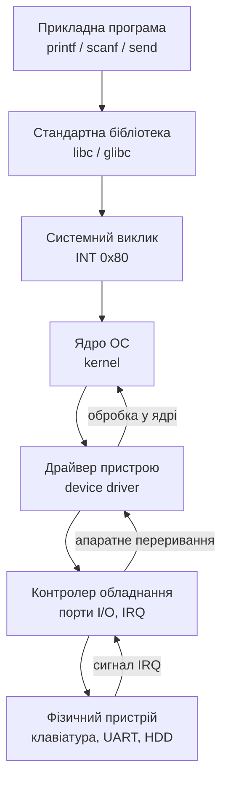
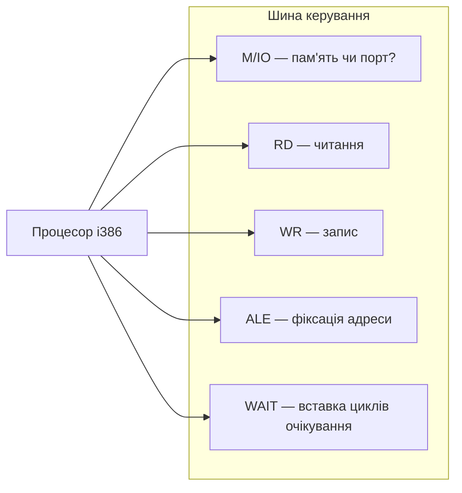
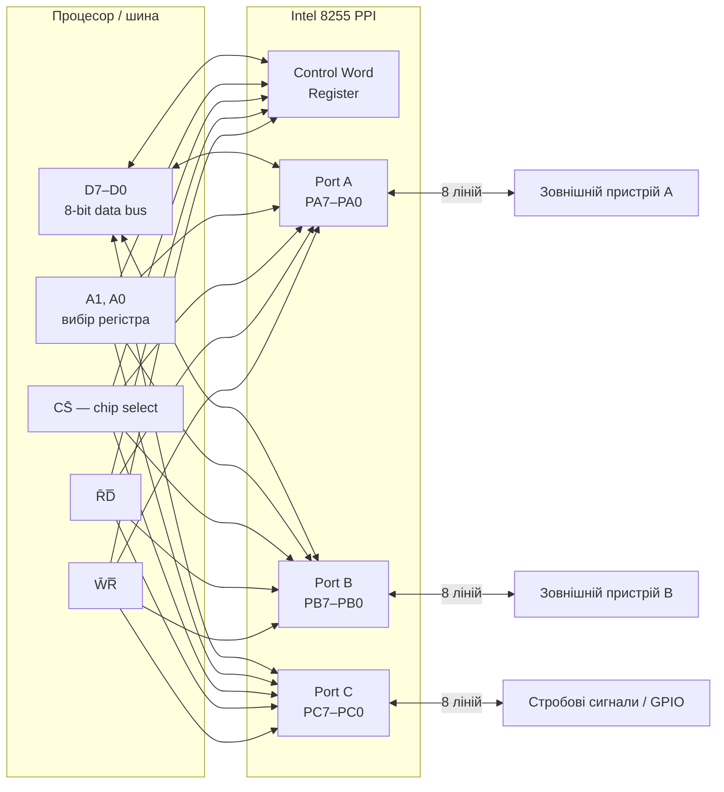
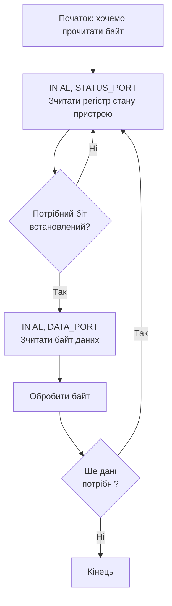
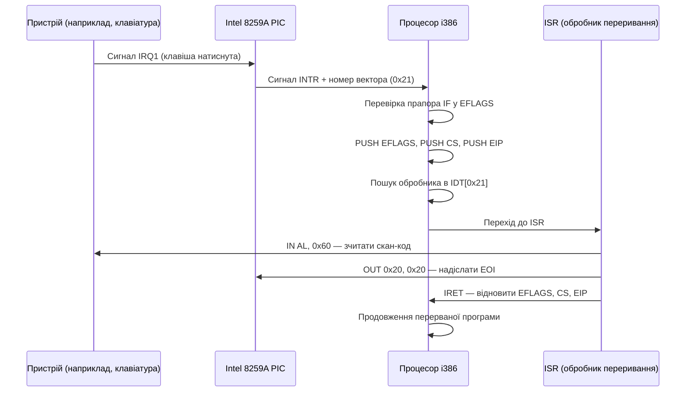
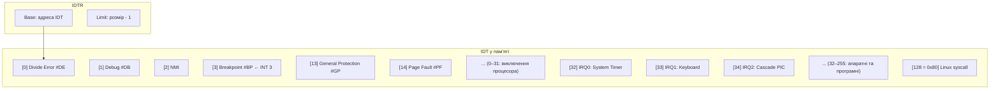
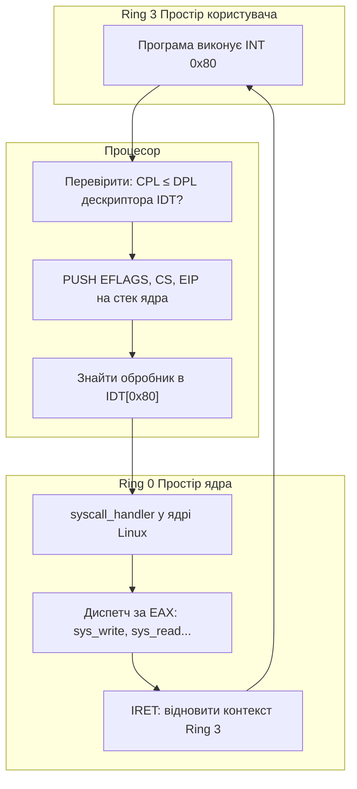
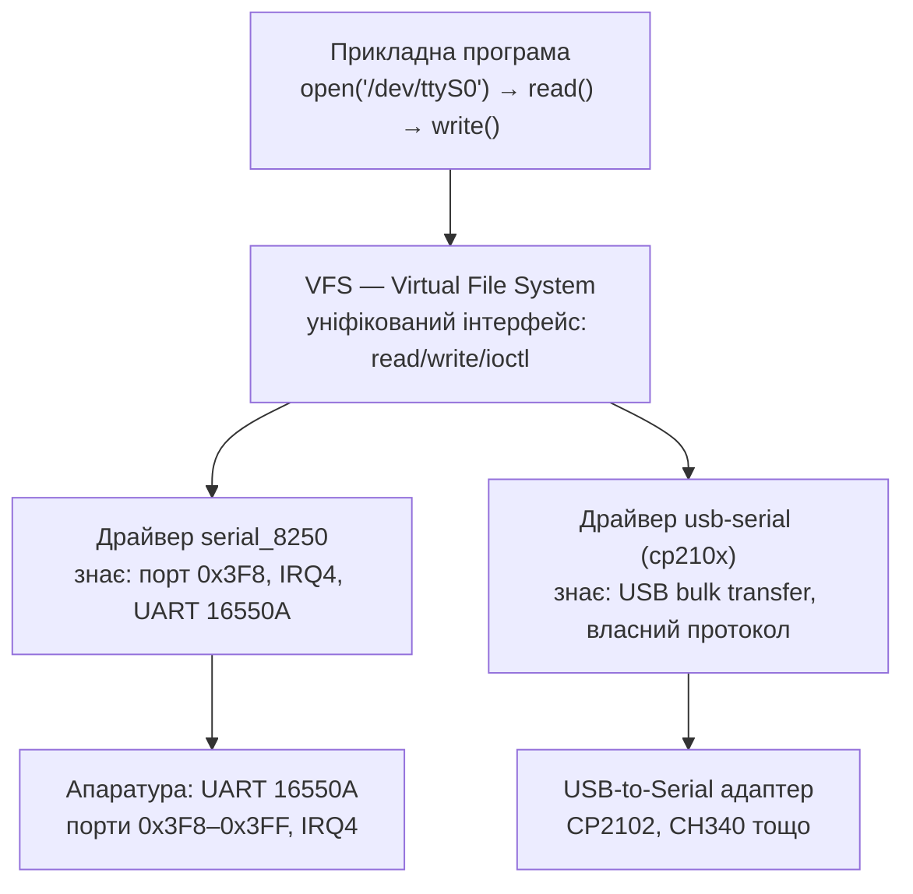
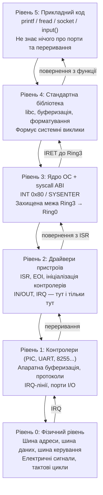

# Лекція 12. Ввід та вивід в асемблері i386 та переривання
## Розгорнутий конспект лектора

---

## Слайд 1. Навіщо I/O: від обчислень до реального світу

Якщо бути відвертими — все, що ми вивчали до цього моменту, є підготовчою роботою. Ми навчилися завантажувати значення у регістри, виконувати арифметику, зсувати біти, керувати потоком виконання через умовні переходи, викликати підпрограми через стек. Але якщо взяти програму, яка робить виключно це, і запустити її — вона буде, по суті, «чорним ящиком». Внутрішньо вона щось порахує, нікому нічого не скаже і завершиться. Для людини, яка її запустила, це рівнозначно нічому.

Справжня цінність програми — у її взаємодії зі світом. У теорії функціонального програмування такі взаємодії прийнято називати «ефектами» (side effects): все, що відбувається поза межами чистого обчислення. Записати файл — ефект. Відобразити символ на екрані — ефект. Передати байт у мережу — ефект. Засвітити діод на платі — теж ефект. Без ефектів програма існує у вакуумі. Введення-виведення (Input/Output, I/O) — це і є механізм створення таких ефектів, місток між абстрактним обчисленням та фізичним світом.

В архітектурі i386 цей місток реалізований через два принципово різних шляхи. Перший — через операційну систему: програма «просить» ОС виконати якусь дію за неї, передаючи керування ядру через програмне переривання. Вона не знає, де фізично знаходиться клавіатура, не знає адрес портів, не піклується про деталі протоколу — вона просто каже ядру «дай мені байт із stdin», і ядро робить усе інше. Другий шлях — bare metal: програма сама безпосередньо звертається до портів введення-виведення, сама налаштовує контролери пристроїв, сама реагує на апаратні переривання. Це складніше, але дає повний контроль над обладнанням і мінімальні затримки реакції.

Розуміння обох шляхів є обов'язковим для системного програміста. Знаючи, як влаштований bare metal рівень, ви розумієте, що саме робить операційна система «за лаштунками». Чому драйвери такі важливі? Тому що хтось має виконати саме цю роботу — надіслати потрібні байти у потрібні порти. Чому у Linux відкриття файлу і читання з послідовного порту виглядають однаково з точки зору програміста? Тому що між кодом і «залізом» є кілька рівнів абстракції, що перетворюють різні апаратні операції на єдиний уніфікований інтерфейс.

Подивимось на загальну картину того, що нас очікує:



На найнижчому рівні є фізичне обладнання: мікросхеми, провідники, електричні сигнали. Рівень вище — апаратний рівень доступу: шини, порти, регістри контролерів, лінії переривань. Ще вище — ядро операційної системи та драйвери, що ховають апаратну специфіку й надають уніфікований інтерфейс. Нарешті, найвищий рівень — прикладний код, що оперує абстрактними поняттями: файли, потоки, сокети, навіть не здогадуючись, що десь внизу є конкретні адреси портів і сигнали IRQ.

Сьогодні ми пройдемо цей стек знизу вгору: від фізичного рівня — шин та сигналів — через конкретні інструкції IN та OUT, механізм апаратних переривань і аж до програмних переривань та системних викликів. Після цієї лекції ви зможете написати код, що напряму читає клавіатуру через порт без будь-якої операційної системи, написати обробник переривань від таймера, і зрозуміти, що відбувається всередині кожного разу, коли ваша програма Python викликає `input()`. Це тема, яка робить із програміста системного програміста.

---

## Слайд 2. Шина адреси і шина даних: фізичний канал між процесором і периферією

Перш ніж говорити про порти і переривання, потрібно зрозуміти, як процесор фізично спілкується із зовнішнім світом. Між процесором і всіма іншими компонентами системи — пам'яттю, контролерами пристроїв, чипсетом — існує набір паралельних провідників, об'єднаних у групи за своїм призначенням. Ці групи називають шинами. Системна шина складається з трьох принципово різних компонентів: шини адреси (address bus), шини даних (data bus) і шини керування (control bus). Кожна з них виконує свою унікальну роль, і без жодної з них обмін інформацією неможливий.

Шина адреси — це однонаправлений набір ліній, якими процесор повідомляє решті системи, до якого саме місця він хоче звернутися. Кожен провідник у цій шині несе один біт адреси, а разом вони формують двійкове число — адресу. В архітектурі 8086 шина адреси була 20-розрядною, що дозволяло адресувати 2²⁰ = 1 048 576 байт = 1 МБ — звідси й знаменита межа «640 КБ» у ранніх ПК. В архітектурі i386 шина адреси розширилась до 32 розрядів, що дало 2³² = 4 294 967 296 адрес = 4 ГБ. Саме тому i386 став першим процесором, що міг адресувати понад 1 МБ без сегментних трюків.

Шина даних є двонаправленою: по ній дані рухаються як від процесора до периферії (під час запису), так і у зворотному напрямку (під час читання). У i386 шина даних 32-розрядна, тобто за один цикл шини можна передати 4 байти одночасно. Однак зовнішні пристрої — зокрема класична мікросхема 8255 або стандартні контролери I/O — зазвичай мають 8-розрядний інтерфейс, тому при роботі з ними використовується лише молодший байт шини даних. Розрядність шини даних визначає «пропускну здатність» одного звернення, тоді як розрядність шини адреси визначає «розмір адресного простору».

Шина керування несе сигнали, що уточнюють характер поточного звернення. Найважливіші з них такі:



Сигнал M/IO# (Memory / Input-Output) є ключовим для розуміння того, як x86 розмежовує два адресні простори. Коли цей сигнал у стані логічної одиниці — процесор звертається до пам'яті, і значення на шині адреси інтерпретується як адреса у просторі пам'яті. Коли сигнал у стані логічного нуля — процесор виконує операцію введення-виведення, і те саме значення на шині адреси інтерпретується як номер порту I/O. Саме цей сигнал і дозволяє існувати двом окремим адресним просторам: пам'яті та портів I/O. Чіпсет і периферійні контролери «дивляться» на цей сигнал, щоб зрозуміти, до кого звертається процесор.

Цикл шини — це послідовність подій, що відбуваються при кожному зверненні процесора до зовнішнього компонента. Спочатку процесор виставляє адресу на шині адреси і встановлює сигнал ALE (Address Latch Enable), щоб зовнішні пристрої зафіксували цю адресу. Потім процесор виставляє або очікує дані на шині даних, встановлюючи сигнали RD# або WR#. Якщо пристрій повільний, він може утримувати сигнал WAIT (або READY в давніших архітектурах), змушуючи процесор додати цикли очікування (wait states). Коли пристрій готовий, він відпускає WAIT, і цикл шини завершується. Саме ця схема лежить в основі роботи будь-якого введення-виведення на рівні «заліза».

Важливо розуміти різницю між «фізичним» і «логічним» рівнями. Те, що ми бачимо в коді — інструкція `IN AL, 0x60` — це лише символьний запис. Реально ж відбувається ціла послідовність електричних подій на мікросекундному рівні: вихід адреси 0x60 на шину адреси, перехід M/IO# у нуль, сигнал RD# у нуль, очікування відповіді контролера клавіатури, поява байта на шині даних, захоплення цього байта у регістр AL. Наступного разу, коли будете писати `IN AL, dx`, уявляйте саме цю послідовність — вона допомагає зрозуміти, чому I/O-операції повільніші за звернення до регістрів і чому timing має значення при роботі з повільними пристроями.

---

## Слайд 3. Простір портів введення-виведення: окрема адресна карта x86

Одна з архітектурних особливостей, що відрізняє x86 від більшості сучасних архітектур (ARM, RISC-V, MIPS), — це наявність окремого адресного простору для пристроїв введення-виведення. В ARM-архітектурі, наприклад, периферія відображається у той самий простір, що й пам'ять (memory-mapped I/O): щоб записати байт у UART, ви просто пишете за певною адресою пам'яті через звичайне `STR`. В x86 всі пристрої, крім відеопам'яті й деяких інших, доступні через окремий простір портів I/O, що існує паралельно до простору пам'яті.

Простір портів I/O в x86 налічує рівно 65 536 адрес: від 0x0000 до 0xFFFF. Кожна адреса в цьому просторі — це окремий «порт», через який можна передати або прийняти один байт (або слово/подвійне слово, якщо пристрій підтримує). Доступ до цього простору здійснюється виключно через спеціальні інструкції IN та OUT — звичайними `MOV` до портів не звернутися. Такий дизайн рішення Intel дозволив зберегти повний адресний простір пам'яті незайнятим для пристроїв, хоча з часом memory-mapped I/O стало домінуючим підходом навіть у x86 (зокрема, PCI та PCIe-пристрої використовують саме його).

Карта портів у класичній PC-архітектурі склалася історично і закріплена стандартами IBM PC. Ось найважливіші діапазони:

### Простір портів I/O  0x0000 — 0xFFFF
| Діапазон портів | Пристрій / Опис                |
|-----------------|--------------------------------|
| 0x0020 — 0x003F | Master PIC 8259A               |
| 0x0040 — 0x005F | Системний таймер PIT 8253/8254 |
| 0x0060 — 0x006F | Контролер клавіатури 8042      |
| 0x0070 — 0x007F | CMOS / RTC                     |
| 0x00A0 — 0x00BF | Slave PIC 8259A                |
| 0x01F0 — 0x01F7 | IDE Primary контролер          |
| 0x0278 — 0x027F | LPT2 паралельний порт          |
| 0x02E8 — 0x02EF | COM4 серійний порт             |
| 0x02F8 — 0x02FF | COM2 серійний порт             |
| 0x0378 — 0x037F | LPT1 паралельний порт          |
| 0x03F8 — 0x03FF | COM1 серійний порт UART        |

У захищеному режимі процесора (Protected Mode), в якому працює Linux та Windows, доступ до портів I/O з рівня прикладного коду (Ring 3) є заблокованим за замовчуванням. Це зроблено з міркувань безпеки: якби будь-яка програма могла напряму звертатися до портів, вона могла б, наприклад, відправити команду до контролера жорсткого диска і зіпсувати дані іншого процесу. Механізм контролю доступу реалізований через поле IOPL (I/O Privilege Level) у регістрі EFLAGS та через таблицю I/O Permission Bitmap (IOPB) у сегменті стану задачі (TSS). IOPL — це двобітне поле (біти 12–13 EFLAGS), що задає мінімальний рівень привілеїв, необхідний для виконання IN/OUT. Зазвичай ОС встановлює IOPL = 0, тобто тільки Ring 0 (ядро) має право виконувати ці інструкції.

Якщо програма у Ring 3 намагається виконати `IN AL, 0x60`, процесор перевіряє IOPL. Якщо CPL (Current Privilege Level) > IOPL, генерується виключення #GP (General Protection Fault) з кодом 0, і операційна система зазвичай завершує програму з помилкою сегментації. Існує спосіб надати окремій задачі доступ до конкретних портів через IOPB, де кожен біт відповідає одному порту: якщо біт = 0, доступ дозволений; якщо = 1 — заборонений. Це використовується, наприклад, у X Window System для надання відеодраксеру прямого доступу до портів VGA без запуску всього X-сервера у Ring 0.

Слід зазначити, що межа 65 536 портів на практиці є більш ніж достатньою: реальних стандартизованих портів у класичній PC-архітектурі значно менше, і більша частина простору 0x0100–0xFFFF або не використовується, або зайнята пристроями розширення ISA/PCI. Сучасні PCI Express пристрої майже повністю перейшли на memory-mapped I/O, так що класичні I/O-порти зараз — це переважно спадщина від 8086/8088, яку зберігають для сумісності. Тим не менше, розуміння цього простору є обов'язковим для роботи з BIOS, firmware, UEFI та низькорівневими драйверами.

---

## Слайд 4. Intel 8255 — програмований інтерфейс периферії (PPI)

Коли в кінці 1970-х розроблялися перші мікропроцесорні системи на базі 8080 та 8085, інженери зіткнулися з практичною проблемою: як підключити до процесора зовнішні пристрої — клавіатури, дисплеї, датчики, реле — якщо у самого процесора ліній введення-виведення загального призначення дуже мало? Рішенням стала спеціалізована мікросхема Intel 8255 — Programmable Peripheral Interface (PPI), програмований інтерфейс периферії, що побачила світ у 1976 році. Вона стала стандартним «перехідником» між 8-розрядною шиною даних процесора та зовнішнім обладнанням, і це рішення настільки добре себе проявило, що 8255 використовувалася десятиліттями — у ранніх IBM PC, у промислових контролерах, у навчальних стендах.

Архітектура 8255 надзвичайно елегантна. Мікросхема містить три незалежних 8-розрядних порти: PA (Port A), PB (Port B) та PC (Port C). Кожен з них — це 8 фізичних виводів на корпусі, кожен з яких може бути або входом, або виходом. Крім трьох портів, є четвертий логічний регістр — Control Word Register (CWR), — до якого не підключені фізичні виводи, але через який програміст задає режим роботи всієї мікросхеми. Разом це дає 24 лінії введення-виведення, керовані через чотири послідовних порти з боку процесора.



Вибір конкретного регістра всередині 8255 здійснюється двома адресними лініями A1 та A0. Комбінація 00 адресує Port A, 01 — Port B, 10 — Port C, 11 — Control Word Register. Якщо, наприклад, 8255 підключена до процесора так, що її базова адреса у просторі портів — 0x300, то: порт A знаходиться за адресою 0x300, порт B — 0x301, порт C — 0x302, регістр керування — 0x303. Запис значення у регістр керування (адреса 0x303) визначає напрямок роботи кожного порту. Читання або запис у порти A, B, C відбувається вже через відповідні адреси після того, як напрямок налаштований.

Формат керуючого слова (Control Word) у режимі 0 — базовому режимі простого введення-виведення — такий: біт 7 має бути 1 (ознака режиму), біти 6–5 задають режим порту A (00 = Mode 0), біт 4 задає напрямок порту A (0 = вихід, 1 = вхід), біт 3 задає напрямок старшого півбайта порту C, біти 2–1 задають режим порту B, біт 0 задає напрямок порту B та молодшого півбайта C. Наприклад, керуюче слово 0x9B (двійково: 10011011) у режимі 0 означає: порт A — вхід, порт B — вхід, порт C (старший) — вхід, порт C (молодший) — вихід.

Крім базового Mode 0 (Simple I/O), 8255 підтримує Mode 1 (Strobed I/O — з сигналами підтвердження) та Mode 2 (Bidirectional Bus — двонаправлена шина, тільки для порту A). Mode 1 особливо корисний для підключення принтерів і подібних пристроїв, де треба підтверджувати передачу кожного байта через апаратні сигнали STB (Strobe) та ACK (Acknowledge) — вони використовують для цього відповідні лінії порту C. Це, по суті, вбудований апаратний протокол квітування (handshaking) без участі процесора.

У контексті IBM PC мікросхема 8255 використовувалась у найперших моделях для зчитування DIP-перемикачів конфігурації, управління гучномовцем і зчитування стану клавіатури. Хоча у пізніших ПК вона була замінена спеціалізованими контролерами, принцип організації залишився тим самим. Розуміння 8255 є ідеальним введенням у тему програмованих периферійних інтерфейсів, бо вона показує в чистому вигляді: є шина процесора, є вибір регістра через адресні лінії, є керуюче слово для конфігурації, є порти для даних. Ті самі концепції — у будь-якому сучасному мікроконтролері, будь то AVR, STM32 чи ESP32.

---

## Слайд 5. Читання зовнішніх даних: інструкція IN

Інструкція IN є фундаментальним примітивом читання з простору портів I/O в архітектурі x86. Вона перекладає процесор у режим I/O-читання: виставляє адресу порту на шину адреси, встановлює сигнал M/IO# у нуль (I/O-цикл), сигнал RD# у нуль (читання) і захоплює значення, яке зовнішній пристрій виставив на шину даних, у цільовий регістр. З точки зору програміста — одна строка коду; з точки зору апаратури — повний цикл шини з очікуванням відповіді пристрою.

Синтаксис інструкції IN має рівно дві форми адресації порту і три варіанти розрядності:

```nasm
; Форма 1: константна адреса порту (тільки 0x00–0xFF)
IN AL, imm8     ; зчитати байт  з порту imm8 → AL
IN AX, imm8     ; зчитати слово з порту imm8 → AX
IN EAX, imm8    ; зчитати подвійне слово     → EAX

; Форма 2: адреса порту у регістрі DX (0x0000–0xFFFF)
IN AL, DX       ; зчитати байт  з порту [DX] → AL
IN AX, DX       ; зчитати слово з порту [DX] → AX
IN EAX, DX      ; зчитати подвійне слово     → EAX
```

Перша форма — з константою imm8 — дозволяє адресувати лише перші 256 портів (0x00–0xFF). Саме в цьому діапазоні знаходяться всі класичні системні компоненти: PIC, таймер, клавіатура, DMA. Якщо ж потрібен порт з номером більше 0xFF (наприклад, LPT1 за адресою 0x378 або COM1 за 0x3F8), необхідно використовувати форму з DX: завантажити номер порту у регістр DX і виконати `IN AL, DX`. Регістр DX тут грає роль «адресного регістра для портів» — аналог того, як SI та DI є адресними регістрами для пам'яті.

Розглянемо найкласичніший приклад: читання байта з контролера клавіатури. Контролер клавіатури Intel 8042 (або його сучасний аналог) має два порти: 0x60 — порт даних, 0x64 — порт стану/команд. Коли користувач натискає або відпускає клавішу, контролер генерує скан-код і записує його у внутрішній буфер. Біт OBF (Output Buffer Full, біт 0) у регістрі стану (порт 0x64) встановлюється у 1, сигналізуючи, що є дані для читання. Після читання байта через `IN AL, 0x60` контролер автоматично знімає OBF.

```nasm
; Зчитування скан-коду клавіатури (bare metal, real mode або захищений режим з IOPL=0)
wait_kbd:
    IN   AL, 0x64       ; зчитати регістр стану контролера клавіатури
    TEST AL, 0x01       ; перевірити біт OBF (Output Buffer Full)
    JZ   wait_kbd       ; якщо 0 — буфер порожній, чекаємо
    IN   AL, 0x60       ; OBF=1: зчитати байт скан-коду з порту даних
    ; тепер у AL — скан-код натиснутої/відпущеної клавіші
```

Важливий момент щодо привілеїв: у захищеному режимі з нормальними налаштуваннями (CPL=3, IOPL=0) виконання `IN` з рівня прикладної програми спричинить #GP (General Protection Fault). Виняток становлять два випадки: або програма виконується у Ring 0 (це ядро або модуль ядра), або для даного порту в TSS є відповідний дозвільний біт у таблиці IOPB (I/O Permission Bitmap). Другий механізм дозволяє надавати окремим процесам доступ до конкретних портів, не надаючи їм повного доступу Ring 0. Саме так, наприклад, у деяких конфігураціях Linux програма `ioperm()` або `iopl()` може надати доступ до портів VGA для X-сервера.

Слід також пам'ятати про timing. Старі пристрої (особливо ISA-пристрої) дуже повільні і можуть не встигнути відповісти на швидкий сучасний процесор. Для цього у firmware іноді вставляють штучну затримку між зверненнями до I/O: записують будь-яке значення у «безпечний» порт 0x80 (порт POST-кодів), що займає час циклу шини і дає повільному пристрою можливість підготуватися. Ця техніка відома як «I/O delay» і зустрічається у кодах BIOS та старих ядер Linux.

---

## Слайд 6. Надсилання команд і даних: інструкція OUT

Якщо IN читає зовнішні дані, то OUT — надсилає. За механізмом роботи це симетрична операція: процесор виставляє адресу порту на шину адреси, встановлює M/IO# у нуль і WR# у нуль, виставляє дані на шину даних — і зовнішній пристрій захоплює ці дані у свій внутрішній регістр. Пристрій «бачить» момент запису за переднім або заднім фронтом сигналу WR# і фіксує стан шини даних у цей момент. Саме так процесор «розмовляє» зі світом: записуючи байти у порти контролерів.

```nasm
; Синтаксис OUT — дзеркальний до IN
OUT imm8, AL    ; записати байт  AL → порт imm8
OUT imm8, AX    ; записати слово AX → порт imm8
OUT imm8, EAX   ; записати подвійне слово EAX → порт imm8

OUT DX, AL      ; записати байт  AL → порт [DX]
OUT DX, AX      ; записати слово AX → порт [DX]
OUT DX, EAX     ; записати подвійне слово EAX → порт [DX]
```

Зверніть увагу на порядок операндів: у `OUT` спочатку йде адреса порту (призначення), потім — регістр з даними (джерело). Це протилежно до більшості інструкцій x86, де призначення — перший операнд. Будьте уважні: `OUT DX, AL` — правильно; `OUT AL, DX` — помилка синтаксису. Ця асиметрія — одна з архітектурних непослідовностей x86, що часто плутає новачків.

Найпростіший і найнаочніший приклад роботи OUT — управління індикаторами (LED) на клавіатурі. Три світлодіоди — Num Lock, Caps Lock і Scroll Lock — контролюються безпосередньо через порти контролера клавіатури 8042. Щоб змінити їхній стан, потрібно виконати двокрокову послідовність: спочатку надіслати команду 0xED (Set LEDs) до командного порту 0x64, а потім — байт маски до порту даних 0x60, де біт 0 = Scroll Lock, біт 1 = Num Lock, біт 2 = Caps Lock.

```nasm
; Увімкнути Num Lock LED (біт 1 = 1, решта = 0)
.set_leds:
    ; 1. Чекаємо, поки контролер готовий прийняти команду (IBF=0)
    .wait_cmd:
        IN   AL, 0x64
        TEST AL, 0x02       ; перевірити біт IBF (Input Buffer Full)
        JNZ  .wait_cmd      ; якщо 1 — контролер зайнятий, чекаємо

    MOV  AL, 0xED           ; команда "Set LEDs"
    OUT  0x64, AL           ; надіслати команду

    ; 2. Чекаємо знову і надсилаємо байт маски LED
    .wait_data:
        IN   AL, 0x64
        TEST AL, 0x02
        JNZ  .wait_data

    MOV  AL, 0b00000010     ; тільки Num Lock (біт 1)
    OUT  0x60, AL           ; надіслати маску
```

Інший класичний приклад — паралельний порт LPT1 за адресою 0x378. Цей порт, що використовувався для принтерів, є одним із найпростіших інтерфейсів у всій PC-архітектурі: 8 ліній даних (D0–D7), кілька ліній статусу та керування. Записавши байт у порт 0x378 через `OUT 0x378, AL` (або `MOV DX, 0x378; OUT DX, AL`), ви буквально виставляєте 8 біт на 8 фізичних виводів роз'єму. Саме завдяки цій простоті LPT-порт широко використовувався у саморобних проектах — для програматорів мікросхем, управління реле, підключення самодельних дисплеїв.

Гучномовець (PC speaker) — ще один приклад управління через OUT. У класичній PC-архітектурі він підключений до біта 1 порту 0x61 (Keyboard Controller Port B) і до виходу таймера PIT. Щоб видати звук, потрібно встановити біти 0 та 1 порту 0x61 (підключити гучномовець до таймера), а частоту задати через відповідні регістри PIT (порти 0x40–0x43). Це приклад того, як кілька простих операцій OUT координуються між різними контролерами для отримання конкретного фізичного ефекту — в даному разі, звукового тону заданої частоти.

Обидві інструкції — IN та OUT — є в прямому сенсі «словами», якими процесор спілкується з апаратурою. Все I/O, весь ввід і вивід, на рівні bare metal зводиться саме до них. Скільки б шарів абстракції не було збудовано зверху — в основі завжди буде ця пара інструкцій і цикли шини, що переносять байти між процесором та фізичними мікросхемами.

---

## Слайд 7. Polling (активне опитування): найпростіший, але витратний спосіб очікування

Маючи у руках інструкції IN та OUT, найінтуїтивніший спосіб отримати дані від пристрою — це постійно питати його: «ти вже готовий? а тепер? а зараз?» — аж поки відповідь не стане позитивною. Цей підхід називається polling, або активним опитуванням, і є найпростішим можливим способом взаємодії з периферією. Жодних додаткових налаштувань, жодної реєстрації обробників, жодних таблиць дескрипторів — просто цикл і перевірка статусного біта.

Практично кожен пристрій введення-виведення має один або кілька статусних регістрів, де певні біти сигналізують про готовність до обміну. Для контролера клавіатури це біт OBF у порту 0x64: коли він дорівнює 1, у буфері є непрочитаний байт. Для UART-контролера (COM-порт) у регістрі стану лінії (LSR) є біт DR (Data Ready): якщо він встановлений, у буфері прийому є байт для читання. Для контролера диска є біт BSY (Busy) і DRQ (Data Request). Схема завжди однакова: прочитай статус → перевір потрібний біт → якщо не готовий, повторюй.



Перевага polling очевидна: простота реалізації і абсолютна передбачуваність. Програма повністю контролює, коли і де вона перевіряє пристрій, і не може бути «перервана» у несподіваний момент. У жорстких системах реального часу (hard real-time), де затримка відповіді має бути гарантованою і мінімальною, polling іноді є кращим вибором, ніж переривання — особливо коли пристрій відповідає дуже швидко (мікросекунди) і цикл очікування займає лише кілька ітерацій.

Проте ціна polling значна. По-перше, 100% завантаження процесора: поки виконується цикл перевірки, процесор не може робити нічого іншого. Якщо клавіатура генерує подію раз на секунду, а процесор запускає цикл 10 мільйонів разів на секунду — 9 999 999 ітерацій із 10 000 000 є абсолютно марними. По-друге, затримка реакції є невизначеною якщо у системі є й інша робота між перевірками. По-третє, у сучасних процесорах активні цикли очікування запобігають переходу у стани зниженого споживання (C1, C2, C3 у x86), що критично для мобільних пристроїв та серверів, де енергоефективність має значення.

На практиці polling залишається виправданим у кількох сценаріях. Перший — дуже швидкі пристрої з мінімальним часом відповіді, де overhead від переривань (збереження/відновлення контексту) був би порівнянним або навіть більшим за сам час очікування. Другий — ситуації, де переривання є небажаними або неможливими: наприклад, у певних фазах завантаження системи, коли IDT ще не налаштована. Третій — прості вбудовані системи без ОС, де процесор «своїй» задачі і не потрібно ділити час між процесами. Четвертий — програмовані логічні контролери (PLC) та FPGA-системи, де детермінованість важливіша за ефективність.

Є проміжний підхід між чистим polling і перериваннями — так зване переривання з опитуванням (interrupt-driven polling). У цьому варіанті переривання лише сигналізує, що пристрій готовий, але сам ISR потім читає всі доступні байти у циклі (не одиночно), доки пристрій не скаже «більше немає». Це комбінує переваги обох підходів: процесор не витрачає час у порожньому циклі між подіями (бо є переривання), але й не обробляє кожен байт окремим перериванням (бо всередині ISR є polling).

---

## Слайд 8. Апаратні переривання (Hardware Interrupts): пристрій сам подає сигнал

Polling вирішує задачу отримання даних від пристрою, але ціною постійного завантаження процесора. Природне альтернативне рішення — перекласти ініціативу на сам пристрій: нехай він сам повідомляє, коли є що обробляти. Саме цей принцип реалізується через механізм апаратних переривань (hardware interrupts). Ідея проста: пристрій «тягне за дзвінок» — подає електричний сигнал — і процесор, отримавши цей сигнал, зупиняє поточну роботу, зберігає стан і переходить до спеціальної процедури обробки. Після обробки — повертається точно туди, де зупинився.

Фізично цей «дзвінок» реалізований через лінії IRQ (Interrupt Request). У класичній PC-архітектурі їх 16: IRQ0–IRQ15. Кожна лінія підключена до конкретного пристрою або контролера: IRQ0 — системний таймер, IRQ1 — клавіатура, IRQ3 — COM2, IRQ4 — COM1, IRQ6 — дисковод, IRQ14 — IDE Primary і так далі. Коли пристрій хоче повідомити процесор про подію, він встановлює свою IRQ-лінію у активний стан (здебільшого — логічна одиниця). Ці лінії не йдуть безпосередньо до процесора — вони збираються спеціальним контролером переривань.



Процесор i386 реагує на сигнал INTR лише між завершенням однієї інструкції і початком наступної — тобто ніколи «посередині» інструкції. Якщо прапор IF (Interrupt Flag, біт 9) у регістрі EFLAGS встановлений у 1, процесор після поточної інструкції перевіряє наявність запиту переривання. Якщо є — виконує наступну послідовність: автоматично штовхає у стек регістр EFLAGS (зі скинутим IF, щоб вкладені переривання не виникли самі по собі), потім CS (сегмент коду), потім EIP (вказівник на наступну інструкцію). Потім отримує від PIC номер вектора переривання, шукає відповідний запис у IDT, завантажує адресу обробника і передає туди керування.

Скидання прапора IF при вході в ISR є важливою деталлю: воно запобігає тому, щоб під час обробки одного переривання сталося інше, що могло б пошкодити стан стека або спричинити рекурсивні виклики ISR. Це поведінка «Interrupt Gate» — типу дескриптора в IDT для більшості апаратних переривань. Якщо переривання такі важливі, що їх дозволяти вкладати (наприклад, переривання від таймера важливіше за переривання від UART), ISR може явно повторно встановити IF командою `STI` після початку обробки. Команди CLI та STI — це і є механізм ручного управління прапором IF.

Після виконання всіх дій в ISR обов'язково виконується інструкція IRET (Interrupt Return). Вона є точним дзеркалом вхідної послідовності: знімає зі стека EIP, потім CS, потім EFLAGS (разом з відновленим прапором IF), і повертає виконання точно до тієї точки, де програма була перервана. Для перерваної програми це «магія»: вона навіть не знає, що між двома її інструкціями відбулася ціла процедура обробки клавіатурного вводу. Саме завдяки цьому механізму операційна система може обслуговувати десятки пристроїв і при цьому створювати ілюзію для кожного процесу, що він виконується безперервно.

---

## Слайд 9. Таблиця дескрипторів переривань (IDT) і структура вектора

Механізм переривань потребує відповіді на запитання: «коли прийшло переривання з номером N, куди саме переходити?» Відповідь на це запитання зберігається у спеціальній структурі в пам'яті — Interrupt Descriptor Table (IDT), таблиці дескрипторів переривань. Ця таблиця є однією з центральних структур захищеного режиму x86 поряд із GDT (Global Descriptor Table) та LDT. Без правильно налаштованої IDT жодне переривання і жодне виключення не може бути оброблене — система просто зависне або перезавантажиться.

IDT розміщується в довільному місці пам'яті, а її адреса та розмір зберігаються у спеціальному 48-бітному системному регістрі IDTR. Молодші 16 бітів IDTR — це ліміт таблиці (розмір мінус 1), старші 32 біти — базова лінійна адреса. Команда `LIDT mem` завантажує IDTR з пам'яті (аналогічно `LGDT`), а `SIDT mem` — зчитує поточне значення. Ядро операційної системи завантажує власну IDT під час ініціалізації, і вся подальша робота переривань спирається на цю таблицю.



Кожен запис у IDT (дескриптор) у захищеному режимі i386 займає 8 байт. Він містить: молодші 16 бітів зміщення (offset) адреси обробника, 16-бітний селектор сегменту коду, однобайтний тип і атрибути доступу, та старші 16 бітів зміщення. З цих полів процесор складає лінійну адресу ISR: бере базу сегменту з GDT/LDT по вказаному селектору і додає зміщення з дескриптора. У плоскій моделі пам'яті (flat model), де всі сегменти охоплюють весь адресний простір, зміщення фактично є абсолютною адресою функції-обробника.

Тип дескриптора визначає поведінку при вході в обробник. Interrupt Gate (тип 0xE): процесор скидає прапор IF, тобто переривання під час виконання ISR заблоковані — стандартний вибір для апаратних IRQ. Trap Gate (тип 0xF): прапор IF не змінюється, тобто під час виконання обробника інші переривання можливі — зазвичай використовується для системних викликів (наприклад, INT 0x80 у Linux реалізований через Trap Gate). Task Gate (тип 0x5): перемикання на іншу задачу через TSS — рідкісне використання. Вибір правильного типу є важливим рішенням при проектуванні ОС.

Перші 32 вектори (0–31) зарезервовані Intel і описані у документації як «процесорні виключення» (processor exceptions). Виключення поділяються на три категорії. Faults (помилки) — відновлювані: процесор зберігає EIP, що вказує на інструкцію, яка спричинила помилку, даючи обробнику шанс виправити ситуацію і повторити її. Класичний приклад — #PF (Page Fault, вектор 14): ОС обробляє відсутню сторінку, завантажує її з диска і повертається до тієї ж інструкції. Traps (пастки) — процесор зберігає EIP наступної інструкції; виконання продовжується після трапи. #BP (Breakpoint, вектор 3 = INT 3) є типовою пасткою — відладчик зупиняє виконання, але при відновленні переходить до наступної інструкції після точки зупину. Aborts (аварійні зупинки) — невідновлювані: система не може продовжувати, наприклад #DF (Double Fault, вектор 8).

У реальному режимі (real mode) замість IDT існує Interrupt Vector Table (IVT), що завжди знаходиться за адресою 0x0000:0x0000 і містить 256 записів по 4 байти кожен (сегмент:зміщення у форматі 16:16). Це набагато простіша структура, але й менш захищена. Перехід у захищений режим вимагає обов'язкового налаштування IDT — без цього перше ж переривання або виключення призведе до невизначеної поведінки.

---

## Слайд 10. Практичні приклади апаратних переривань: таймер, клавіатура, UART

Теорія переривань стає значно зрозумілішою, коли подивитися на конкретні приклади ISR для реальних пристроїв. Три найважливіших джерела апаратних переривань у класичній PC-архітектурі — це системний таймер (IRQ0), контролер клавіатури (IRQ1) та послідовний порт UART (IRQ3/IRQ4). Кожен із них демонструє різний аспект обробки переривань: лічення подій у часі, асинхронний прийом байтів та буферизацію даних від потокового пристрою.

**Таймер IRQ0 і системний лічильник.** Системний таймер PIT (Programmable Interval Timer, Intel 8253/8254) за замовчуванням генерує переривання IRQ0 з частотою 18,206 Гц (кожні ~54,9 мс) — це частота, що дісталась у спадок від дизайну IBM PC. ISR для IRQ0 у більшості операційних систем виконує мінімальну але критичну роботу: збільшує глобальний лічильник тіків, що є основою системного часу. У DOS це була змінна у BIOS-пам'яті; у Linux — змінна `jiffies`. Крім лічення часу, IRQ0 у Linux запускає планувальник задач: після кожного тіку ядро вирішує, чи не пора надати процесор іншому процесу.

```nasm
; Мінімальний ISR для IRQ0 (системний таймер), 32-бітний захищений режим
timer_isr:
    PUSH EAX                    ; зберегти регістри, що використовуємо
    INC  DWORD [system_ticks]   ; збільшити лічильник тіків
    MOV  AL, 0x20               ; команда EOI (End of Interrupt)
    OUT  0x20, AL               ; надіслати EOI до Master PIC
    POP  EAX
    IRET                        ; відновити контекст і повернутися
```

**Клавіатура IRQ1 і прийом скан-кодів.** Коли користувач натискає клавішу, контролер клавіатури 8042 генерує скан-код, поміщає його у свій внутрішній буфер і подає сигнал IRQ1. ISR зчитує байт із порту 0x60. Скан-коди — це не ASCII: кожна клавіша має унікальний «make code» (натискання) та «break code» (відпускання). Наприклад, клавіша 'A' при натисканні дає скан-код 0x1E, при відпусканні — 0x9E (make + 0x80). Перетворення скан-кодів на символи — це вже робота ОС, а не апаратури. ISR лише кладе байт у кільцевий буфер (ring buffer), звідки прикладна програма зчитує символи у зручний для неї момент.

```nasm
; ISR для IRQ1 (клавіатура)
keyboard_isr:
    PUSH EAX
    PUSH EBX
    IN   AL, 0x60               ; зчитати скан-код
    ; тут: покласти AL у кільцевий буфер (ring buffer)
    ; [kbd_buf + kbd_write_pos] = AL; kbd_write_pos = (kbd_write_pos+1) % BUF_SIZE
    MOV  AL, 0x20
    OUT  0x20, AL               ; EOI до Master PIC
    POP  EBX
    POP  EAX
    IRET
```

**UART і прийом потокових даних IRQ4.** Послідовний порт COM1 базується на UART-контролері (Universal Asynchronous Receiver-Transmitter), класично — Intel 8250 або 16550A. UART підключений до IRQ4. Коли по послідовній лінії приходить байт, UART приймає його побітово (відповідно до налаштованої швидкості — baud rate), збирає у байт, поміщає у регістр прийому і генерує IRQ4. ISR читає байт із регістра RBR (Receiver Buffer Register) UART за адресою COM1+0 (0x3F8). Важливий момент: UART 16550A має вбудований FIFO-буфер на 16 байт, і переривання може генеруватися лише після накопичення певної кількості байт (налаштовується) — це значно знижує кількість переривань при великій швидкості передачі.

Спільний патерн для всіх трьох ISR: зберегти регістри → виконати специфічну дію (прочитати порт, покласти у буфер) → надіслати EOI до PIC → відновити регістри → IRET. Три кроки є незмінними для будь-якого апаратного ISR: зберегти контекст, обробити подію, надіслати EOI. Пропустити EOI — найпоширеніша помилка початківців при написанні ISR: без нього PIC заблокує всі наступні переривання того самого або нижчого пріоритету, і система «завмирає» — клавіатура більше не реагує, таймер не тікає.

---

## Слайд 11. Контролер переривань PIC 8259A і протокол EOI

Intel 8259A PIC (Programmable Interrupt Controller) — це мікросхема, що відіграє роль «диспетчера» між фізичними IRQ-лініями і процесором. Без PIC процесор мав би лише один вхід INTR і не знав би, від якого пристрою прийшло переривання і яку функцію викликати. 8259A вирішує цю задачу: він збирає запити від кількох пристроїв, визначає, яке з них має вищий пріоритет, повідомляє процесор через сигнал INTR і по запиту процесора повідомляє номер вектора через шину даних. Саме 8259A є причиною того, що переривання у PC мають номери: він «присвоює» вектори.

У стандартній PC-конфігурації використовуються два PIC у каскадному (master-slave) режимі:

```mermaid
graph LR
    subgraph "Master PIC  0x20/0x21"
        IRQ0["IRQ0 — Таймер PIT"]
        IRQ1["IRQ1 — Клавіатура 8042"]
        IRQ2["IRQ2 — Slave PIC (каскад)"]
        IRQ3["IRQ3 — COM2 / COM4"]
        IRQ4["IRQ4 — COM1 / COM3"]
        IRQ5["IRQ5 — LPT2 / Sound Card"]
        IRQ6["IRQ6 — Дисковод FDD"]
        IRQ7["IRQ7 — LPT1 / Parallel Port"]
    end

    subgraph "Slave PIC  0xA0/0xA1"
        IRQ8["IRQ8  — RTC Clock"]
        IRQ9["IRQ9  — ACPI / PCI redirect"]
        IRQ10["IRQ10 — вільний / мережева карта"]
        IRQ11["IRQ11 — вільний / USB"]
        IRQ12["IRQ12 — PS/2 миша"]
        IRQ13["IRQ13 — FPU / Coprocessor"]
        IRQ14["IRQ14 — IDE Primary"]
        IRQ15["IRQ15 — IDE Secondary"]
    end

    IRQ2 -->|"каскад"| Slave PIC
    Master PIC -->|"INTR"| CPU["Процесор"]
```

Slave PIC підключений до лінії IRQ2 Master PIC. Коли пристрій на IRQ8–IRQ15 подає запит, Slave PIC сигналізує Master через IRQ2, і Master передає INTR процесору. Тому будь-яке переривання від Slave вимагає надсилання EOI двічі: спочатку до Slave (порт 0xA0), потім до Master (порт 0x20). Це обов'язково — інакше Master не дізнається, що обробка IRQ2 (каскадного входу) завершена, і заблокує всі IRQ8–IRQ15 назавжди.

Ініціалізація PIC відбувається послідовністю команд ICW (Initialization Command Words). ICW1 (порт 0x20/0xA0) запускає ініціалізацію і задає режим. ICW2 (порт 0x21/0xA1) задає базовий вектор переривань: стандартно Master отримує 0x20 (IRQ0→вектор 0x20, IRQ1→0x21 і т.д.), Slave — 0x28 (IRQ8→вектор 0x28). ICW3 задає каскадну конфігурацію. ICW4 задає режим роботи (зокрема, 80x86 режим). Без цієї ініціалізації PIC не функціонуватиме коректно — зокрема, у реальному режимі BIOS налаштовує IRQ0→вектор 0x08, IRQ1→0x09, що конфліктує з виключеннями процесора у захищеному режимі, і перше, що робить ядро Linux при завантаженні — переналаштовує PIC.

```nasm
; Надіслати EOI (End of Interrupt)
; Для IRQ0–IRQ7 (Master PIC):
    MOV AL, 0x20
    OUT 0x20, AL        ; EOI до Master

; Для IRQ8–IRQ15 (Slave PIC) — обов'язково обидва:
    MOV AL, 0x20
    OUT 0xA0, AL        ; EOI до Slave
    OUT 0x20, AL        ; EOI до Master
```

Регістр маски переривань (IMR — Interrupt Mask Register) дозволяє програмно вимкнути конкретні IRQ. Записавши байт у порт 0x21 (Master IMR) або 0xA1 (Slave IMR), де кожен біт відповідає одному IRQ (1 = заблоковано, 0 = дозволено), можна тимчасово заборонити певні переривання. Це корисно, наприклад, при налаштуванні пристрою, коли не хочемо отримувати переривання від нього, поки він ще не готовий. Якщо записати 0xFF у обидва IMR — всі маскуємі переривання будуть заблоковані. NMI (Non-Maskable Interrupt) через PIC не проходить і не може бути замаскований — він сигналізує про апаратні помилки.

Варто також знати, що у сучасних системах 8259A поступився місцем APIC (Advanced Programmable Interrupt Controller), який підтримує більше 16 IRQ, дозволяє розподіляти переривання між кількома процесорами (у SMP-системах) і забезпечує значно гнучкіше налаштування пріоритетів. Проте 8259A залишається стандартом для навчання, і вся класична база знань про переривання — включно з EOI, IMR, каскадуванням — повністю відповідна до 8259A.

---

## Слайд 12. Програмні переривання (Software Interrupts): інструкція INT

Апаратні переривання — це сигнал ззовні, від пристрою до процесора. Але в архітектурі x86 існує симетричний механізм: програмне переривання — сигнал зсередини, від самого коду. Інструкція `INT n` (де n — число від 0 до 255) дозволяє будь-якій програмі явно запустити той самий механізм, що й апаратне переривання: зберегти EFLAGS, CS, EIP на стек і передати керування обробнику, зареєстрованому в IDT за вектором n. З точки зору процесора різниця між апаратним і програмним перериванням полягає лише у джерелі сигналу — все інше однаково.

Перша і найважливіша різниця між INT і звичайним CALL — це рівень привілеїв. Команда CALL може викликати лише функцію в межах поточного рівня або нижчого. Але `INT n`, якщо дескриптор в IDT має тип Trap Gate або Interrupt Gate з достатнім DPL (Descriptor Privilege Level), може перемкнути процесор із Ring 3 у Ring 0, автоматично змінивши стек на стек ядра (з TSS). Це і є механізм системного виклику: `INT 0x80` у Linux дозволяє програмі у Ring 3 легально і безпечно звернутися до функцій ядра у Ring 0, не порушуючи ізоляції між процесами.



Особливу роль грає `INT 3` — однобайтовий опкод 0xCC. Стандартний механізм точок зупину (breakpoint) у всіх відладчиках x86 побудований саме на ньому. Коли відладчик ставить breakpoint за адресою X, він зберігає оригінальний байт і записує на його місце 0xCC. Коли процесор доходить до цього місця і виконує 0xCC, генерується переривання вектора 3 (#BP, Breakpoint Trap). Ядро або сам відладчик перехоплює це переривання, відновлює оригінальний байт, зупиняє процес і дозволяє відладчику інспектувати стан. Через це INT 3 є Trap, а не Fault: EIP на стеку вказує на інструкцію після 0xCC, тобто на наступну, а не на саму точку зупину.

В епоху DOS інструкція `INT 0x21` була головним інтерфейсом до функцій операційної системи. Перед викликом в AH клали номер функції: AH=0x09 — вивести рядок, AH=0x3D — відкрити файл, AH=0x4C — завершити програму. У BIOS існували власні переривання: INT 0x10 — відеосервіси, INT 0x13 — дисковий I/O, INT 0x16 — клавіатурні сервіси. По суті, `INT n` — це API виклик, реалізований через механізм переривань: замість адреси функції, яку потрібно знати заздалегідь, достатньо знати номер вектора, а конкретну адресу знайде процесор у IDT. Це дозволяє ОС змінювати реалізацію функцій без перекомпіляції програм, що їх викликають.

Є ще один тонкий момент стосовно прапора IF. При вході через Interrupt Gate прапор IF скидається, тобто маскуємі переривання забороняються. При вході через Trap Gate прапор IF залишається незмінним. Системний виклик `INT 0x80` у Linux реалізований через Trap Gate саме тому, що під час виконання системного виклику ядро хоче продовжувати отримувати апаратні переривання (наприклад, від таймера для планування). Якби використовувався Interrupt Gate, то під час `sys_read` на повільному диску таймер не міг би перервати ядро і запустити інший процес — що зробило б систему нереагуючою під час будь-якого I/O.

---

## Слайд 13. Системні виклики через INT 0x80: міст між програмою та ядром Linux

Системний виклик (syscall) — це контрольована точка входу в ядро операційної системи. Слово «контрольована» тут ключове: програма у Ring 3 не може просто «стрибнути» у довільне місце ядра — це порушило б усю безпеку системи. Натомість вона робить `INT 0x80`, процесор перевіряє права доступу через IDT, перемикається у Ring 0 і передає керування на єдиний диспетчер системних викликів. Цей диспетчер сам вирішує, яку саме функцію ядра виконати, спираючись на значення, що передала програма у регістрах.

Угода про виклик (calling convention) для `INT 0x80` у 32-бітному Linux фіксована і задокументована у ABI (Application Binary Interface):

| Регістр | Призначення              |
|---------|--------------------------|
| EAX     | Номер системного виклику |
| EBX     | Перший аргумент          |
| ECX     | Другий аргумент          |
| EDX     | Третій аргумент          |
| ESI     | Четвертий аргумент       |
| EDI     | П'ятий аргумент          |
| EBP     | Шостий аргумент          |

Ядро виконує функцію і повертає результат у EAX. Якщо значення від -1 до -4095 — це від'ємний код помилки (наприклад, -2 = ENOENT «файл не знайдено», -13 = EACCES «відмовлено у доступі»). Від'ємне повернене значення стандартна бібліотека C конвертує у встановлення глобальної змінної `errno` і повернення -1.

Найкраще зрозуміти механізм на повному прикладі — програмі «Hello, World» на чистому асемблері без будь-яких бібліотек:

```nasm
section .data
    msg db "Hello, World!", 0x0A   ; рядок + символ нового рядка
    len equ $ - msg                 ; довжина рядка (compile-time константа)

section .text
    global _start

_start:
    ; syscall 4 = sys_write(fd, buf, count)
    mov eax, 4          ; номер syscall: sys_write
    mov ebx, 1          ; fd = 1 (stdout, стандартний вивід)
    mov ecx, msg        ; вказівник на буфер з рядком
    mov edx, len        ; кількість байт для запису
    int 0x80            ; виклик ядра

    ; syscall 1 = sys_exit(status)
    mov eax, 1          ; номер syscall: sys_exit
    xor ebx, ebx        ; код виходу = 0 (успіх)
    int 0x80            ; завершити програму
```

Що відбувається за лаштунками при `int 0x80` у цьому прикладі? Процесор знаходить дескриптор вектора 0x80 в IDT, перевіряє, що DPL=3 (доступно з Ring 3), перемикається на стек ядра (з TSS), зберігає EFLAGS/CS/EIP, завантажує CS:EIP з дескриптора. Ядро Linux у своєму обробнику syscall_handler перевіряє EAX: значення 4 → функція `sys_write`. Ядро перевіряє аргументи: fd=1 — дійсний? Так. `ecx` — адреса у просторі користувача? Ядро копіює рядок із простору користувача у ядерний буфер (через `copy_from_user`), щоб безпечно з ним працювати. Потім через внутрішні механізми VFS (Virtual File System) знаходить драйвер termios для консолі і в кінцевому рахунку виводить символи на екран. Повертає кількість записаних байт у EAX і виконує IRET.

Важливий аспект безпеки: ядро ніколи не довіряє вказівникам із простору користувача. Перед тим як читати або писати за адресою, переданою через EBX/ECX/EDX, ядро перевіряє, що ця адреса дійсно знаходиться у просторі користувача, а не вказує на ядерну пам'ять. Якби цієї перевірки не було, шкідлива програма могла б передати адресу ядерної структури і змусити `sys_write` вивести секретні дані, або `sys_read` — записати поверх ядерного коду. Власне, такі атаки дійсно існували в ранніх ядрах, поки не з'явились відповідні перевірки.

У сучасному 32-бітному Linux `INT 0x80` поступово замінюється більш швидким механізмом `SYSENTER`/`SYSEXIT` (Intel) або `SYSCALL`/`SYSRET` (AMD/64-bit), що уникають частини overhead від механізму IDT. Але для навчання INT 0x80 залишається ідеальним: він наочний, добре задокументований і точно показує, як програма передає керування ядру і отримує результат назад. Розуміння INT 0x80 — це розуміння базового контракту між програмою та операційною системою.

---

## Слайд 14. Драйвери як рівень абстракції апаратури

Розглянемо такий сценарій: ви написали код, що читає байти з COM-порту через `IN AL, 0x3F8`. Він чудово працює на вашому комп'ютері з UART 16550A. Потім ви запускаєте цю програму на іншому комп'ютері, де COM-порт реалізований іншим контролером з іншою адресою, або взагалі через USB-to-Serial адаптер — і ваш код нічого не читає, бо звертається не туди. Це і є фундаментальна проблема прямого програмування портів: жорстка прив'язка до конкретної апаратури.

Саме для вирішення цієї проблеми існують драйвери — спеціалізовані програмні модулі, що виконуються у привілейованому Ring 0 і є єдиними, хто знає специфіку конкретного пристрою. Виробник обладнання знає: його контролер відповідає на порти 0x3F8–0x3FF і генерує IRQ4. Він пише драйвер, що реєструє ISR для IRQ4, ініціалізує UART, налаштовує baud rate, 8N1 тощо. Прикладний програміст взаємодіє не з портами, а з абстракцією, що надає драйвер.



Ключова ідея цієї схеми: прикладна програма відкриває `/dev/ttyS0` (апаратний COM-порт) або `/dev/ttyUSB0` (USB-адаптер) абсолютно однаково — через `open()`, `read()`, `write()`. VFS і ядро вирішують, який драйвер обслуговує цей пристрій. Якщо завтра виробник випустить новий контролер UART з іншими портами і іншим IRQ — досить написати новий драйвер; всі прикладні програми продовжать працювати без змін. Це і є сенс абстракції.

Драйвер у Linux є ядерним модулем (kernel module, .ko файл), що завантажується динамічно або компілюється у ядро. Він реєструє себе для обслуговування пристроїв певного класу та типу через відповідні ядерні API. Для символьних пристроїв (до яких належать COM-порти, клавіатура) драйвер реалізує структуру `file_operations` з покажчиками на функції `open`, `read`, `write`, `ioctl`, `release`. Коли програма викликає `read()` на файловому дескрипторі `/dev/ttyS0`, ядро знаходить відповідну функцію в `file_operations` і викликає її — це і є та сама функція, що всередині виконує `IN AL, 0x3F8` або організовує DMA-читання.

Механізм `ioctl` (Input-Output Control) дозволяє передавати до драйвера довільні команди, що не вкладаються у просту схему read/write. Наприклад, `tcsetattr()` у POSIX (що всередині викликає `ioctl(fd, TCSETS, &termios)`) дозволяє змінити швидкість передачі COM-порту, режим парності, кількість стопових бітів. Драйвер отримує цю команду і виконує відповідні записи у внутрішні регістри UART. Все це відбувається повністю прозоро для прикладної програми.

Розуміння ролі драйверів пояснює багато практичних питань. Чому у Windows при підключенні нового пристрою система просить «встановити драйвер»? Тому що без драйвера ОС не знає, як спілкуватися з конкретним обладнанням. Чому завантаження модуля ядра вимагає root-прав? Тому що драйвер виконується у Ring 0 і має необмежений доступ до всієї пам'яті та всіх портів. Чому шкідливий драйвер є найнебезпечнішим видом шкідливого ПЗ? Тому що він виконується з максимальними привілеями і може приховати свою присутність від будь-яких захисних механізмів.

---

## Слайд 15. Підсумок: рівні абстракції I/O від bare metal до застосунку

Ми пройшли шлях від електричних сигналів на провідниках — до рядка `printf("Hello\n")` у C. Тепер настав час подивитися на цей шлях цілісно і усвідомити, яку структуру ми збудували у своїй голові за час цієї лекції. Вся система введення-виведення — це добре продуманий стек рівнів абстракції, де кожен рівень виконує чітко визначену роботу, приховує складність нижчого рівня і надає більш зручний інтерфейс вищому.



Рівень 0 — фізичний. Тут шина адреси виставляє 32 біти адреси, шина керування сигналізує M/IO#=0 для I/O-циклу, шина даних переносить байти. Час одного циклу шини — десятки наносекунд. На цьому рівні все є електрикою.

Рівень 1 — контролери. 8255 PPI приймає байти і виставляє їх на 24 GPIO-лінії. 8259A PIC агрегує IRQ від 16 пристроїв, визначає пріоритети і сигналізує INTR. UART 16550A приймає послідовні дані і буферизує їх у FIFO. На цьому рівні є апаратна логіка і протоколи.

Рівень 2 — драйвери. Вони знають все про Рівень 1: які порти, які IRQ, як ініціалізувати, як надіслати EOI. Вони реєструють ISR в IDT, обробляють переривання, кладуть дані у кільцеві буфери і надають вищим рівням абстрактний інтерфейс. Саме тут живуть єдині легітимні виклики IN та OUT у сучасній системі.

Рівень 3 — ядро та системні виклики. INT 0x80 є захищеною «прохідною» між Ring 3 і Ring 0. Ядро перевіряє аргументи, перекладає абстрактні операції (read/write) у виклики конкретних драйверів, управляє пам'яттю і захистом.

Рівень 4 і 5 — бібліотека та прикладний код. Тут програміст думає про логіку, а не про порти і переривання.

Де в реальній практиці застосовуються знання кожного рівня? Рівень 0 і 1 — розробка FPGA, схемотехніка, оцінка timing-параметрів. Рівень 1 і 2 — firmware для мікроконтролерів (Arduino, STM32, ESP32), BIOS/UEFI, розробка драйверів. Рівень 2 і 3 — ядро Linux/Windows, модулі ядра, гіпервізори. Рівень 3 і 4 — системне програмування, написання власних stdlib, профілювання. Рівень 4 і 5 — прикладне програмування, яким займається більшість розробників.

Курс «Низькорівневе програмування та програмування мікроконтролерів» існує саме для того, щоб ви розуміли всі рівні — не лише верхні. Програміст, що розуміє, як байт потрапляє від клавіші до змінної у своїй програмі, і що відбувається на кожному кроці цього шляху, є значно більш ефективним і компетентним спеціалістом, ніж той, хто знає лише верхні рівні. Ця лекція дала вам повну карту цього шляху — тепер завдання полягає у тому, щоб пройти по кожному рівню самостійно через практичні завдання.
