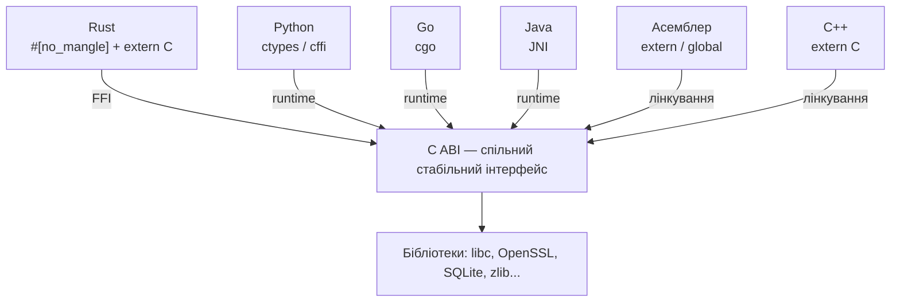
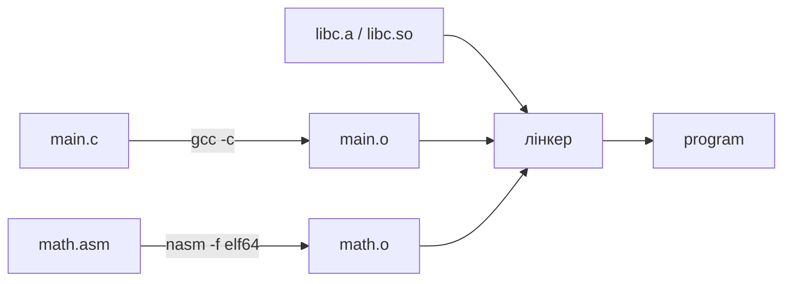
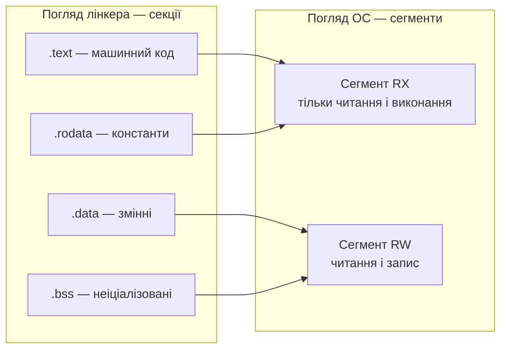
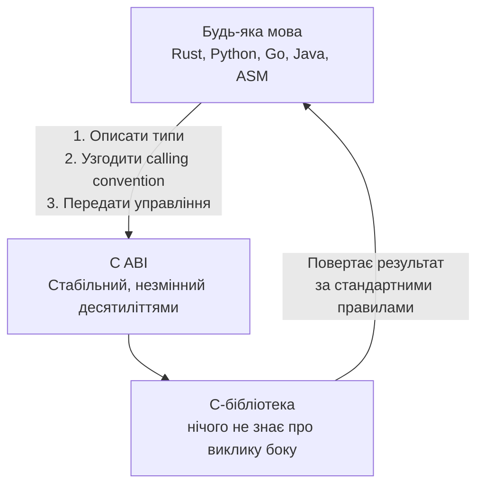

# Лекція 13: Взаємодія Assembler, C та інших мов програмування

## Слайд 1. Асемблер у сучасному програмуванні (~7 хв)

Існує стійке упередження, нібито асемблер — це реліквія минулого, витіснена сучасними компіляторами. Реальна картина суттєво відрізняється. Асемблер продовжує жити у виробничих системах — не як спадщина, а як усвідомлений інструмент для конкретних задач.

Перша причина — продуктивність у критичних ділянках. Компілятор зобов'язаний бути коректним для всіх можливих вхідних даних і тому обирає консервативні рішення. Програміст, що оптимізує конкретну функцію, знає точний контекст: які дані надходять на вхід, які інваріанти виконуються, яка апаратна платформа. Це знання дозволяє вручну підібрати векторні інструкції AVX2 або SSE4, усунути зайві завантаження з пам'яті, розкласти цикл без побоювань порушити загальність. Прискорення у два-п'ять разів порівняно з автоматично згенерованим кодом — реальний результат для задач обробки зображень, шифрування чи стиснення. Ядра бібліотек OpenSSL, libsodium, x264 і FFmpeg містять саме такі ретельно написані ділянки.

Друга причина — апаратний доступ, для якого мова C не має синтаксичних засобів. Інструкція `cpuid` визначає можливості процесора, `rdtsc` зчитує лічильник тактів, інструкції `in` і `out` звертаються до портів вводу-виводу в режимі ядра, `lgdt` і `lidt` завантажують таблиці дескрипторів. Жодну з цих інструкцій не можна виразити у C без асемблера. Операційні системи, гіпервізори, прошивки UEFI і завантажувачі змушені використовувати асемблер для ранньої ініціалізації — не з міркувань швидкості, а тому що іншого шляху немає.

Третя причина — розуміння роботи компілятора. Коли профайлер вказує на повільну функцію, наступний крок — відкрити дизасемблер. Там можна побачити, чому компілятор не векторизував цикл, чи зробив зайвий виклик там, де мав підставити код безпосередньо. Розуміння згенерованого машинного коду дозволяє осмислено застосовувати атрибути оптимізації і налагоджувати поведінку компілятора. Без базових знань асемблера цей аналіз недоступний.

Четверта причина — спадкований код у промисловості й вбудованих системах. Прошивки промислових контролерів, алгоритми реального часу для цифрових сигнальних процесорів, телекомунікаційне обладнання — значна частина цього коду написана у 1980–90-х роках і досі функціонує. Переписувати його дорого й ризиковано, а в сертифікованих галузях — медичній та авіаційній — нерідко заборонено регуляторами. Натомість цей код інтегрується у нові системи через лінкування, і знання правил такої інтеграції стає практичною необхідністю.

---

## Слайд 2. C як lingua franca системного програмування (~5 хв)

Питання не лише в тому, чому асемблер взаємодіє з C, а в тому, чому C посів роль посередника між усіма мовами програмування взагалі. Python, Rust, Go, Java, Ruby — жодна з цих мов не взаємодіє безпосередньо з іншою. Але кожна вміє говорити з C.

Відповідь криється не у красоті мови C і не у її продуктивності. Все вирішує стабільність бінарного інтерфейсу. У C немає перетворення імен символів: функція з ім'ям `open` зберігає у бінарному файлі символ `open` — рівно так, як написав програміст. Немає залежності від рантайм-системи: бібліотека на C не тягне за собою збирач сміття, систему типів чи менеджер пакетів. Правила передачі аргументів зафіксовані стандартом і не змінюються між версіями компілятора чи операційними системами однієї платформи.

Наслідок цієї стабільності — величезна бібліотечна екосистема. Стандартна бібліотека libc, OpenSSL, SQLite, zlib, libpng, libcurl — все це C. Написавши бібліотеку на C один раз, автор отримує доступ до будь-якої мови, що вміє звертатись до C-інтерфейсу. І така можливість є у кожній серйозній мові програмування.

Інакше кажучи, C — це не просто мова, а стандартна шина для між'язикової взаємодії. Розуміти, як ця шина влаштована, означає розуміти основу системного програмування загалом.

---

## Слайд 3. Від вихідного коду до об'єктного файлу (~7 хв)

Перш ніж говорити про виклики між мовами, варто зрозуміти, що відбувається під час компіляції. Компілятор не перетворює вихідний код безпосередньо у виконуваний файл. Він створює проміжний результат — **об'єктний файл**. Це структурований контейнер, що містить скомпільований код і дані, але ще не є готовою програмою.

Чому не готовою? Тому що в момент компіляції окремого файлу компілятор не знає адрес функцій з інших файлів. Якщо `main.c` викликає функцію `calculate`, визначену у `math.c`, компілятор залишає у коді заглушку — місце, куди пізніше буде підставлена правильна адреса. Завдання заповнити ці заглушки лежить на іншому інструменті — **лінкері**.

Об'єктний файл можна уявити як посилку з супровідним листом. Зовні — метадані: для якої платформи, якого типу вміст. Всередині — відсіки з підписами: тут машинний код, тут ініціалізовані дані, тут список символів, тут інструкції лінкеру щодо незаповнених адрес. Ці відсіки називаються **секціями**.

Важлива деталь: один і той самий вихідний файл може породжувати різні об'єктні файли залежно від платформи, прапорів компіляції та цільової архітектури. Об'єктний файл для Linux несумісний з об'єктним файлом для Windows — навіть якщо код написаний однаково і виконується на однаковому процесорі. Причина — різні формати об'єктних файлів, про які мова піде далі.

Варто також розуміти: компіляція і лінкування — два окремих процеси. Компілятор не знає нічого про інші файли проекту. Він обробляє один файл, створює об'єктний файл і зупиняється. Лінкер потім збирає всі об'єктні файли разом і утворює фінальний результат. Цей поділ відповідальності — не технічна деталь, а архітектурне рішення, що дозволяє компілювати лише змінені файли при повторному складанні проекту.

---

## Слайд 4. Анатомія об'єктного файлу: секції (~8 хв)

Кожна секція об'єктного файлу має чітко визначене призначення. Розуміння цього призначення пояснює ряд ефектів, що без цього знання здаються магічними.

Секція **`.text`** містить скомпільований машинний код функцій. Вона призначена тільки для читання і виконання. Операційна система, завантажуючи програму, відображає цю секцію у пам'ять з відповідними правами доступу. Запис у цю ділянку під час виконання неможливий і спричиняє апаратне виключення.

Секція **`.data`** зберігає ініціалізовані глобальні та статичні змінні — ті, що мають конкретне значення, задане на момент компіляції. Глобальна змінна цілого типу зі значенням сорок два займатиме рівно чотири байти у секції `.data` з відповідним вмістом. Ця секція доступна для читання і запису під час виконання.

Секція **`.bss`** призначена для неініціалізованих глобальних змінних. Принципова відмінність: вона займає нульовий обсяг у файлі на диску. У файлі записується лише розмір. Коли операційна система завантажує програму, вона виділяє цей обсяг у пам'яті і самостійно заповнює його нулями. Це доцільна оптимізація: немає сенсу зберігати мільйон нульових байтів у файлі, якщо система й так обнулить їх при завантаженні.

Секція **`.rodata`** — константи тільки для читання. Рядкові літерали, константні глобальні змінні, таблиці перетворення — все це потрапляє сюди. Розміщення констант у секції з правами "тільки читання" запобігає їхній випадковій або навмисній зміні під час виконання.

Крім цих чотирьох основних секцій, в об'єктному файлі присутні службові: таблиця символів, таблиця рядків з іменами символів, таблиця релокацій. Ці секції використовує лінкер під час збирання програми — у фінальний виконуваний файл вони не потрапляють у незмінному вигляді.

Знання секцій пояснює на перший погляд дивний факт: чому оголошення `int x = 0;` і `int x;` поводяться по-різному з точки зору розміру файлу. Перше записує значення у `.data`, займаючи місце у файлі. Друге записується у `.bss`, не займаючи у файлі нічого. Це не деталь реалізації — це визначена поведінка, зафіксована у стандарті і в ABI.

---

## Слайд 5. Таблиця символів і релокації (~7 хв)

Кожен об'єктний файл містить **таблицю символів** — перелік імен із зазначенням їхнього стану. Розуміння цього механізму пояснює цілий клас помилок лінкування.

Символи бувають двох типів: **визначені** і **невизначені**.

Визначений символ означає, що у цьому файлі є реалізація з таким ім'ям. Функція `calculate`, визначена у файлі `math.o`, є визначеним символом цього файлу. Лінкер знає: якщо іншому файлу потрібна функція `calculate` — вона є тут, за певним зміщенням від початку секції `.text`.

Невизначений символ означає, що у файлі є виклик функції або звернення до змінної, визначеної деінде. Якщо `main.o` викликає `printf` — то `printf` буде невизначеним символом у `main.o`. Лінкер шукатиме його у стандартній бібліотеці.

Коли лінкер перебрав усі файли і бібліотеки, але якийсь невизначений символ так і залишився невизначеним — виникає добре знайома помилка "undefined reference to". Знаючи цей механізм, легко зрозуміти її природу: в жодному з переданих лінкеру файлів немає визначення символу з таким ім'ям.

**Релокація** — це запис у таблиці релокацій, що каже лінкеру: "у такому-то місці секції `.text` стоїть посилання на символ `foo` — коли дізнаєшся його адресу, підстав її". Коли компілятор генерує виклик функції, адреса якої ще невідома, він залишає у машинному коді заглушку і записує відповідну релокацію. Лінкер, розмістивши всі секції у пам'яті і знаючи фінальні адреси всіх символів, проходить по таблиці релокацій і **патчить** машинний код — підставляє правильні адреси.

Для динамічних бібліотек частина релокацій відкладається на момент завантаження програми. Їх виконує **динамічний лінкер** — системна бібліотека `ld.so` на Linux. Це дозволяє бібліотекам завантажуватись за будь-якою адресою у пам'яті. Такий підхід отримав назву позиційно-незалежного коду, тобто коду, що не прив'язаний до конкретних адрес завантаження.

---

## Слайд 6. Лінкер: від фрагментів до готового бінарника (~8 хв)

Лінкер — це архітектор фінального бінарного файлу. Він отримує на вхід кілька об'єктних файлів, можливо кілька бібліотек, і будує з них один цілісний результат — виконуваний файл або бібліотеку.

Процес лінкування складається з кількох етапів. Спочатку лінкер збирає всі секції одного типу: усі секції `.text` з усіх файлів об'єднуються в одну велику секцію `.text` у фінальному файлі. Те саме відбувається з `.data` і `.bss`. Потім лінкер призначає кожній секції адресу у пам'яті. Маючи адреси всіх секцій, він знає адреси всіх символів і може заповнити таблиці релокацій, підставивши правильні значення у машинний код.

**Linker script** визначає карту пам'яті фінального бінарника. Це текстовий файл з описом: куди покласти секцію `.text`, звідки починається `.data`, де межа між областями тільки для читання і для запису. У звичайних Linux-програмах лінкер використовує вбудований скрипт за замовчуванням, і програміст навіть не підозрює про його існування.

У вбудованій розробці та при написанні операційних систем кастомні linker scripts — норма. Вони дозволяють розмістити вектори переривань за фіксованою апаратною адресою, наприклад за нульовою адресою при старті мікроконтролера. Або вказати, що певна критична функція має завантажуватись у швидку оперативну пам'ять, а не у Flash-пам'ять з більшими затримками. Без розуміння linker scripts неможливо коректно організувати пам'ять у вбудованій системі.

Лінкер також вирішує задачу включення бібліотек. При обробці статичної бібліотеки він включає до фінального файлу лише ті об'єктні файли з бібліотеки, де є символи, потрібні програмі. Якщо бібліотека містить тисячу функцій, а програма використовує лише три — у виконуваний файл потраплять лише три відповідних об'єктних файли. Це пояснює, чому порядок бібліотек в аргументах лінкера має значення: лінкер обробляє аргументи зліва направо і вирішує питання про включення символів у момент їхньої першої зустрічі.

---

## Слайд 7. Статичне та динамічне лінкування (~7 хв)

Існує два способи пов'язати програму з бібліотеками — статичний і динамічний. Кожен має свої переваги й наслідки, і вибір між ними залежить від конкретних вимог проекту.

**Статичне лінкування** означає, що лінкер копіює у виконуваний файл весь необхідний код із бібліотек. Результат — один самодостатній бінарний файл без зовнішніх залежностей. Перевага очевидна: такий файл запускається на будь-якій сумісній системі незалежно від встановлених бібліотек. Це особливо цінно для інструментів адміністрування, що мають працювати навіть у мінімальному середовищі.

Недолік статичного лінкування — розмір і безпека. Якщо десять програм статично злінковані зі стандартною бібліотекою, у пам'яті присутні десять копій одного коду. Коли у бібліотеці знаходять вразливість, виправлення не зачепить бінарники, зібрані до публікації патча — їх треба перекомпілювати.

**Динамічне лінкування** — стандарт для більшості сучасних систем. У бінарному файлі зберігаються лише імена потрібних бібліотек і символів. При запуску динамічний лінкер `ld.so` знаходить бібліотеки на диску, відображає їх у пам'ять процесу і виконує залишкові релокації. Кілька процесів можуть спільно використовувати одну копію бібліотеки у фізичній пам'яті, що суттєво знижує загальне споживання ресурсів. При оновленні бібліотеки всі залежні програми автоматично отримують виправлення.

Команда `ldd` показує список динамічних залежностей виконуваного файлу — саме ці файли шукатиме `ld.so` при запуску. Якщо одна з бібліотек не знайдена — програма не запуститься з відповідним повідомленням.

На практиці вибір між статичним і динамічним лінкуванням часто диктується контекстом. Контейнеризовані застосунки нерідко зберуть бінарник статично, щоб зменшити залежність від образу контейнера. Системні бібліотеки загального призначення завжди динамічні.

---

## Слайд 8. ELF: формат для Linux і Unix-систем (~8 хв)

Об'єктний файл — це не просто послідовність байтів машинного коду. Це структурований контейнер, формат якого визначає, як лінкер і операційна система інтерпретують його вміст. Різні операційні системи використовують різні формати.

**ELF** — Executable and Linkable Format — є стандартом для Linux, Android, FreeBSD і більшості Unix-подібних систем. З'явившись у 1990-х роках, він замінив кілька несумісних форматів і досі залишається актуальним. Одна з головних переваг ELF — універсальність: один і той самий формат описує об'єктний файл після компіляції, виконуваний файл після лінкування і динамічну бібліотеку. Тип файлу записаний у заголовку, і системні інструменти зчитують його першим ділом.

Концептуально важлива особливість ELF — два різних погляди на один і той самий файл.

**Погляд лінкера** — це секції: маленькі іменовані блоки з різним призначенням і атрибутами. **Погляд операційної системи** — це сегменти: великі блоки пам'яті з правами доступу, у які упаковані секції. Коли програміст компілює код, він працює у термінах секцій. Коли програма запускається і ОС відображає файл у пам'ять, вона оперує сегментами.

У виконуваний сегмент "тільки для читання і виконання" потрапляє і машинний код, і рядкові константи. У сегмент "читання і запис" — змінні й ініціалізовані дані. Це не лише організаційне рішення, а й безпека на рівні архітектури: якщо код і дані розміщені у різних сегментах із різними правами, записати щось у ділянку виконуваного коду неможливо. Спроба такого запису спричиняє апаратне виключення ще до того, як шкідлива інструкція встигне виконатись.

---

## Слайд 9. PE та Mach-O: формати Windows і macOS (~7 хв)

Поряд із ELF існують два інших широко розповсюджені формати — PE для Windows і Mach-O для macOS. Розуміння їхньої специфіки допомагає краще орієнтуватись у між'язиковій взаємодії на цих платформах.

**PE**, від Portable Executable, є форматом усіх виконуваних файлів і бібліотек Windows: файли з розширеннями `.exe`, `.dll` і `.sys`. Перше, що привертає увагу при відкритті будь-якого PE-файлу — невелика DOS-програма на початку. Вона виводить повідомлення про неможливість запуску у DOS-режимі і завершується. Це реліктовий шар сумісності з епохи, коли DOS і Windows існували паралельно і один файл міг опинитись у будь-якій з систем. Сьогодні ця програма — лише ритуальний артефакт у кожному Windows-бінарнику.

За DOS-заголовком іде власне PE-структура. Принципова відмінність від ELF — явний **список імпортів** і **список експортів**. Список імпортів перелічує, які функції і з яких DLL потрібні цій програмі. При запуску Windows читає цей список і завантажує всі зазначені бібліотеки. Якщо одна не знайдена — програма не запускається. Список експортів містить функції, що бібліотека надає зовнішньому коду.

**Mach-O** — формат macOS і iOS. Структурно він схожий на ELF, але має унікальну особливість — підтримку кількох архітектур в одному файлі. Коли Apple переходила з архітектури PowerPC на Intel у 2006 році, а потім з Intel на власні процесори M1 у 2020 році, перед розробниками постало питання: як поширювати програму, що однаково добре працює на обох архітектурах? Рішення Apple — **Universal Binary**, або "товстий бінарник". Один файл програми всередині містить два повноцінних варіанти: для Intel і для ARM. Операційна система при запуску самостійно обирає потрібний, і для кінцевого користувача це абсолютно прозоро.

Mach-O використовує концепцію команд завантаження — список інструкцій для системного завантажувача: які сегменти відображати у пам'ять, де знайти динамічний лінкер, звідки починати виконання, які зовнішні бібліотеки потрібні. Це гнучкіша модель, ніж фіксована структура PE, але вирішує ту саму фундаментальну задачу.

---

## Слайд 10. Інструменти аналізу бінарних файлів (~5 хв)

Теорія стає практичною, коли є інструменти для безпосереднього спостереження. На Linux для роботи з ELF-файлами є три утиліти, що регулярно використовуються у повсякденній роботі системного програміста.

**`nm`** — найпростіший спосіб переглянути таблицю символів. Виводить список: ім'я символу, його тип і розташування. Тип позначається буквою: `T` означає функцію у секції коду, `D` — змінну у секції даних, `U` — невизначений символ, що очікує лінкера. Якщо виникла помилка "undefined reference" — перший крок полягає у тому, щоб запустити `nm` на підозрілому об'єктному файлі і перевірити, чи є там потрібний символ із типом `T`.

**`readelf`** — повноцінний інспектор ELF-файлу. Покаже заголовок, список секцій із розмірами та атрибутами, таблицю символів у деталях, таблицю релокацій із переліком місць, де лінкер підставлятиме адреси. Якщо `nm` — це погляд з висоти, то `readelf` — погляд під мікроскопом.

**`objdump`** — швейцарський ніж серед цих інструментів. Крім усього, що вміє `readelf`, він дизасемблює машинний код назад у читабельні інструкції. Це незамінно, коли треба перевірити, що саме згенерував компілятор, чи відбулась оптимізація, або де саме програма поводиться несподівано.

Для роботи з C++-символами знадобиться четвертий інструмент — **`c++filt`**. Він приймає спотворене ім'я символу і повертає читабельну форму: наприклад, `_ZN10Calculator3addEii` перетворюється на `Calculator::add(int, int)`. Прапор `-C` у команди `nm` виконує те саме автоматично. Це перше, що варто зробити при дебагу C++-бінарника через таблицю символів — замість того щоб намагатись читати закодовані рядки очима.

---

## Слайд 11. Угода про виклик: принципи і необхідність (~7 хв)

Лінкер вирішує задачу адрес: він знає, де знаходиться кожна функція. Але є інша задача, яку лінкер не вирішує: коли одна функція викликає іншу — як передаються аргументи? Де чекати результату? Хто зберігає регістри, щоб їхній вміст не зник після виклику? Хто прибирає дані зі стека після повернення? Ці питання регулює **угода про виклик**, або **calling convention**.

Корисна аналогія: двоє людей домовились зробити справу разом, але не обговорили деталей. Один приніс матеріали і поклав їх ліворуч від дверей. Другий прийшов і пошукав їх праворуч — нічого немає. Обидва зробили все правильно зі своєї точки зору, але взаємодія провалилась. Те саме відбувається з функціями: якщо викликаючий код кладе перший аргумент у регістр `rdi`, а функція очікує знайти його у `rcx` — нічого не спрацює.

Calling convention відповідає на чотири запитання. Перше: де передаються аргументи — у яких регістрах або на стеку. Друге: де повертається результат — у якому регістрі. Третє: хто зберігає регістри — чи може функція вільно змінювати будь-який регістр, або зобов'язана відновити певні з них перед поверненням. Четверте: хто прибирає стек — якщо аргументи передавались через стек, хто видаляє їх після виклику.

Важливо розуміти: calling convention — це угода між людьми, тобто між авторами компіляторів, операційних систем і стандартів. Це не частина архітектури процесора. Процесор нічого не знає про аргументи чи результати — він знає лише про регістри й інструкції. Calling convention — це рівень вище: домовленість про те, як ці регістри використовуються у конкретній екосистемі.

Наслідок: якщо код написаний на ASM і повинен взаємодіяти з C, він мусить дотримуватись тієї самої угоди, що і C-компілятор для цієї платформи. Якщо угода порушена, наслідки непередбачувані: програма може падати, повертати неправильні значення або непомітно псувати дані. Помилка часто виникає не в тому місці, де угода порушена, а деінде — що суттєво ускладнює діагностику.

---

## Слайд 12. System V AMD64 ABI — Linux та macOS (~8 хв)

На Linux і macOS діє **System V AMD64 ABI** — відкритий стандарт, прийнятий на початку 2000-х років. Його дотримуються GCC, Clang і будь-який інший компілятор для цих платформ. Знання цього стандарту є обов'язковим для написання коректного асемблерного коду, що взаємодіє з C.

**Передача аргументів.** Перші шість цілочисельних аргументів і вказівників передаються через регістри у фіксованому порядку: перший аргумент у `rdi`, другий у `rsi`, третій у `rdx`, четвертий у `rcx`, п'ятий у `r8`, шостий у `r9`. Сьомий і наступні аргументи кладуться на стек у зворотному порядку — останній аргумент виштовхується першим. Для аргументів із плаваючою комою діє окрема черга: регістри `xmm0` через `xmm7`. Вони не перетинаються з цілочисельними, тому функція може одночасно отримати три цілі числа через `rdi`, `rsi`, `rdx` і два числа з плаваючою комою через `xmm0`, `xmm1`.

**Повернення результату.** Цілочисельний або вказівниковий результат повертається у регістрі `rax`. Якщо результат 128-бітний — використовуються `rax` і `rdx` разом. Результат із плаваючою комою повертається у `xmm0`.

**Збереження регістрів.** ABI розрізняє дві групи. **Caller-saved регістри** — ті, що функція може вільно змінювати без збереження: `rax`, `rcx`, `rdx`, `rsi`, `rdi`, `r8`-`r11` і всі `xmm`-регістри. Якщо викликаючий код зберігає у `rdi` важливе значення, він сам мусить його врятувати перед викликом. **Callee-saved регістри** — ті, що функція зобов'язана відновити перед поверненням: `rbx`, `rbp`, `r12`-`r15`. Якщо функція хоче використати `rbx` для власних потреб, вона зберігає його на початку і відновлює наприкінці.

Чому саме такий поділ? Це компроміс між зручністю для коротких функцій і надійністю для довгих. Короткі функції не зберігають зайвих регістрів — caller-saved регістри вільні для використання. Тривалі обчислення зберігають проміжні результати у callee-saved регістрах і не турбуються про те, що вкладені виклики їх знищать.

**Вирівнювання стека.** Перед кожною інструкцією `call` стек мусить бути вирівняний на 16 байтів. Інструкція `call` кладе на стек 8-байтову адресу повернення, зміщуючи вирівнювання на 8. Тому на початку функції виконується `push rbp` — ще 8 байтів, і вирівнювання відновлюється до 16. Це не випадковість — це частина угоди. Порушення правила призводить до помилки при виконанні SIMD-інструкцій, що вимагають вирівняного доступу до пам'яті.

**Red zone.** На Linux існує особлива область — 128 байтів нижче поточного значення вказівника стека `rsp`, що можна вільно використовувати без явного резервування. Нікого немає, хто б перезаписав цей простір у звичайному контексті виконання. Тому функції без вкладених викликів можуть зберігати тут локальні змінні, не витрачаючи інструкцій на модифікацію `rsp`. Умова одна: щойно функція виконує виклик іншої функції, red zone стає недійсною — викликана функція може її перезаписати. Red zone призначена виключно для листкових функцій.

---

## Слайд 13. Windows x64 ABI — відмінності та пастки (~7 хв)

Windows використовує власну угоду про виклик, і вона відрізняється від System V у кількох принципових місцях. Код, написаний для Linux, не буде коректно працювати на Windows без змін, і навпаки. Якщо зустрічається завдання написати кросплатформний асемблерний код — ці відмінності треба знати напам'ять.

**Аргументи.** На Windows перші чотири цілочисельних аргументи передаються через регістри `rcx`, `rdx`, `r8`, `r9` — а не `rdi`, `rsi`, `rdx`, `rcx` як на Linux. Тобто перший аргумент іде у `rcx`, а не у `rdi`. Асемблерний код, що коректно приймає аргументи на Linux, на Windows прочитає значення не з тих регістрів і отримає некоректні дані.

**Shadow space.** На Windows викликаючий код зобов'язаний зарезервувати на стеку 32 байти перед кожним викликом. Це так зване тіньове місце — чотири слоти по вісім байтів для можливого збереження чотирьох регістрових аргументів. Функція, яку викликають, може або не може використовувати ці слоти — але місце має бути виділене завжди. Якщо це місце не виділене, а викликана функція вирішила скористатись ним — вона перезапише дані викликаючого коду. На Linux нічого схожого немає.

**Callee-saved регістри.** На Windows список ширший: `rbx`, `rbp`, `rdi`, `rsi`, `r12`-`r15` і частина `xmm`-регістрів від `xmm6` до `xmm15`. Варто звернути увагу: `rdi` і `rsi` на Windows є callee-saved регістрами, і функція зобов'язана їх зберегти. На Linux вони передають перші два аргументи і є caller-saved. Це одна з найпоширеніших пасток при портуванні асемблерного коду між платформами.

**Відсутність red zone.** На Windows концепції red zone не існує. Будь-яке використання пам'яті нижче вказівника стека без явного декременту є некоректним і може призвести до непередбачуваних наслідків при обробці виключень або асинхронних переривань.

Стандартний підхід для кросплатформного коду полягає у тому, щоб оточувати платформо-залежні секції умовними директивами компіляції і явно документувати, яка угода діє в кожному місці.

---

## Слайд 14. Перетворення імен символів і extern "C" (~8 хв)

Лінкер зіставляє символи за іменами. Але що саме є ім'ям символу — залежить від мови. Тут починається один із найпідступніших класів помилок лінкування.

У мові C все просто: функція `add` зберігається у таблиці символів під ім'ям `add`. Лінкер знаходить її там за цим ім'ям. У C++ ситуація складніша.

**Перевантаження функцій** — можливість мати кілька функцій з однаковим ім'ям, але різними типами аргументів — є особливістю C++, якої у C немає. Функції `add(int, int)` і `add(double, double)` — це дві різні функції з однаковим ім'ям. Але лінкер оперує символами, і символи мусять бути унікальними рядками. Покласти обидві під ім'ям `add` неможливо — лінкер не розрізнить їх.

Рішення: компілятор C++ кодує у символі не лише ім'я, а й типи аргументів. Цей процес називається **name mangling** — перетворення імені. Функція `add(int, int)` у глобальному просторі імен стає символом `_Z3addii`. Тут `_Z` — маркер C++-символу, `3` — довжина слова "add", `ii` — два аргументи типу `int`. Якщо функція належить до простору імен `math`, символ стає `_ZN4math3addEii`. Метод класу `Calculator::add` породжує ще довший рядок, де закодовано і клас, і метод, і аргументи. Конкретний алгоритм залежить від компілятора: GCC і Clang на Linux використовують Itanium ABI, MSVC — власний несумісний алгоритм.

**Практичний наслідок**: якщо асемблерний файл оголошує зовнішній символ `add`, розраховуючи знайти C++-функцію з таким ім'ям, лінкер повертає помилку. Бо у C++-об'єктному файлі ця функція лежить під ім'ям `_Z3addii`, а не `add`. Ці два рядки різні — лінкер не вважає їх одним символом.

Рішення — директива **`extern "C"`** у C++-коді. Вона інструктує компілятор помістити символ у таблицю без перетворення, рівно так само як це зробив би C-компілятор. Після цього символ у таблиці — просто `add`, і будь-який код знайде його без проблем.

Для бібліотек, доступних як із C, так і з C++, існує усталений прийом: у заголовковому файлі весь публічний інтерфейс обгортається умовним блоком. Якщо заголовок підключає C++-код — блок активний, символи кладуться без перетворення. Якщо підключає C-код — блок ігнорується. Цей прийом зустрічається у кожній C-бібліотеці, розрахованій на використання з C++.

`extern "C"` знімає перетворення імені, але не дозволяє перевантаження. Дві функції `extern "C"` з однаковим ім'ям і різними аргументами неможливі — лінкер побачить два визначення одного символу.

**Name mangling у Rust.** Rust також застосовує перетворення імен і додає до символу хеш, унікальний для конкретної версії компіляції. Це зроблено навмисно: Rust не гарантує стабільний ABI між версіями компілятора, і хеш захищає від випадкового злінкування несумісних версій однієї бібліотеки. Атрибут `#[no_mangle]` у Rust є прямим аналогом `extern "C"` у сенсі "не змінюй ім'я символу".

Swift, D, Fortran — у кожної мови власний алгоритм перетворення. Але C залишається єдиною мовою, де символи зберігають ім'я без змін. Тому `extern "C"` є не просто директивою для C++, а універсальним роз'ємом для підключення будь-якої мови до будь-якої іншої через спільний C ABI.

---

## Практика міжмовної взаємодії: ASM, C, Rust, Python, Go, Java (~12 хв)

Маючи розуміння форматів, символів, угод про виклик і перетворення імен, можна розглянути, як ця теорія реалізується у конкретних мовах.

### Слайд 16. ASM ↔ C: три режими взаємодії

Взаємодія між ASM і C відбувається у трьох режимах, і кожен має свою типову область застосування.

**Режим перший: C викликає ASM-функцію.** Це найпоширеніший сценарій — критична функція реалізована вручну на асемблері, а решта коду написана на C. З боку C потрібно оголосити прототип із ключовим словом `extern`, щоб компілятор знав сигнатуру і не шукав реалізацію у C-файлах. З боку ASM функцію потрібно оголосити глобальним символом, щоб лінкер її побачив, і реалізувати з дотриманням calling convention: перший аргумент з `rdi`, другий з `rsi`, результат у `rax`. Лінкер з'єднає виклик і визначення. З точки зору C-коду ця функція нічим не відрізняється від звичайної.

**Режим другий: ASM викликає C-функцію.** Асемблерний код оголошує потрібну C-функцію як зовнішній символ. Лінкер знайде її у об'єктному файлі або бібліотеці. Перед викликом необхідно підготувати аргументи у правильних регістрах, забезпечити вирівнювання стека на 16 байтів і врахувати особливості variadic-функцій: для виклику `printf` регістр `al` має містити кількість векторних аргументів, переданих через `xmm`-регістри. Якщо там виявиться ненульове значення, `printf` спробує читати векторні аргументи з `xmm`-регістрів, де лежить сміття.

**Режим третій: вбудований асемблер у C.** GCC і Clang підтримують синтаксис extended inline asm — вставку асемблерних інструкцій безпосередньо у C-код. Такий підхід доречний для поодиноких привілейованих інструкцій: `cpuid`, `rdtsc`, операцій із портами вводу-виводу, конкретних атомарних операцій. Для великих блоків оптимізованого коду набагато зручніше й надійніше виносити їх у окремий ASM-файл, де весь контекст зрозумілий.

### Слайд 17. Rust FFI

Rust побудований навколо безпеки пам'яті, і це одразу створює напругу при взаємодії з C, де таких гарантій немає. Тому Rust маркує виклик зовнішнього C-коду як `unsafe` — не тому що C завжди небезпечний, а тому що компілятор Rust не може перевірити інваріанти на тому боці межі. Це явна позначка: тут відповідальність за коректність лежить на програмісті.

Для виклику C-функцій з Rust їх оголошують у блоці `extern "C"` — прямий аналог C-декларації. Щоб зробити Rust-функцію доступною для C, використовують атрибут `#[no_mangle]` разом з `extern "C"` в оголошенні. Перший усуває перетворення імені, другий вказує використовувати C calling convention замість Rust-власного.

Типи мусять відповідати: `i32` у Rust відповідає `int32_t` у C. Для структур необхідний атрибут `#[repr(C)]`, що гарантує збіг розташування полів у пам'яті з тим, що очікує C-код. Для великих FFI-інтерфейсів існує інструмент `bindgen` — він читає C-заголовковий файл і автоматично генерує Rust-оголошення для всіх функцій і типів.

### Слайд 18. Python: ctypes і cffi

Python не має фази лінкування, але може завантажити `.so`-бібліотеку прямо під час виконання і викликати звідти C-функції. Для цього є два підходи.

**ctypes** — стандартна бібліотека без жодних зовнішніх залежностей. Принцип: завантажити бібліотеку, описати типи аргументів і тип результату, викликати. Якщо типи не описані, Python не знає, як правильно передати байти на стек. Без явного вказання типу результату Python за замовчуванням вважає, що функція повертає ціле число — що спрацює для простих випадків, але призведе до помилки для функцій, що повертають число з плаваючою комою або вказівник.

**cffi** — більш потужний інструмент, популярний у сучасних проектах. Він дозволяє передати C-заголовок у вигляді рядка, і cffi самостійно розбирає типи. При великому інтерфейсі можна скопіювати вміст заголовкового файлу замість того, щоб описувати кожну функцію вручну.

Обидва підходи об'єднує одне: вони не вимагають жодних змін у C-бібліотеці. Бібліотека не знає, що її викликає Python, а не C — вона отримує правильні аргументи і повертає результат.

### Слайд 19. Go cgo

Go має вбудований механізм виклику C-коду — **cgo**. Він активується автоматично, якщо у Go-файлі є спеціальний коментар безпосередньо перед підключенням псевдопакету `C`. Цей псевдопакет надає доступ до C-функцій і типів.

Але cgo має репутацію дорогого механізму. Перехід між Go і C — це перехід між двома різними рантаймами зі своїми стеками і правилами управління пам'яттю. Go використовує горутинні стеки, що ростуть динамічно. C очікує фіксований стек. Кожен виклик через cgo коштує значно більше, ніж звичайний Go-виклик. Тому у Go-спільноті є правило: cgo застосовується для важких операцій, де вартість переходу незначна на тлі обсягу роботи всередині C-коду. Для дрібних викликів у циклі вигідніше переписати логіку безпосередньо на Go.

### Слайд 20. Java JNI

Java Native Interface — механізм виклику C і C++ з Java та у зворотному напрямку. Він найскладніший із розглянутих, оскільки JVM вносить додатковий шар: об'єкти Java живуть у купі під управлінням збирача сміття. При передачі об'єкта у C-код треба обережно керувати посиланнями, щоб збирач сміття не прибрав об'єкт, поки C-код ним користується.

Щоб викликати C-функцію з Java, потрібно оголосити `native`-метод у Java-класі, скомпілювати клас, згенерувати C-заголовок і реалізувати функцію у C з точно заданим ім'ям за шаблоном, що включає пакет, клас і метод. Лише після цього JVM зможе знайти і викликати потрібну функцію. Через складність і накладні витрати JNI використовують точково — там де немає альтернативи: доступ до апаратного API або критичні числові обчислення.

### Слайд 21. Спільний знаменник

Попри різні синтаксиси і механізми, всі мови реалізують одну ідею: кожна будує тонкий міст до C ABI. Описує типи. Узгоджує calling convention. Передає управління. C-бібліотека нічого про це не знає — вона отримує аргументи і повертає результат за правилами, що не змінювались десятиліттями. Саме ця незмінність і робить C ABI таким цінним: написавши бібліотеку один раз, автор отримує доступ до екосистеми будь-якої мови, що вміє говорити з C.

---

**Ключова ідея лекції:** усі мови у кінцевому підсумку стають об'єктними файлами. Якщо вони дотримуються одних і тих самих правил — ABI, calling convention, формат символів — вони можуть взаємодіяти. Асемблер, C, C++, Rust, Python, Go і Java говорять різними синтаксисами, але спілкуються через один і той самий бінарний інтерфейс. Розуміння цього інтерфейсу — це розуміння того, як насправді влаштоване програмне забезпечення на найнижчому рівні.
