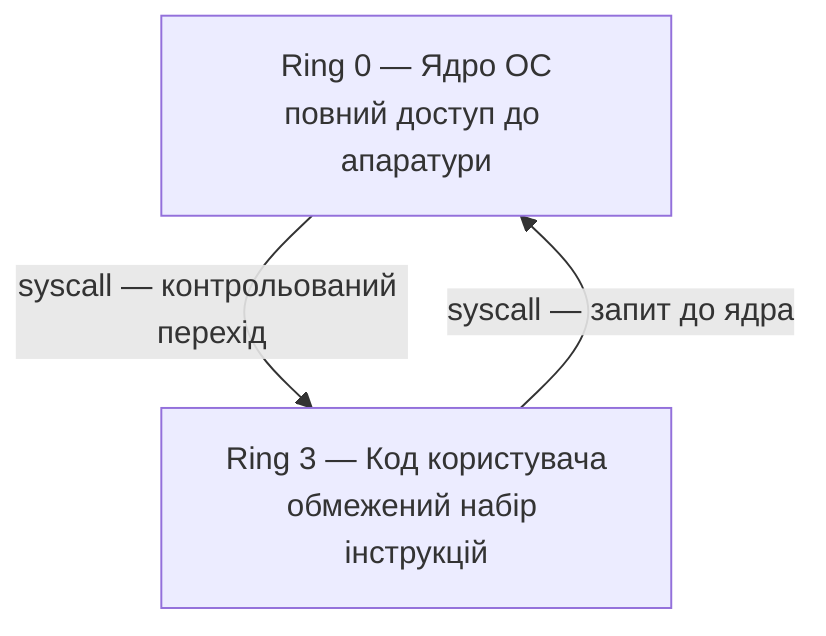
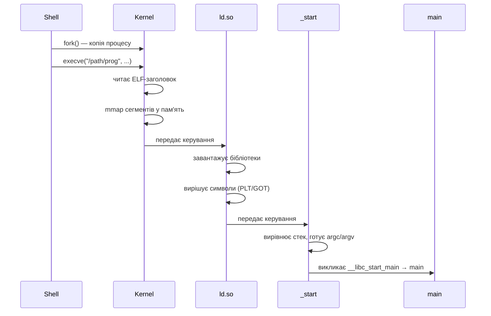
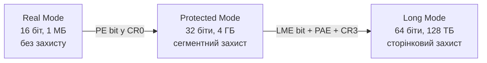
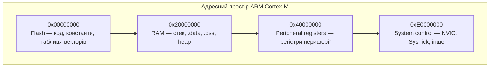
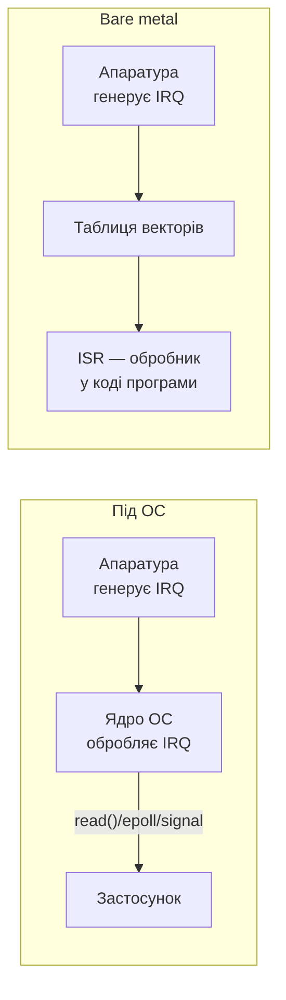
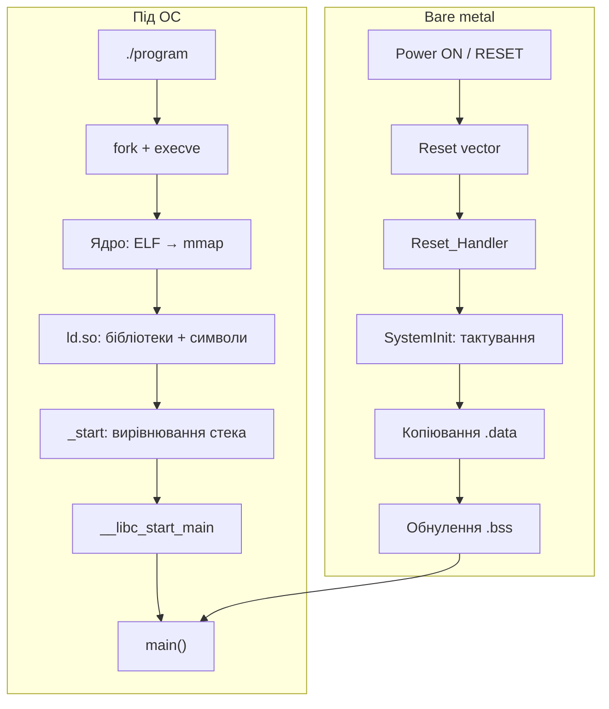

# Лекція 14. Виконання програм: операційна система та голе залізо

## Слайд 1. Вступ: два світи низькорівневого програмування (~5 хв)

Програміст, який пише код на C або асемблері, живе водночас у двох різних світах. Перший — це виконання під операційною системою, де є зручна абстракція: пам'ять, файли, процеси. Другий — це голе залізо, де жодних абстракцій немає взагалі, і перший рядок коду виконується ще до того, як існує навіть поняття стека.

Мета цієї лекції — провести чіткий міст між цими двома світами. Розуміння обох дає цілісну картину того, як насправді виконується програма — від підключення живлення або удару по клавіші Enter до завершення останньої інструкції.

Тема побудована від простого до складного. Починається з того, як операційна система запускає програму, через механізм системних викликів — до режимів роботи процесора і повного розбору запуску без операційної системи.

## Слайд 2. Простір користувача і простір ядра (~10 хв)

Будь-яка сучасна операційна система поділяє пам'ять і виконання на два принципово різних рівні.

Перший — **простір ядра**. Тут виконується код операційної системи. Ядро має повний доступ до апаратури: до пам'яті, до пристроїв вводу-виводу, до налаштувань процесора. Тут немає обмежень.

Другий — **простір користувача**. Тут виконується звичайна програма. Вона існує в ізольованому середовищі. Вона не може напряму торкнутись диска, мережевої карти чи будь-якого іншого пристрою. Не може прочитати пам'ять іншого процесу. Навіть вимкнути переривання — і то не може.

Ця ізоляція — не обмеження заради обмеження. Це захист: від помилок, від зловмисного коду, від одного процесу, що руйнує роботу іншого.

Розподіл між цими двома рівнями реалізується апаратно через механізм привілеїв — ще до будь-якого програмного забезпечення. Про нього мова в наступному розділі.

## Слайд 3. Кільця привілеїв (~10 хв)

Архітектура x86-64 визначає чотири рівні привілеїв — їх прийнято називати кільцями, від нуля до трьох.

Нульове кільце — найвищий рівень. Тут виконується ядро операційної системи. Тут доступні абсолютно всі інструкції процесора. Можна зупинити процесор, переналаштувати таблиці пам'яті, звернутись до будь-якого апаратного ресурсу.

Третє кільце — найнижчий рівень. Тут виконується звичайний код програми. Доступний лише безпечний підмножина інструкцій. Кільця перше і друге сучасні операційні системи практично не використовують.

Різниця між кільцями — принципова. Якщо код у третьому кільці спробує виконати привілейовану інструкцію — наприклад, зупинити процесор або записати в системний регістр — процесор генерує виключення, і операційна система завершує процес.

Перехід між третім і нульовим кільцями — можливий. Але він контрольований. Не можна довільно «зістрибнути» в ядро. Процесор перевіряє спеціальну таблицю і дозволяє перехід лише через зареєстровану ядром точку входу. Саме цей механізм і є системним викликом.

## Слайд 4. Системні виклики: міст між програмою і ядром (~15 хв)

Системний виклик — це єдиний законний спосіб, яким програма у просторі користувача може попросити ядро зробити щось від її імені.

Відкрити файл, записати байти на диск, отримати поточний час, створити новий процес — все це виконує ядро, а не програма безпосередньо. Програма лише надсилає запит.

На x86-64 механізм такий: програма кладе номер потрібного системного виклику в регістр `rax`, аргументи — у шість інших регістрів, і виконує інструкцію `syscall`. Процесор перемикається з кільця три в кільце нуль і передає керування ядру. Ядро виконує запит, записує результат знову у `rax` і повертає керування програмі.

Важлива деталь: набір регістрів для передачі аргументів у системних викликах дещо відрізняється від звичайних функцій. Четвертий аргумент передається через регістр `r10`, а не `rcx`. Причина технічна: при виконанні `syscall` процесор сам використовує `rcx` для збереження адреси повернення.

Номери системних викликів — фіксовані і гарантовано стабільні для конкретної архітектури. Це частина так званого стабільного ABI ядра Linux. Наприклад, виклик `write` завжди має номер один, `read` — нуль, `exit` — шістдесят. Ці числа не зміняться навіть із оновленням ядра. Але на ARM або RISC-V ті самі виклики матимуть інші номери.

Коли системний виклик завершується помилкою, `rax` містить від'ємне значення — це від'ємний числовий код помилки. Функції стандартної бібліотеки libc перевіряють цей діапазон і встановлюють глобальну змінну `errno`. При прямому використанні системних викликів перевірку на помилку треба виконувати самостійно.

Утиліта `strace` дозволяє побачити всі системні виклики, які виконує програма. Вона виводить назву виклику, аргументи і повернений результат. Це надзвичайно корисно: видно, скільки разів програма звертається до диска, які файли відкриває, де блокується. Розуміння системних викликів на рівні асемблера робить результати `strace` повністю зрозумілими без додаткових пояснень.

Існує одна оптимізація, варта окремої згадки: для деяких дуже часто викликаних операцій — зокрема, отримання поточного часу — перехід у ядро є занадто дорогим. Кількасот тактів на кожен виклик. Ядро Linux вирішує цю проблему через механізм vDSO, скорочення від Virtual Dynamic Shared Object. Ядро відображає у адресний простір кожного процесу невелику бібліотеку, яка виконується вже у просторі користувача і читає дані зі спільної сторінки пам'яті. Виклик функції `clock_gettime` з коду на C може взагалі не виконувати жодного переходу у ядро.

## Слайд 5. Формат ELF: що всередині виконуваного файлу (~10 хв)

Перш ніж розглядати запуск програми, варто зрозуміти, що саме зберігається у виконуваному файлі на Linux. Цей формат називається ELF — Executable and Linkable Format.

Кожен ELF-файл починається з чотирьох магічних байтів: `0x7F`, після яких іде латинські літери `E`, `L`, `F`. За ними — заголовок, який описує все необхідне для завантаження: архітектуру, для якої зібрано файл, тип файлу — виконуваний, бібліотека чи об'єктний, адресу точки входу, де знаходяться описи сегментів.

Ключова структура в ELF — це таблиця заголовків програми, або program headers. Кожен такий заголовок описує сегмент: неперервну область файлу, яку треба помістити у пам'ять. Найважливіші типи сегментів такі.

Сегмент типу `PT_LOAD` підлягає завантаженню в пам'ять. Типова програма має два таких сегменти: один для коду з правами на читання і виконання, інший для даних з правами на читання і запис.

Сегмент типу `PT_INTERP` містить шлях до динамічного лінкера. Його наявність означає, що програма використовує зовнішні бібліотеки і потребує їх завантаження.

Ядро читає ці заголовки і на їх основі організовує пам'ять процесу. Власне виконання починається не одразу — між читанням ELF і першою інструкцією `main` відбувається кілька важливих кроків.

## Слайд 6. Як операційна система запускає програму (~15 хв)

Запуск програми виглядає тривіально: надрукував назву і натиснув Enter. Але між натисканням і виконанням першої інструкції `main` відбувається складна послідовність дій.

Коли оболонка отримує команду запустити програму, вона не перетворюється на неї. Вона викликає системний виклик `fork`, який створює точну копію поточного процесу. Дочірній процес одразу викликає `execve` з шляхом до програми. Системний виклик `execve` замінює образ поточного процесу на вміст зазначеного файлу. Після цього від дочірнього процесу оболонки не залишається нічого — тільки нова програма з тим самим ідентифікатором процесу.

Ядро отримує керування і першим ділом дивиться на магічні байти файлу, щоб визначити формат. Для ELF воно читає заголовок, знаходить таблицю program headers і для кожного сегменту типу `PT_LOAD` викликає `mmap`. Файл не копіюється у пам'ять фізично — він відображається: сторінки завантажуватимуться лише тоді, коли процесор до них вперше звернеться.

Адресний простір процесу після цього виглядає передбачувано: код програми розміщується за нижніми адресами, над ним ініціалізовані і неініціалізовані глобальні дані, далі купа для динамічних виділень пам'яті, відображені бібліотеки, і зверху — стек, що росте донизу.

Для так званих PIE-файлів — Position Independent Executable — ядро обирає базову адресу випадково при кожному запуску. Цей механізм називається ASLR, Address Space Layout Randomization. Він ускладнює атаки, які покладаються на знання конкретних адрес у пам'яті процесу.

Якщо у файлі є сегмент `PT_INTERP`, ядро відображає у пам'ять ще й динамічний лінкер і передає керування йому, а не самій програмі. Саме динамічний лінкер стає фактично першим кодом, який виконується від імені нового процесу.

## Слайд 7. Динамічний лінкер і вирішення символів (~10 хв)

Динамічний лінкер — це системна бібліотека `ld.so`, яка запускається до будь-якого коду самої програми. Її завдання — з'єднати всі частини.

Перший крок: читання таблиці залежностей із ELF. Там перелічено всі бібліотеки, які потрібні програмі — наприклад, `libc.so.6` чи `libpthread.so.0`. Лінкер знаходить ці бібліотеки у стандартних каталогах або за шляхами з змінної середовища `LD_LIBRARY_PATH`, після чого відображає кожну у адресний простір процесу.

Другий крок: вирішення символів. Програма на етапі компіляції не знає, за якою адресою знаходиться функція `printf` у `libc.so`. Натомість у бінарнику є спеціальна структура — таблиця глобальних зміщень, відома як GOT. Динамічний лінкер заповнює цю таблицю реальними адресами функцій.

Після цього лінкер передає керування на точку входу самого виконуваного файлу.

Саме тут криється пояснення дії змінної середовища `LD_PRELOAD`. Якщо вона вказана, динамічний лінкер завантажує задану бібліотеку першою. При вирішенні символів знайшовши функцію `malloc` у ній, він більше не шукає далі. Так одна бібліотека може підмінити функції іншої — цілком законним способом.

## Слайд 8. _start і що відбувається до main (~10 хв)

Точка входу ELF-файлу вказує не на `main`. Вона вказує на функцію `_start`, яку додає лінкер з об'єктного файлу `crt0.o` — скорочення від C runtime. Цей файл написаний на асемблері і автоматично долучається при збірці будь-якої C-програми.

`_start` виконує мінімальну, але критичну підготовку: обнуляє вказівник на фрейм стека відповідно до вимог ABI, дістає зі стека кількість аргументів і вказівники на них, вирівнює стек до шістнадцяти байт — як вимагає System V AMD64 ABI — і викликає функцію `__libc_start_main`.

Тут варто зупинитись і пояснити поняття ABI. Application Binary Interface — це набір угод про те, як на рівні машинного коду взаємодіють між собою компоненти. В яких регістрах передаються аргументи. Хто зберігає які регістри. Як вирівнюється стек. Як повертаються значення. ABI для бінарного коду — те саме, що API для вихідного. Якщо два компоненти дотримуються одного ABI, вони можуть взаємодіяти навіть якщо написані різними мовами або скомпільовані різними компіляторами.

Функція `__libc_start_main` завершує підготовку: реєструє функції для виклику при завершенні, запускає конструктори глобальних об'єктів, і лише після цього викликає `main`. Після повернення з `main` вона запускає деструктори і завершує процес.

Ця ланцюжок пояснює кілька практичних питань. Чому не можна просто «стрибнути на `main`» зовнішнім кодом? Тому що стек не вирівняний, аргументи не підготовлені, глобальні конструктори не викликані. Програма впаде або поведеться непередбачувано.

Чому статично скомпоновані програми запускаються швидше? Тому що відсутній крок роботи динамічного лінкера — не треба знаходити і відображати бібліотеки, вирішувати символи. Для коротко живучих утиліт це суттєво.

## Слайд 9. Режими роботи процесора x86 (~15 хв)

Коли сучасний x86-64 процесор вмикається, він не одразу опиняється у знайомому 64-бітному середовищі. Він проходить через кілька режимів роботи — і кожен потребує явного перемикання у машинному коді.

**Real mode** — це стартовий стан. Процесор повертається до архітектури 1978 року: шістнадцять біт, адресний простір один мегабайт, жодного захисту пам'яті і жодних привілеїв. Будь-яка програма може записати у будь-яку адресу. У цьому режимі BIOS виконує початкову самоперевірку і завантажує перший сектор диска за фіксованою адресою. Туди — за адресу `0x7C00` — передається керування завантажувачу.

Переривання у real mode обслуговуються через таблицю на початку пам'яті: масив з 256 адрес обробників по чотири байти кожна. BIOS заповнює цю таблицю сервісами для виведення тексту, читання диска, читання клавіатури. Завантажувач може використовувати їх — але лише до перемикання у наступний режим.

**Protected mode** — тридцять два біти, чотири гігабайти адресного простору, апаратна ізоляція пам'яті. Щоб перейти в нього, завантажувач виконує строго визначену послідовність: формує Global Descriptor Table з описами сегментів, завантажує її адресу у спеціальний регістр `GDTR`, встановлює біт захисту у системному регістрі `CR0` і виконує далекий стрибок, який змушує процесор завантажити новий дескриптор сегменту. Після цього BIOS-сервіси стають недоступними.

**Long mode** — шістдесят чотири біти, той самий режим, в якому виконуються всі сучасні програми. Перехід у нього з protected mode складніший: потрібно підготувати початкові сторінкові таблиці, завантажити їх адресу у регістр `CR3`, увімкнути кілька бітів у різних системних регістрах і виконати черговий далекий стрибок. Лише після всього цього процесор переходить у повноцінний 64-бітний режим.

У long mode сегментація фактично вимкнена — захист пам'яті тепер повністю сторінковий. Тут також діє поняття канонічних адрес: валідні адреси у 64-бітному режимі мусять мати біти 48 і вище рівними біту 47. Адреси нижче певної межі — простір користувача, вище — ядро. Все що між — спричиняє виключення при спробі звернення.

Окрема згадка заслуговує режим System Management Mode. Це «прихований» режим з найвищим рівнем привілеїв, у який процесор перемикається за апаратним сигналом. Тут виконується код прошивки BIOS або UEFI — недоступний операційній системі і невидимий для неї. Він використовується для управління живленням і термічного захисту. Для системного програміста важливо знати про його існування: затримки від входу в цей режим можуть непередбачувано впливати на системи реального часу.

Сучасні машини з UEFI мають дещо інший ланцюжок: прошивка передає керування завантажувачу вже у режимі з ширшим адресним простором, і класичний шістнадцятибітний режим може бути взагалі непомітним. Але архітектурно послідовність залишається схожою.

## Слайд 10. Що відбувається при увімкненні: bare metal (~10 хв)

Запуск програми під операційною системою — це комфортне середовище: пам'ять підготовлена, стек готовий, бібліотеки завантажені. На голому залізі нічого з цього немає.

Коли на процесор подається живлення або надходить сигнал скидання, апаратура встановлює регістри у відомий початковий стан і починає виконання з фіксованої адреси, жорстко закодованої у специфікації процесора. Цю адресу називають reset vector.

На архітектурі x86 після скидання сегментний регістр коду отримує значення `0xF000`, а вказівник на інструкцію — `0xFFF0`. Це дає фізичну адресу `0xFFFF0` в real mode. За цією адресою — в кінці адресного простору одного мегабайта — знаходиться код BIOS у постійній пам'яті.

На ARM Cortex-M reset vector влаштований інакше і елегантніше. Перші два 32-бітних слова у Flash-пам'яті за нульовою адресою — це не інструкції, а дані: початкове значення покажчика стека і адреса функції-обробника скидання. Процесор апаратно читає ці два слова, завантажує стек і передає керування на обробник. Це принципова відмінність від x86: стек на ARM Cortex-M готовий ще до першої інструкції коду.

Незалежно від архітектури, стан після скидання є мінімальним: більшість регістрів загального призначення мають невизначені значення, кеші очищені, переривання вимкнені апаратно, периферійні пристрої знаходяться у стані скидання.

Важливий наслідок для x86: **стека немає**. Жодна C-функція не може бути викликана до того, як буде явно налаштований покажчик стека. Спроба виклику функції без налаштованого стека призведе до запису або читання за невідомою адресою.

Ще одна неочевидна деталь: одразу після скидання на багатьох мікроконтролерах тактова частота ядра мінімальна. STM32, наприклад, стартує на внутрішньому генераторі з невеликою частотою замість штатних кількох десятків чи сотень мегагерц. Якщо код одразу налаштовує послідовний порт на певну швидкість, але тактування PLL ще не увімкнено, реальна швидкість виявиться неправильною. Тому ініціалізація тактування — перший крок після встановлення стека.

## Слайд 11. Карта пам'яті мікроконтролера (~10 хв)

Під операційною системою розподіл адресного простору готує ядро. На голому залізі цю карту треба знати наперед і описати вручну.

Типова карта ARM Cortex-M мікроконтролера виглядає так. Flash-пам'ять розміщена за нижніми адресами — тут зберігається код, константи і таблиця векторів переривань. RAM — за вищими адресами — тут під час виконання живуть змінні, стек і динамічно виділена пам'ять. Реєстри периферії — ще вище: кожен апаратний модуль має свій діапазон адрес, і взаємодія з апаратурою — це звичайне читання і запис пам'яті.

Звернення до адреси, яка ні на що не відображена, генерує апаратне виключення HardFault. На мікроконтролері без операційної системи обробник цього виключення за замовчуванням — нескінченний цикл, тобто зависання.

Для налагодження HardFault доступний корисний механізм: ARM Cortex-M автоматично зберігає на стеку значення кількох регістрів безпосередньо перед входом в обробник виключення. Серед них є вміст лічильника інструкцій у момент помилки. Під'єднавшись через JTAG або SWD, можна точно встановити, яка саме інструкція спричинила HardFault і яке значення мав покажчик стека у той момент.

## Слайд 12. Linker script: опис карти пам'яті для лінкера (~15 хв)

При збірці програми під операційну систему лінкер використовує вбудований скрипт — він знає стандартний розподіл адресного простору Linux. На голому залізі стандартів немає. У кожного мікроконтролера свій обсяг Flash, свій обсяг RAM, своя базова адреса.

Всю цю інформацію описує linker script — файл із розширенням `.ld`, який читає GNU-лінкер. Мінімальний скрипт для ARM Cortex-M складається з кількох ключових частин.

Секція `MEMORY` описує карту фізичної пам'яті конкретного чіпа: Flash з правами на читання і виконання, RAM з правами на читання, запис і виконання, їхні базові адреси і розміри. Ці числа беруться з документації на мікроконтролер і різняться між моделями.

Секція `SECTIONS` описує, куди помістити кожну частину програми. Таблиця векторів іде першою у Flash. Код і константи — за нею. Ініціалізовані глобальні змінні мають особливість: під час виконання вони мусять знаходитись у RAM, але зберігатись у Flash, щоб пережити відключення живлення. Лінкер підтримує дві адреси для такої секції: адресу під час виконання і адресу у файлі прошивки.

Неініціалізовані глобальні змінні розміщуються тільки у RAM і взагалі не займають місця у Flash-образі — лінкер лише записує розмір і адресу цієї секції.

Важливий нюанс: директива `KEEP` забороняє лінкеру видалити секцію як «невикористану» при оптимізації. Таблиця векторів не викликається явно з коду — вона просто лежить у Flash. Без захисту директивою `KEEP` лінкер з увімкненою збіркою сміття може її видалити, і мікроконтролер не запуститься.

Символи меж секцій — `_sdata`, `_edata`, `_sidata`, `_sbss`, `_ebss` — це не змінні. Це числові значення адрес, вбудовані у бінарник лінкером. Startup-код читає їх як адреси і використовує для виконання копіювання та обнулення. У C-коді такі символи оголошуються через `extern` і використовуються через оператор взяття адреси.

Після збірки можна перевірити розподіл секцій спеціальними утилітами: результат показує розмір коду і констант у Flash, розмір ініціалізованих даних — вони займають місце і у Flash, і у RAM — і розмір неініціалізованих даних, що займають місце лише у RAM. Якщо сума перших двох перевищує розмір Flash або сума другого і третього перевищує RAM — збірка завершиться помилкою.

## Слайд 13. Startup code: від першої інструкції до main (~15 хв)

Startup code — це той шматок програми, який зазвичай не пишуть вручну: він надходить готовим від виробника чіпа або з HAL-бібліотеки. Але саме тут відбувається все найважливіше між увімкненням і першим рядком `main`.

На ARM Cortex-M Flash починається з таблиці векторів переривань. Перший елемент — початкове значення покажчика стека. Другий елемент — адреса функції Reset_Handler. За ними йдуть адреси обробників усіх можливих виключень і переривань.

Усі обробники, для яких не написано власного коду, за замовчуванням вказують на одну заглушку — нескінченний цикл. Атрибут `weak alias` у мові C дозволяє зробити це елегантно: визначити всі обробники як заглушки з можливістю перевизначення, і тоді достатньо написати функцію з потрібним іменем у власному файлі.

Reset_Handler виконує строго визначену послідовність:

Перший крок — ініціалізація тактування. Процесор перемикається з внутрішнього генератора на PLL або зовнішній кварц. Це має відбутись до будь-якого коду, що залежить від частоти.

Другий крок — копіювання секції `.data` з Flash у RAM. Ініціалізовані глобальні змінні зберігаються у Flash як константи. При кожному увімкненні startup-код копіює їх образ у відповідну область RAM.

Якщо пропустити цей крок — всі ініціалізовані глобальні змінні матимуть сміттєві значення. Програма може «майже» працювати, якщо значення за збігом виявляться близькими до очікуваних. Симптом такої помилки: після повного відключення живлення програма поводиться інакше, ніж після простого скидання, оскільки RAM зберігає вміст між ними.

Третій крок — обнулення секції `.bss`. Стандарт C гарантує, що неініціалізовані глобальні і статичні змінні мають значення нуль. Під операційною системою ядро забезпечує це автоматично — нові сторінки пам'яті завжди обнулені. На голому залізі RAM після увімкнення містить довільні дані, і ніхто крім startup-коду це не виправить.

Четвертий крок — виклик `main`. Лише після підготовки стека, копіювання `.data` і обнулення `.bss` оточення достатньо готове.

П'ятий крок — нескінченний цикл після повернення з `main`. На голому залізі нікуди повертатись: немає операційної системи, яка б прийняла керування.

Linker script і startup code — нерозривна пара. Startup-код покладається на символи, оголошені у linker script. Linker script покладається на наявність Reset_Handler і таблиці векторів у коді. Якщо змінити імена символів в одному місці і не оновити інше — збірка або провалиться, або, що гірше, тихо скомпілюється з хибними адресами.

## Слайд 14. Переривання: під операційною системою і на голому залізі (~15 хв)

Переривання — це механізм, яким апаратура сповіщає процесор про подію: прийшов байт через UART, спрацював таймер, натиснута кнопка. Апаратний механізм скрізь однаковий — процесор зупиняє поточний потік виконання і переходить на обробник. Але все навколо цього переходу принципово відрізняється залежно від наявності операційної системи.

Під операційною системою застосунок ніколи не взаємодіє з перериваннями напряму. Ядро є єдиним власником таблиці переривань і реєструє там свої обробники. Коли периферія генерує переривання, ядро обробляє його і доставляє результат до застосунку через абстракції: файловий дескриптор, сигнал, механізм `epoll`. Застосунок ізольований від деталей — не знає, які номери переривань використовує UART, не керує пріоритетами, не зберігає регістри.

На голому залізі весь цей функціонал ядра відсутній. Програма є єдиним кодом, що виконується. Реєстрація обробника — це просто запис адреси функції у таблицю векторів. Дозвіл переривання потребує двох кроків: дозволити на рівні самої периферії і дозволити у контролері переривань NVIC.

ARM Cortex-M автоматично зберігає на стеку вісім регістрів перед входом в обробник. Завдяки цьому обробник, написаний на C, може вільно використовувати ці регістри — вони вже збережені апаратно. На x86 у real mode апаратура зберігає лише три значення, і обробник сам повинен зберегти все інше на початку і відновити в кінці.

ARM Cortex-M підтримує вкладені переривання: обробник з вищим пріоритетом може перервати обробник з нижчим. Контролер переривань NVIC керує цим апаратно — не потрібно писати жодного коду для підтримки вкладеності.

Обробник переривань на голому залізі повинен дотримуватись кількох строгих правил.

Мінімум роботи: обробник має виконуватись якомога швидше. Ідеальна схема — прийняти байт, покласти у кільцевий буфер, вийти. Всю обробку — в основному циклі.

Без блокуючих викликів: жоден цикл очікування всередині обробника неприпустимий. Він заблокує весь процесор і не дасть іншим перериванням виконатись.

Ключове слово `volatile` для спільних змінних: будь-яка змінна, яку обробник і основний код читають або записують разом, мусить бути оголошена `volatile`. Без цього компілятор може закешувати її у регістрі і не помітити змін, зроблених обробником. Результат — основний код, який вічно чекає значення, яке вже давно записано.

Атомарність критичних секцій: якщо основний код читає структуру даних, яку обробник може змінити посередині — на час читання переривання треба тимчасово вимкнути.

Одна з головних переваг голого заліза над операційною системою — детермінована затримка реакції на переривання. На ARM Cortex-M без операційної системи від апаратної події до першої інструкції обробника — фіксовані дванадцять тактів. Це критично для систем реального часу: мотор-контролер або протокол з жорсткими часовими обмеженнями не може допустити нефіксованої затримки. Під операційною системою загального призначення реакція може затриматись на мілісекунди.

## Слайд 15. Підсумок: від `main` до металу і назад (~10 хв)

Ця лекція пройшла повний маршрут: від натискання Enter у терміналі — через ядро, динамічний лінкер, startup-код — до `main`. І паралельний маршрут: від подачі живлення — через reset vector, ініціалізацію стека і тактування — теж до `main`.

Обидва маршрути ведуть до одного місця — але підготовка принципово різна.

Під операційною системою більшість підготовки виконується автоматично і невидимо: ядро підготовує пам'ять, динамічний лінкер вирішує залежності, startup-код з libc ініціалізує оточення. Програміст отримує готове середовище і може зосередитись на логіці.

На голому залізі кожен крок — відповідальність програміста. Стек налаштовується вручну. Дані копіюються вручну. Нулі записуються вручну. Переривання реєструються вручну. Немає операційної системи, яка обробить помилку — є лише HardFault і зависання.

Знання цього ланцюжку відповідає на питання, які інакше залишаються магічними. Чому `main` — не перша інструкція програми? Чому `LD_PRELOAD` підміняє бібліотечні функції? Чому мікроконтролер після заміни startup-файлу починає вести себе непередбачувано? Чому затримка реакції на подію у системі реального часу вимірюється тактами, а не мілісекундами?

Розуміння того, що відбувається між увімкненням і першим рядком `main`, перетворює системне програмування з «чорної магії» на передбачувану і налагоджувану інженерну дисципліну.
