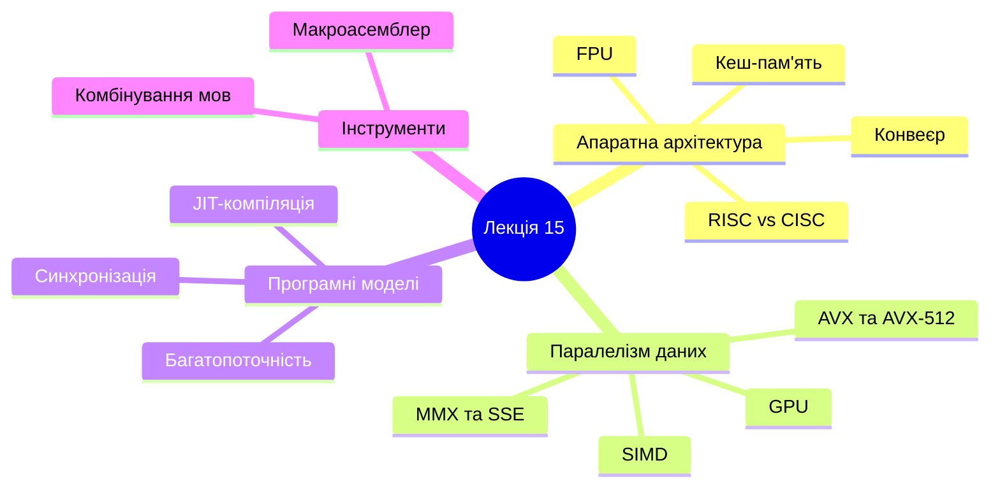
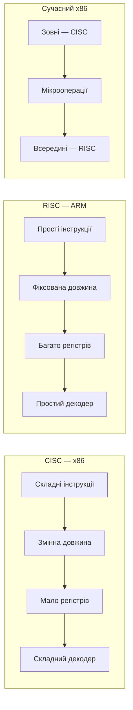
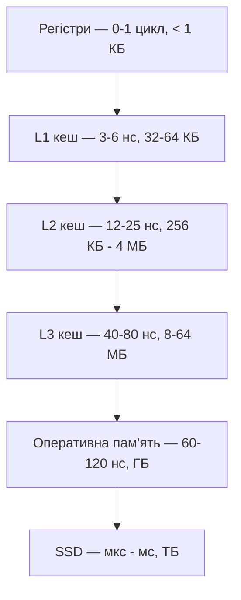
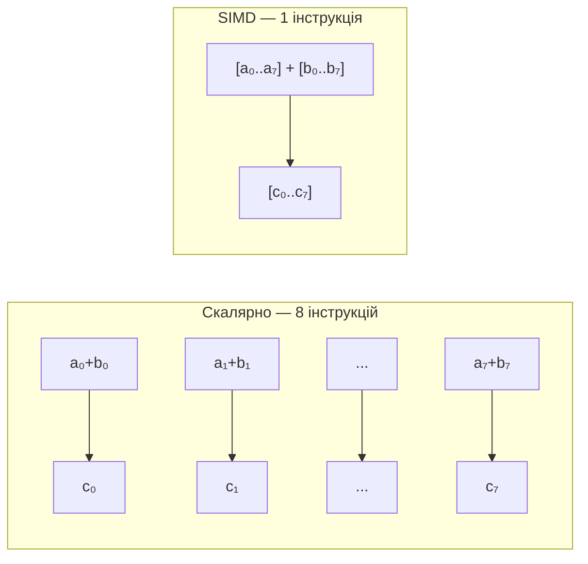
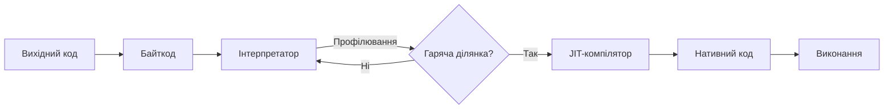
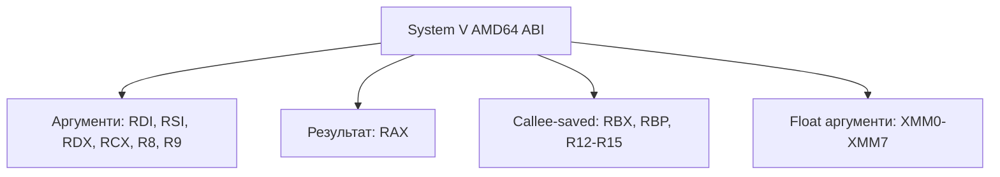
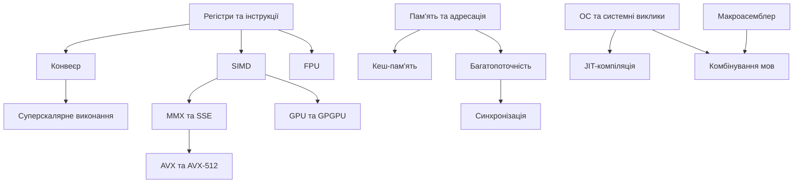

# Лекція 15. Інші теми, які залишилися поза курсом

---

## Розділ 1. Карта тем, що чекають попереду (~10 хв)

Будь-який навчальний курс має межі. Ці межі визначаються не лише кількістю академічних годин, а й логікою подачі матеріалу та рівнем підготовки аудиторії. Курс низькорівневого програмування та програмування мікроконтролерів зосередився на фундаменті: архітектурі x86-64, командах асемблера, роботі зі стеком та пам'яттю, підпрограмах та взаємодії з операційною системою. Ці знання утворюють ядро, без якого неможливо рухатися далі у будь-якому з напрямків системного програмування.

Водночас поза межами курсу залишилися теми, що є природним продовженням вивченого. Частина з них стосується апаратної складової процесора: конвеєр виконання, кеш-пам'ять, векторні розширення, обчислення з плаваючою комою. Інша частина охоплює програмні моделі: багатопоточність, синхронізацію, JIT-компіляцію. Ще одна група включає інструменти розробника: макроасемблер та комбінування мов програмування.

Остання лекція курсу не ставить за мету повністю розкрити кожну із зазначених тем. Мета є іншою: показати, де знаходиться нерозкрита частина карти, що саме там міститься та чому ці знання важливі для подальшого розвитку. Після цієї лекції студент повинен знати про існування кожного напрямку та розуміти, яке місце він займає у загальній картині комп'ютерних наук.

### Структура лекції

Лекція організована від простого до складного та від загального до конкретного. Перші розділи торкаються апаратної архітектури: вибір між RISC і CISC, конвеєр виконання інструкцій, ієрархія пам'яті та кешування, FPU для роботи з числами з плаваючою комою. Далі розглядається паралелізм на рівні даних: SIMD-модель, мультимедійні розширення MMX та SSE, сучасні AVX та AVX-512, архітектура GPU. Потім увага переходить до програмних моделей: основи багатопоточного програмування, примітиви синхронізації та JIT-компіляція. Завершальні розділи присвячені практичним інструментам: макроасемблер та комбінування мов програмування.

### Чому ці теми залишилися поза курсом

Причини різні. Деякі теми вимагають значного апаратного підґрунтя, яке формувалося впродовж усього курсу. Вивчати SIMD до засвоєння базових регістрів та команд означало б будувати будинок без фундаменту. Інші теми, зокрема багатопоточність та JIT-компіляція, настільки широкі, що заслуговують на окремий курс. Їхнє включення в основний матеріал порушило б баланс та глибину викладення.

Є й суто практичні обмеження часу. Кожна додаткова тема витісняє іншу, не менш важливу. Вибір фокусу є свідомим рішенням: глибоке розуміння основ важливіше, ніж поверхове знайомство з усім. Хороший фундамент дає змогу самостійно освоїти будь-яку з цих тем пізніше.

### Зв'язок із вивченим матеріалом

Усі теми цієї лекції будуються на тому, що вже вивчено. Розуміння регістрів є необхідним для SIMD — там регістри просто стають ширшими. Розуміння стеку та викликів підпрограм потрібне для JIT-компіляції та комбінування мов. Розуміння роботи з пам'яттю є основою для вивчення кешування та GPU. Фундамент, закладений у попередніх лекціях, є справжнім фундаментом, а не лише вступом.

Низькорівневе програмування залишається актуальним попри розвиток мов високого рівня. Навіть код на Python зрештою виконується на процесорі, і знання того, як це відбувається, дає змогу писати ефективніші програми, краще розуміти поведінку систем у нестандартних ситуаціях та знаходити помилки там, де інші бачать лише симптоми.

---

## Розділ 2. RISC і CISC — два підходи до архітектури процесора (~15 хв)

Коли інженери проектують процесор, вони неминуче стикаються з фундаментальним питанням: яким має бути набір інструкцій. Чи варто ускладнювати апаратуру заради наближення до мов програмування? Чи, навпаки, спростити її до мінімуму та покласти відповідальність на компілятор? Ці два підходи отримали назви CISC і RISC і протягом десятиліть визначали розвиток усієї процесорної індустрії.

### CISC — Complex Instruction Set Computer

CISC-архітектура виросла з практичних потреб 1960–70-х років. Пам'ять у ті часи коштувала надзвичайно дорого. Розробники прагнули скоротити розмір програм до мінімуму. Природним рішенням здавалося насичення процесора потужними інструкціями, кожна з яких виконувала б відразу кілька дій.

Ідеологія CISC виходить із того, що одна інструкція може виконати складну дію: завантажити значення з пам'яті, обчислити результат і записати його назад в інше місце пам'яті — все однією командою. Інструкції мають змінну довжину. Кількість тактів на виконання однієї інструкції не фіксована: прості команди виконуються за 1–2 такти, складні — за 10 і більше.

Найвідоміший представник CISC — сімейство x86, розроблене компанією Intel. Набір інструкцій x86 накопичувався десятиліттями, починаючи з процесора 8086 у 1978 році. Послідовно додавалися підтримка захищеного режиму, 32-бітний режим у i386, 64-бітний режим у x86-64, а також мультимедійні розширення MMX, SSE та AVX. Результатом є архітектура, яка підтримує тисячі варіантів інструкцій та десятки режимів адресації.

Складність x86-архітектури є водночас її силою та слабкістю. Сила — у зворотній сумісності: програма, написана для 8086 у 1980 році, теоретично запуститься на сучасному процесорі. Слабкість — у складності апаратного декодера, який мусить розбирати інструкції змінної довжини та підтримувати увесь багаж десятиліть.

### RISC — Reduced Instruction Set Computer

На початку 1980-х років дослідники IBM та Каліфорнійського університету в Берклі поставили під сумнів правильність CISC-підходу. Вивчивши реальну статистику виконання програм, вони виявили несподіваний факт: 80% часу процесор виконує лише 20% доступних інструкцій. Складні спеціалізовані команди або не використовуються, або викликаються рідко.

RISC-філософія пропонує протилежне рішення: мінімальний набір простих інструкцій. Кожна інструкція виконує одну просту дію. Довжина всіх інструкцій фіксована. Більшість операцій завершуються за один такт. Пам'ять доступна лише через спеціальні команди завантаження та збереження, а всі обчислення відбуваються виключно над регістрами.

У RISC-процесорів значно більше регістрів загального призначення. Архітектура ARM надає 31 регістр загального призначення, порівняно з 16 у x86-64. Більша кількість регістрів зменшує кількість звернень до пам'яті та спрощує роботу компілятора.

Відповідальність у RISC-моделі зміщується на компілятор. Саме він генерує послідовності простих інструкцій для виконання складних дій. Але завдяки передбачуваній структурі RISC-процесора компілятор може оптимізувати код значно ефективніше. Простий і регулярний набір інструкцій добре піддається автоматичній оптимізації.

### ARM — домінуючий RISC сучасності

Найвідомішим представником RISC у сучасному світі є архітектура ARM. Вона домінує у мобільних пристроях: смартфонах, планшетах, носимій електроніці. Процесори Apple Silicon серії M, що використовуються у сучасних MacBook та iPad, побудовані саме на ARM. Процесори Qualcomm Snapdragon та MediaTek Dimensity у переважній більшості Android-смартфонів також реалізують ARM-архітектуру.

Перевага ARM у мобільному сегменті пояснюється не лише продуктивністю, але й енергоефективністю. Простіший декодер інструкцій, регулярна структура конвеєра та менша кількість транзисторів на декодування призводять до нижчого енергоспоживання при порівнянній продуктивності. Для пристроїв із батарейним живленням це є вирішальним аргументом.

### RISC-V — відкрита архітектура

Окремої уваги заслуговує архітектура RISC-V, розроблена в Каліфорнійському університеті у Берклі у 2010 році. На відміну від ARM, RISC-V є повністю відкритою специфікацією без ліцензійних відрахувань. Будь-яка організація може реалізувати RISC-V процесор без виплати роялті. RISC-V набуває популярності у вбудованих системах, IoT та академічних проектах. Деякі великі виробники напівпровідників вже випустили комерційні RISC-V процесори.

### Сучасний стан: межа розмивається

Парадоксальна ситуація склалася у сучасному процесорному дизайні. Зовнішньо x86-процесори залишаються CISC-архітектурою та підтримують повний набір x86-інструкцій. Але всередині вони реалізовані на принципах RISC. Коли Intel або AMD отримує x86-інструкцію, блок декодування розбиває її на кілька внутрішніх мікрооперацій — спрощених команд RISC-типу. Саме ці мікрооперації й виконуються суперскалярним ядром.

Таким чином, сучасний x86-процесор є CISC ззовні та RISC зсередини. Це дозволяє підтримувати сумісність з існуючим програмним забезпеченням і одночасно використовувати сучасні техніки оптимізації виконання. Трансляція складних x86-інструкцій у прості мікрооперації відбувається апаратно, за один такт, і не спричиняє помітних накладних витрат.

| Критерій | CISC | RISC |
|---|---|---|
| Кількість інструкцій | Сотні та тисячі | Десятки–сотні |
| Довжина інструкцій | Змінна | Фіксована |
| Тактів на інструкцію | 1–20 і більше | Переважно 1 |
| Регістри | Менше | Більше |
| Складність декодера | Висока | Низька |
| Відповідальність | На апаратурі | На компіляторі |
| Приклади | x86, Motorola 68000 | ARM, RISC-V, MIPS, SPARC |

Вибір між RISC і CISC сьогодні менш принциповий, ніж 30 років тому. Сучасні процесори обох архітектур використовують конвеєр, суперскалярне виконання та динамічне планування інструкцій. Різниця переважно проявляється у конкретних застосуваннях: x86 домінує у настільних комп'ютерах та серверах, ARM — у мобільних пристроях та IoT.

---

## Розділ 3. Конвеєр виконання інструкцій (~15 хв)

Навіть найпростіша інструкція процесора проходить кілька етапів до свого завершення. Спочатку її потрібно завантажити з пам'яті, потім розшифрувати, виконати, звернутися до пам'яті за операндами та записати результат. Кожен із цих кроків займає час. Питання полягає у тому, як організувати ці кроки найефективніше. Відповідь — конвеєр виконання.

### Аналогія з фабрикою

Уявіть фабрику, де автомобілі збираються послідовно: кузов, двигун, колеса, фарба, оздоблення. Якщо кожну машину збирати повністю перед тим, як починати наступну, фабрика буде вкрай неефективною. Натомість сучасна фабрика організована у вигляді конвеєра: поки один автомобіль фарбується, наступний вже отримує колеса, а третій — двигун. Загальний час збірки кожної машини не зменшується, але пропускна здатність конвеєра різко зростає.

Точно так само влаштований процесорний конвеєр. Поки одна інструкція виконується, наступна вже декодується, а третя завантажується з пам'яті. Різні стадії конвеєра працюють паралельно над різними інструкціями.

### Класичний п'ятистадійний конвеєр

Класичний конвеєр, що лежить в основі більшості RISC-архітектур, складається з п'яти стадій.

Перша стадія — IF — Instruction Fetch, вибірка інструкції. Процесор зчитує інструкцію з пам'яті за адресою, що зберігається у лічильнику команд. Результат потрапляє у конвеєрний буфер.

Друга стадія — ID — Instruction Decode, декодування. Блок декодування визначає, яку операцію виконувати, які регістри є операндами та яка адресація використовується. Зчитуються значення з регістрів.

Третя стадія — EX — Execute, виконання. Арифметично-логічний пристрій виконує обчислення. Для інструкцій переходу тут обчислюється цільова адреса.

Четверта стадія — MEM — Memory Access, звернення до пам'яті. Для інструкцій завантаження або збереження відбувається звернення до кешу даних. Для арифметичних інструкцій ця стадія пропускається.

П'ята стадія — WB — Write Back, запис результату. Результат записується у регістровий файл.

```mermaid
gantt
    title Конвеєр: виконання трьох інструкцій
    dateFormat X
    axisFormat %s
    section Інструкція 1
    IF :a1, 1, 1
    ID :a2, 2, 1
    EX :a3, 3, 1
    MEM :a4, 4, 1
    WB :a5, 5, 1
    section Інструкція 2
    IF :b1, 2, 1
    ID :b2, 3, 1
    EX :b3, 4, 1
    MEM :b4, 5, 1
    WB :b5, 6, 1
    section Інструкція 3
    IF :c1, 3, 1
    ID :c2, 4, 1
    EX :c3, 5, 1
    MEM :c4, 6, 1
    WB :c5, 7, 1
```

Без конвеєра кожна інструкція займала б 5 тактів. З конвеєром після кількох тактів прогріву кожен такт завершується одна інструкція. Теоретичне прискорення — у 5 разів.

### Конфлікти конвеєра

На практиці конвеєр не завжди працює ідеально. Виникають ситуації, де наступна інструкція не може виконуватись одразу після попередньої. Такі ситуації називаються конфліктами конвеєра.

Структурні конфлікти виникають, коли два різних етапи конвеєра одночасно потребують одного апаратного ресурсу. Наприклад, якщо пам'ять інструкцій та пам'ять даних є фізично однією, стадія MEM однієї інструкції конфліктує зі стадією IF наступної. Сучасні процесори вирішують цю проблему розподілом кешів: окремий кеш інструкцій L1i та кеш даних L1d.

Конфлікти даних виникають, коли інструкція залежить від результату попередньої, який ще не записаний у регістр. Одне рішення — призупинити конвеєр на необхідну кількість тактів, ввівши порожні такти — бульбашки. Краще рішення — пересилання: результат зі стадії EX передається безпосередньо на вхід наступного EX, минаючи запис у регістр.

Конфлікти управління є найсерйознішими. Коли процесор зустрічає інструкцію умовного переходу, він ще не знає, чи буде перехід виконаний. Він завантажує наступні інструкції послідовно, але може виявитися, що перехід виконаний і ці інструкції непотрібні. Їх відкидають — а це займає кілька тактів і знижує продуктивність.

### Передбачення переходів

Для боротьби з конфліктами управління сучасні процесори використовують блок передбачення переходів. Він аналізує статистику минулих переходів і намагається вгадати, чи буде виконаний наступний умовний перехід. Точність сучасних предикторів досягає 95–99%.

Якщо передбачення правильне, конвеєр працює без зупинок. Якщо помилкове, відбувається скидання конвеєра: всі неправильно завантажені інструкції відкидаються, і виконання відновлюється з правильної адреси. Штраф за помилкове передбачення дорівнює глибині конвеєра у тактах.

Глибина конвеєра сучасних процесорів Intel і AMD становить 14–20 стадій. Мікроархітектура Intel Netburst мала 31 стадію, що давало змогу досягти дуже високих тактових частот, але ціною великих штрафів за помилкові передбачення.

### Суперскалярна архітектура

Логічним розвитком конвеєра є суперскалярна архітектура. Суперскалярний процесор має кілька незалежних функціональних блоків і може виконувати кілька інструкцій одночасно на одній стадії. Сучасні процесори Intel Core та AMD Ryzen можуть виконувати до 4–6 інструкцій паралельно на одному ядрі.

Виконання не обов'язково відбувається у тому порядку, в якому інструкції записані у програмі. Виконання в позачерговому порядку дозволяє процесору самостійно знаходити незалежні інструкції та виконувати їх паралельно, навіть якщо між ними в коді стоять залежні інструкції. Програмісту гарантується, що результат буде таким самим, як при послідовному виконанні.

---

## Розділ 4. Ієрархія пам'яті та кешування (~15 хв)

Між швидкістю процесора та швидкістю оперативної пам'яті існує колосальна прірва. Сучасний процесор виконує одну операцію приблизно за 0,3 наносекунди, тоді як оперативна пам'ять DDR5 відповідає на запит приблизно за 60–120 наносекунд. Це різниця у 200–400 разів. Якщо процесор мусив би кожного разу звертатися до оперативної пам'яті, більшість часу він чекав би відповіді, а не виконував корисну роботу.

Рішення — ієрархія кеш-пам'яті: кілька рівнів проміжної пам'яті, де кожен наступний є повільнішим та більшим, але ближчим до процесора, ніж основна пам'ять.

### Рівні ієрархії пам'яті

Регістри процесора є найшвидшими: доступ займає 0 або 1 такт. Об'єм мізерний — 16–32 регістри загального призначення плюс спеціалізовані. Регістри є частиною самого процесорного ядра.

Кеш першого рівня — L1 — це мала надшвидка пам'ять, інтегрована безпосередньо у ядро процесора. Сучасні L1-кеші мають об'єм 32–64 кілобайти та затримку доступу 3–6 наносекунд. Кеш L1 поділяється на два незалежних: окремий кеш інструкцій та окремий кеш даних.

Кеш другого рівня — L2 — більший та дещо повільніший: 256 кілобайт — 4 мегабайти, затримка 12–25 наносекунд. Він також розміщений на кристалі процесора, але може бути як індивідуальним для кожного ядра, так і спільним для кількох.

Кеш третього рівня — L3 — є найбільшим кешем на кристалі: від 8 до 64 мегабайт у сучасних процесорах. Він спільний для всіх ядер та має затримку 40–80 наносекунд. L3 є останнім рубежем перед зверненням до оперативної пам'яті.

### Кеш-лінії та принципи локальності

Кеш не зберігає окремі байти — він оперує кеш-лініями. Кеш-лінія — це неподільна одиниця обміну між кешем та пам'яттю, яка зазвичай складає 64 байти. Коли процесор звертається до певної адреси, у кеш завантажується не лише потрібний байт, а вся 64-байтна кеш-лінія, що його містить.

Це рішення є ефективним завдяки двом фундаментальним властивостям програм: просторовій та часовій локальності. Просторова локальність означає, що якщо програма звернулася до адреси X, вона, найімовірніше, незабаром звернеться до адреси X+8 або X+16. Часова локальність означає, що дані, до яких нещодавно зверталися, скоріш за все, знадобляться знову у найближчий час.

Масиви даних є класичним прикладом просторової локальності. Послідовний перебір масиву завантажить кеш-лінію і скористається нею для 8–16 послідовних звернень, перш ніж знадобиться нова кеш-лінія. Це дуже ефективно.

### Попадання та промах кешу

Коли процесор звертається до пам'яті, можливі два сценарії. Кеш-влучення означає, що потрібні дані вже є у кеші — запит виконується зі швидкістю кешу. Кеш-промах означає, що потрібних даних у кеші немає — процесор мусить звернутися до нижчого рівня ієрархії.

Коефіцієнт влучень є критичним показником продуктивності. Для типових програм L1-кеш забезпечує 90–95% влучень, L2 обробляє більшість промахів L1, і лише невелика частка запитів доходить до оперативної пам'яті.

### Асоціативність кешу

Важливою характеристикою кешу є його асоціативність — кількість місць у кеші, куди може бути розміщена кеш-лінія з заданою адресою. Прямо-відображений кеш дозволяє розміщати кожну адресу лише в одному місці. Це найпростіше, але призводить до конфліктів при певних шаблонах доступу. N-шляховий асоціативний кеш дає кожній адресі N можливих місць, що суттєво зменшує конфлікти.

### Когерентність кешів у багатоядерних системах

Кожне ядро процесора має власний L1 та L2 кеш. Але всі ядра працюють із тією самою оперативною пам'яттю. Якщо ядро A записало нове значення у свій L1 кеш, ядро B у своєму L1 кеші ще бачить старе значення.

Для вирішення цієї проблеми використовується протокол когерентності кешів. Найпоширеніший — протокол MESI. Кожна кеш-лінія може перебувати в одному з чотирьох станів: Modified — змінена та лише у цьому кеші; Exclusive — незмінена та лише у цьому кеші; Shared — однакова копія у кількох кешах; Invalid — недійсна. Коли одне ядро записує дані, інші ядра отримують сигнал оголосити свої копії недійсними.

### Практичне значення

Знання принципів роботи кешу має безпосереднє практичне значення. Послідовний перебір масиву є ефективним завдяки просторовій локальності. Перебір у стовпцевому порядку для двовимірного масиву у C призводить до значно більшої кількості кеш-промахів, оскільки елементи одного стовпця знаходяться далеко один від одного в пам'яті.

---

## Розділ 5. FPU — числа з плаваючою комою (~15 хв)

Цілочисельна арифметика є основою обчислень у процесорі. Але реальний світ сповнений чисел, що не є цілими: фізичні виміри, координати, тригонометрія, статистика. Представити число 3,14159 або 0,000001 у двійковій системі точно неможливо без дробової частини. Цю проблему вирішує апаратний блок обчислень із плаваючою комою — FPU, Floating Point Unit.

### Стандарт IEEE 754

У 1985 році Інститут інженерів з електроніки та електротехніки затвердив стандарт IEEE 754, що визначив формати зберігання дійсних чисел у комп'ютерах. Цей стандарт є обов'язковим для всіх сучасних процесорів та мов програмування.

Стандарт визначає кілька форматів. 32-бітний формат — float або single precision — використовує 1 біт знаку, 8 бітів для показника ступеня та 23 біти для мантиси. Точність відповідає приблизно 7 десятковим знакам. 64-бітний формат — double або double precision — має 1 біт знаку, 11 бітів для показника та 52 біти для мантиси. Точність відповідає приблизно 15–17 десятковим знакам.

Процесор x86 також підтримує 80-бітний формат — extended precision — з 1 бітом знаку, 15 бітами показника та 64 бітами мантиси. Цей формат є специфічним для x87 FPU і широко не поширений.

| Формат | Розмір | Знак | Показник | Мантиса | Точність |
|---|---|---|---|---|---|
| Single | 32 біти | 1 | 8 | 23 | ~7 десяткових знаків |
| Double | 64 біти | 1 | 11 | 52 | ~15-17 десяткових знаків |
| Extended | 80 бітів | 1 | 15 | 64 | ~18-19 десяткових знаків |

### Спеціальні значення

Окрім звичайних чисел стандарт IEEE 754 визначає кілька спеціальних значень. Нескінченність — плюс або мінус — виникає при діленні ненульового числа на нуль. NaN — Not a Number — результат некоректних операцій, таких як ділення нуля на нуль або квадратний корінь із від'ємного числа. Денормалізовані числа — дуже малі числа, близькі до нуля, що мають особливе представлення для збереження відносної точності.

Обробка NaN є важливою деталлю: NaN поширюється через обчислення. Будь-яка операція, де один з операндів є NaN, дає NaN у результаті. Це дозволяє виявляти некоректні обчислення, якщо NaN зрештою потрапляє у фінальний результат.

### Історія: від окремого чіпа до інтегрованого блоку

У перших персональних комп'ютерах FPU не був вбудований у процесор. Intel випустила окремий сопроцесор 8087 у 1980 році, призначений для роботи у парі з процесором 8086 або 8088. Встановлення 8087 давало значне прискорення обчислень у програмах, що активно використовували дійсну арифметику.

У 1989 році Intel випустила процесор i486DX з інтегрованим FPU. Відтоді FPU стало стандартною частиною кожного x86-процесора. Версія i486SX навмисно не мала FPU — це була бюджетна версія для застосувань, де дійсна арифметика не потрібна.

### Стекова модель x87

x87 FPU має незвичну архітектуру: замість іменованих регістрів використовується стек із восьми 80-бітних регістрів, позначених ST(0) — ST(7). ST(0) завжди є верхівкою стека. Операції завантаження додають значення на верхівку стека, операції збереження знімають значення зі стека.

Основні інструкції x87: FILD завантажує ціле число у ST(0), перетворюючи його на 80-бітний дійсний формат. FLD завантажує дійсне число. FADD додає ST(0) та ST(1), результат залишається у ST(0). FMUL множить. FDIV ділить. FSQRT обчислює квадратний корінь зі ST(0). FCOM та FUCOM порівнюють два значення зі стека. FISTP зберігає ST(0) як ціле число та знімає значення зі стека.

### Перехід до SSE

З появою розширень SSE2 у 2001 році для обчислень із плаваючою комою почали активно використовувати XMM-регістри. SSE2 надає скалярні операції з float та double безпосередньо над регістрами XMM, без стекової моделі. Сучасні компілятори генерують код з використанням SSE2 або AVX для дійсної арифметики, а не x87 FPU. x87 залишається актуальним лише там, де потрібна 80-бітна точність.

### Поширені помилки

Робота з числами з плаваючою комою має характерні пастки. Числа з плаваючою комою не є точними: 0.1 у двійковому поданні — це нескінченний дріб. Значення 0.1 + 0.2 у double-форматі не дорівнює рівно 0.3. Порівняння двох дійсних чисел на точну рівність у більшості випадків є помилкою. Правильний підхід — порівнювати з урахуванням допустимого відхилення.

Накопичення похибки — ще одна типова проблема. Кожна арифметична операція може вносити невелику похибку округлення. Після мільйонів операцій ці похибки можуть накопичитися до помітного рівня.

---

## Розділ 6. SIMD — одна інструкція над багатьма даними (~15 хв)

Традиційна модель виконання інструкцій є скалярною: один операнд, одна операція, один результат. Якщо потрібно скласти два масиви по 1000 елементів, необхідно 1000 окремих операцій додавання. Для багатьох задач сучасних застосувань це є серйозним обмеженням продуктивності. SIMD — Single Instruction, Multiple Data — пропонує вихід: одна інструкція, що одночасно обробляє кілька елементів даних.

### Таксономія Флінна

У 1966 році Майкл Флінн запропонував класифікацію архітектур виконання команд. Він розглянув дві ортогональні властивості: кількість потоків інструкцій та кількість потоків даних.

SISD — Single Instruction, Single Data — класична скалярна архітектура. Одна інструкція, один операнд, один результат.

SIMD — Single Instruction, Multiple Data — одна інструкція виконується одночасно над кількома елементами даних. Саме цей клас архітектур є предметом цього та наступних розділів.

MISD — Multiple Instructions, Single Data — кілька різних операцій над одним потоком даних. Теоретична категорія, практично не реалізована у комерційних системах.

MIMD — Multiple Instructions, Multiple Data — кілька процесорів або ядер виконують різні програми над різними даними. Це клас сучасних багатоядерних процесорів та розподілених систем.

| Клас | Інструкції | Дані | Приклад |
|---|---|---|---|
| SISD | Одна | Одні | Класичний x86 |
| SIMD | Одна | Множинні | SSE, AVX |
| MISD | Множинні | Одні | Теоретичний |
| MIMD | Множинні | Множинні | Багатоядерний CPU |

### Практична мотивація SIMD

Розглянемо задачу обробки відеокадру. Кадр із роздільною здатністю 1920x1080 пікселів містить понад 2 мільйони пікселів. Для кожного пікселя потрібно виконати кілька операцій: коригування яскравості, колірна корекція, згладжування. При скалярному обчисленні це мільйони операцій на кожен кадр. При частоті 60 кадрів на секунду навантаження стає колосальним.

SIMD вирішує цю проблему: замість обробки одного пікселя за операцію, одна векторна інструкція обробляє 8, 16 або 32 пікселі одночасно. Це зменшує кількість необхідних інструкцій у відповідну кількість разів та суттєво знижує навантаження на процесор.

Той самий принцип застосовується до аудіообробки, матричних обчислень у машинному навчанні, криптографії, стиснення даних та цифрової обробки сигналів.

### SIMD у регістрах

Реалізація SIMD безпосередньо пов'язана з широкими регістрами. Якщо регістр має ширину 256 бітів, він може містити водночас вісім 32-бітних цілих чисел, або вісім 32-бітних float-значень, або чотири 64-бітних double. Одна інструкція додавання, застосована до такого регістру, складає всі вісім пар відповідних елементів одночасно.

### Еволюція ширини регістрів

Перші SIMD-розширення для x86 з'явилися у 1996 році з MMX та пропонували 64-бітні регістри. SSE у 1999 розширив їх до 128 бітів. AVX у 2011 — до 256 бітів. AVX-512 у 2016 — до 512 бітів. На кожному кроці вдвічі збільшувалася потенційна швидкість векторних обчислень для певного класу задач.

### Авторозгортання компілятором

Сучасні компілятори — GCC, Clang, MSVC — здатні автоматично перетворювати прості цикли у SIMD-код. Якщо цикл обробляє елементи масиву незалежно один від одного та без складних умовних переходів, компілятор може згенерувати векторні інструкції замість скалярних. Цей процес називається автовекторизацією.

Явне використання SIMD можливе через intrinsics — функції-обгортки, що безпосередньо відповідають конкретним векторним інструкціям. Наприклад, intrinsic-функція _mm256_add_ps складає вісім float-значень із двох AVX-регістрів. Intel підтримує онлайн-довідник Intrinsics Guide, де перелічені всі доступні функції для кожного розширення.

---

## Розділ 7. MMX та SSE — перші мультимедійні розширення (~15 хв)

Наприкінці 1990-х років мультимедійні застосування ставали дедалі популярнішими. Відтворення відео, обробка аудіо, комп'ютерні ігри — усі вони вимагали значних обчислювальних потужностей. Intel відреагувала, додавши до x86-архітектури перші SIMD-розширення. Ця еволюція пройшла кілька ітерацій і розтягнулася більш ніж на 15 років.

### MMX — MultiMedia eXtensions

MMX з'явився у 1996 році разом із процесором Pentium MMX. Основна ідея: додати до x86 можливість виконувати паралельні операції над кількома цілочисельними значеннями одночасно.

Для MMX введені вісім 64-бітних регістрів MM0–MM7. Але є принципово важлива деталь: ці регістри не є новими апаратними блоками. Вони є псевдонімами нижніх 64 бітів регістрів стека x87 FPU. Це рішення дозволило обійтися без нового апаратного стану, але породило серйозне обмеження.

Оскільки MMX-регістри та x87 FPU-регістри — це одне й те саме фізичне сховище, неможливо одночасно використовувати MMX та обчислення з плаваючою комою. Після будь-якого MMX-коду необхідно виконувати команду EMMS — Empty MMX State — щоб повернути FPU у нормальний стан.

MMX надає кілька типів упакованих даних: packed byte — вісім 8-бітних значень в одному 64-бітному регістрі, packed word — чотири 16-бітних, packed doubleword — два 32-бітних. Відповідні операції виконуються над усіма елементами одночасно.

MMX підтримує операції насиченої арифметики: якщо результат перевищує максимальне значення для типу, він обрізається до максимуму, а не переповнюється. Це важливо для обробки зображень, де піксельні значення мусять залишатися у межах 0–255.

### SSE — Streaming SIMD Extensions

SSE з'явився у 1999 році разом із процесором Pentium III і вирішив головний недолік MMX — конфлікт із FPU. SSE ввів вісім нових 128-бітних регістрів XMM0–XMM7, повністю незалежних від x87 стека. У 64-бітному режимі їхня кількість зросла до шістнадцяти: XMM0–XMM15.

Перший SSE орієнтувався на дійсні числа одинарної точності: у кожному 128-бітному регістрі можна зберігати чотири 32-бітних float. SSE не мав підтримки цілочисельних типів та чисел подвійної точності.

SSE2, представлений разом із Pentium 4 у 2001 році, значно розширив можливості. Додана підтримка чисел подвійної точності: два 64-бітних double на регістр. Також додані цілочисельні SIMD-операції для всіх типів від байта до 64-бітних значень. SSE2 став базовою лінією для всього сучасного 64-бітного x86-коду: усі процесори з підтримкою x86-64 обов'язково підтримують SSE2.

SSE3 додав горизонтальні операції та операції для прискорення обробки комплексних чисел. SSSE3 розширив набір інструкцій маніпуляціями з байтами. SSE4.1 та SSE4.2 надали нові засоби для порівняння рядків, обчислення CRC-32 та вдосконаленої роботи з відео.

| Версія | Рік | Ключові можливості |
|---|---|---|
| MMX | 1996 | 64-бітні MM0-MM7, цілочисельний SIMD |
| SSE | 1999 | 128-бітні XMM0-XMM7, float SIMD |
| SSE2 | 2001 | double та цілочисельні типи в XMM |
| SSE3 | 2004 | Горизонтальні операції |
| SSSE3 | 2006 | Маніпуляції з байтами |
| SSE4.1/4.2 | 2007-2008 | Рядки, CRC-32, blending |

### Застосування в кодеках

Стандарт H.264 для стиснення відео та кодек AAC для стиснення аудіо інтенсивно використовують SSE-інструкції. Бібліотека x264, одна з найпоширеніших реалізацій H.264, містить ретельно написаний SSE-код для ключових операцій: DCT-перетворення, квантизації, пошуку руху. Бібліотека FFmpeg, що є базовою для більшості відеопрогравачів та конвертерів, містить тисячі рядків оптимізованого SSE-коду. OpenSSL використовує SSE та SSSE3 для прискорення SHA-256 та AES-шифрування.

---

## Розділ 8. AVX та AVX-512 — сучасні векторні розширення (~15 хв)

З 128-бітної ширини SSE-регістрів стало недостатньо для вимог машинного навчання, наукових обчислень та обробки великих масивів даних. Intel відповіла введенням AVX — Advanced Vector Extensions — і послідовно збільшувала ширину векторних регістрів.

### AVX — Advanced Vector Extensions

AVX з'явився у 2011 році, починаючи з мікроархітектури Sandy Bridge. Ключова зміна: ширина регістрів збільшилася вдвічі — з 128 до 256 бітів. Нові регістри отримали назви YMM0–YMM15. Кожен YMM-регістр є розширенням відповідного XMM-регістру: молодші 128 бітів YMM0 — це XMM0.

AVX змінив систему кодування інструкцій. Замість попереднього PREFIX-кодування введено VEX-кодування, яке дозволяє записувати три операнди: два вхідних та один вихідний. У SSE більшість інструкцій мають деструктивну форму: перший операнд одночасно є і вхідним, і вихідним. AVX позбавляє від цього обмеження: результат може записуватися у третій регістр, не змінюючи вхідних.

YMM-регістри можуть містити вісім 32-бітних float, або чотири 64-бітних double, або 32 байти. Одна AVX-операція виконує вісім паралельних float-операцій там, де SSE виконував чотири. Теоретична пропускна здатність зростає вдвічі.

### FMA — Fused Multiply-Add

Разом із AVX-ядром процесори Haswell отримали підтримку FMA — Fused Multiply-Add. Операція FMA обчислює вираз a·b + c в одній інструкції з єдиним заокругленням. Порівняно з виконанням двох окремих інструкцій множення та додавання FMA не лише швидше, але й точніше: проміжний результат множення не заокруглюється окремо.

FMA є надзвичайно важливим для матричних операцій. Перемноження матриць — ключова операція у нейронних мережах — зводиться до тисяч операцій виду a·b + c, і FMA прискорює їх вдвічі.

### AVX2

AVX2, представлений разом із Haswell у 2013 році, розширив підтримку 256-бітних операцій на цілочисельні типи. AVX підтримував 256-бітні операції лише для дійсних чисел. AVX2 додав паралельні операції над цілими числами: 32 паралельних 8-бітних операції, або 16 16-бітних, або 8 32-бітних у одному 256-бітному регістрі.

### AVX-512

AVX-512 з'явився у 2016 році на платформах Xeon Phi та серверних Skylake-X. Ширина регістрів знову подвоїлася: 512 бітів. Нові ZMM-регістри мають 512-бітну ширину. Кількість векторних регістрів зросла: ZMM0–ZMM31, тобто 32 регістри замість 16.

AVX-512 ввів принципово нову функцію — маскування операцій. Нові opmask-регістри k0–k7 дозволяють вказати, над якими саме елементами вектору виконувати операцію. Якщо відповідний біт маски дорівнює 0, елемент не оновлюється або обнулюється. Це дозволяє ефективно обробляти масиви, де деякі елементи потребують особливого поводження, без використання умовних переходів.

Scatter та gather — нові операції завантаження та збереження. Gather завантажує елементи з несуміжних адрес пам'яті в один вектор. Scatter зберігає елементи вектора у несуміжні адреси. Ці операції важливі для роботи з розрідженими структурами даних.

### Проблема зниження частоти

AVX-512 має відому особливість: виконання 512-бітних операцій призводить до зниження тактової частоти процесора на частки або навіть одиниці ГГц. Intel свідомо знижує напругу та частоту при активації AVX-512, оскільки потужні 512-бітні блоки генерують значно більше тепла. Це призводить до парадоксального ефекту: сам AVX-512 код є швидшим, але решта програми виконується повільніше через знижену частоту.

Цей компроміс привів до суперечливих рішень. Apple Silicon серії M та нові споживчі процесори Intel Alder Lake не мають AVX-512. Деякі хмарні провайдери також обирають конфігурації без AVX-512 для серверів загального призначення.

---

## Розділ 9. GPU — масивно-паралельна архітектура (~15 хв)

Графічний процесор виник як спеціалізований пристрій для прискорення виводу графіки. Але еволюція GPU перетворила його на потужний інструмент для широкого класу обчислювальних задач. Розуміння GPU-архітектури є важливим не лише для розробників ігор, але й для всіх, хто займається машинним навчанням, науковими обчисленнями або обробкою великих масивів однотипних даних.

### Фундаментальна відмінність від CPU

CPU оптимізований для виконання одного потоку інструкцій якнайшвидше. Велика частина транзисторів CPU витрачається на блоки передбачення переходів, кеш-пам'ять, планувальник інструкцій та інші засоби, що зменшують затримку виконання. Типовий сучасний сервер має 8–128 ядер CPU.

GPU за тою самою площею кристала вибирає інший компроміс: замість кількох дуже потужних ядер — тисячі простих. NVIDIA RTX 4090 має 16 384 CUDA-ядра. AMD Radeon RX 7900 XTX — понад 12 000 шейдерних процесорів. Ці ядра значно простіші за ядра CPU: менші кеші, простіший планувальник, відсутність складного передбачення переходів.

| Характеристика | CPU | GPU |
|---|---|---|
| Кількість ядер | 8–128 | Тисячі |
| Складність ядра | Дуже висока | Низька |
| Кеш | Великий | Малий |
| Оптимізація | Мала затримка | Висока пропускна здатність |
| Тип задач | Різноманітні, послідовні | Однорідні, паралельні |

### SIMT — Single Instruction, Multiple Threads

GPU реалізує модель SIMT — Single Instruction Multiple Threads. Вона подібна до SIMD, але є суттєва відмінність: замість одного потоку, що обробляє вектор даних, SIMT організовує кілька реальних потоків, кожний з яких обробляє один елемент даних.

Базовою одиницею виконання в NVIDIA GPU є варп — warp — група із 32 потоків. Усі 32 потоки у варпі виконують одну й ту саму інструкцію одночасно, але над різними елементами даних. Аналогічна концепція у AMD — wavefront — містить 64 потоки.

Якщо потоки у варпі мають розбіжність у виконанні через умовні переходи, виникає warp divergence. Частина потоків виконує гілку if, інша частина повинна виконати гілку else. У цьому разі обидві гілки виконуються послідовно: спочатку активні потоки однієї гілки, потім іншої. Неактивні потоки у цей час простоюють. Це вдвічі або більше знижує продуктивність варпу.

### Архітектура пам'яті GPU

GPU має власну ієрархію пам'яті. Регістри потоку — найшвидші, але обмежені за кількістю. Shared memory — спільна пам'ять блоку потоків, подібна до L1-кешу, дуже швидка, але мала: зазвичай 48–96 КБ на Streaming Multiprocessor. L2-кеш — спільний для всього GPU. VRAM — video RAM, основна відеопам'ять, підключена через широку шину.

Ключова перевага GPU у порівнянні з CPU — це пропускна здатність відеопам'яті. NVIDIA H100 із пам'яттю HBM3 має пропускну здатність до 3,35 ТБ/с. Для порівняння, сервер з DDR5 ECC має пропускну здатність порядку 300–400 ГБ/с. Ця різниця на порядок є головною причиною переваги GPU у матричних обчисленнях.

### GPGPU: GPU для загальних обчислень

GPGPU — General Purpose GPU computing — це використання GPU для задач, що не пов'язані безпосередньо з графікою. Основними фреймворками є CUDA від NVIDIA та OpenCL — відкритий стандарт для різних GPU та інших прискорювачів.

CUDA дозволяє написати код ядра — функції, що запускається на GPU — та визначити, скільки потоків та блоків потоків її виконують. Наприклад, можна запустити ядро, що виконує обробку пікселів, з одним потоком на кожен піксель. GPU автоматично розподіляє ці потоки по своїх обчислювальних блоках.

### Застосування GPU

Навчання нейронних мереж є найбільш очевидним застосуванням сучасних GPU. Операція перемноження матриць, що є ключовою у нейронних мережах, надзвичайно добре паралелізується та вимагає великої пропускної здатності пам'яті. NVIDIA ввела спеціалізовані Tensor Cores, що виконують матричне множення блоків 4x4 або 16x16 в одній інструкції.

Рендеринг 3D-графіки залишається важливим застосуванням. Трасування променів — фізично точний алгоритм рендерингу — є надзвичайно паралельним завданням: кожен промінь обраховується незалежно. NVIDIA RTX-архітектура містить спеціалізовані блоки RT Cores для прискорення трасування.

Наукові обчислення: молекулярна динаміка, кліматичні симуляції, аеродинамічні розрахунки також активно використовують GPU. Найпотужніші суперкомп'ютери світу є гібридними: CPU для оркестрування обчислень та тисячі GPU для виконання масивно-паралельних розрахунків.

---

## Розділ 10. Багатопоточне програмування — основи (~15 хв)

Протягом кількох десятиліть після появи персональних комп'ютерів усі програми виконувалися послідовно. Одна інструкція за одною. Якщо задача вимагала довгих обчислень, програма "зависала" до їх завершення. З появою багатоядерних процесорів і сучасних вимог до паралельної обробки даних багатопоточне програмування перетворилося з екзотики на необхідну компетенцію.

### Процеси та потоки

Операційна система управляє виконанням за допомогою двох основних абстракцій: процесів та потоків.

Процес — це ізольована виконувана програма зі своїм власним адресним простором. Два різних процеси не можуть безпосередньо читати або записувати пам'ять один одного. Ізоляція між процесами забезпечує стабільність системи: аварія одного процесу не впливає на інші.

Потік — це незалежна послідовність виконання всередині процесу. Кілька потоків одного процесу поділяють один і той самий адресний простір: спільний сегмент коду, спільну купу та глобальні змінні. Але кожен потік має власний стек та власний стан регістрів.

Ця спільна пам'ять є як перевагою, так і небезпекою. Обмін даними між потоками є ефективним: не потрібні міжпроцесні механізми зв'язку. Але та сама спільна пам'ять є джерелом одночасного доступу та пов'язаних з ним помилок.

### Чому потрібна багатопоточність

Перша причина — використання багатоядерних процесорів. Сучасні процесори мають 4, 8, 16 або більше ядер. Однопотокова програма використовує лише одне ядро і залишає решту незайнятими. Розподіл задачі між кількома потоками дозволяє задіяти всі ядра та отримати близьке до лінійного прискорення для паралельних задач.

Друга причина — реактивність програми. У графічному інтерфейсі потоки дозволяють виконувати тривалі операції у фоні, не блокуючи інтерфейс. Веб-сервер використовує потоки для одночасного обслуговування тисяч клієнтів.

Третя причина — очікування введення-виведення. Значну частину часу програма очікує відповіді від диска, мережі або іншого зовнішнього пристрою. Поки один потік чекає відповіді, інші потоки можуть виконувати корисну роботу.

### Гонки даних

Серйозна проблема багатопоточних програм — гонки даних. Гонка виникає, коли кілька потоків одночасно звертаються до спільної змінної, і принаймні один з них виконує запис.

Класичний приклад: два потоки одночасно збільшують глобальний лічильник. Операція збільшення виглядає як одна дія, але на рівні процесора вона складається із трьох: завантажити значення з пам'яті в регістр, збільшити регістр на одиницю, зберегти регістр назад у пам'ять. Якщо обидва потоки одночасно завантажать поточне значення, обидва обчислять збільшене значення, і обидва запишуть свій результат — підсумковий лічильник буде збільшений лише на одиницю замість двох.

Гонки є непередбачуваними: вони можуть не виявлятися роками у нормальних умовах і раптово проявитися при зміні навантаження або на нових процесорах. Виявлення гонок є одним із найскладніших завдань у програмуванні.

### Hyper-Threading та SMT

Intel розробила технологію Hyper-Threading, яка дозволяє одному фізичному ядру процесора виглядати для операційної системи як два логічних ядра. Загальна назва цієї техніки — Simultaneous Multithreading або SMT. AMD реалізує аналогічну технологію.

Виконавчі блоки фізичного ядра при цьому реально одні. Два логічних потоки поділяють кеш, конвеєр та функціональні блоки. Якщо один потік чекає даних з пам'яті, інший може займати виконавчі блоки. При такому сценарії SMT дає реальне прискорення. Якщо обидва потоки є обчислювально інтенсивними, вони конкурують за одні ресурси і прискорення може бути незначним або відсутнім.

### Пул потоків

Створення та знищення потоків є відносно дорогою операцією: потрібно виділяти пам'ять для стеку, ініціалізувати структури ядра, виконати перемикання контексту. Для серверних застосувань, де нові задачі надходять безперервно, постійне створення та знищення потоків є неефективним.

Рішення — пул потоків: заздалегідь створений набір потоків, що чекають на нові задачі. Коли надходить задача, вона потрапляє у чергу. Вільний потік з пулу забирає задачу та виконує її. Після завершення потік повертається у пул і чекає наступної задачі. Це усуває накладні витрати на постійне створення та знищення потоків і є стандартним патерном у будь-якому серверному застосуванні.

---

## Розділ 11. Синхронізація: атомарність, mutex, семафор (~15 хв)

Розуміння потоків та гонок даних є необхідним підґрунтям, але недостатнім. Для побудови коректних багатопоточних програм потрібні засоби синхронізації — механізми, що дозволяють координувати доступ кількох потоків до спільних ресурсів та комунікувати між ними. Ці механізми реалізовані на декількох рівнях: від апаратної підтримки до програмних примітивів.

### Критична секція

Критична секція — це фрагмент коду, де відбувається доступ до спільних даних. Ключова вимога: лише один потік може виконувати критичну секцію у будь-який момент часу. Якщо один потік увійшов у критичну секцію, інші потоки, що намагаються зробити те саме, мусять чекати.

Забезпечення цієї вимоги — завдання примітивів синхронізації.

### Атомарність та LOCK-префікс

Атомарна операція — це операція, яка виконується як єдине неподільне ціле. Ніякий інший потік не може спостерігати проміжний стан атомарної операції. Вона або виконана повністю, або не виконана зовсім.

x86-архітектура надає апаратну підтримку атомарності через префікс LOCK. Інструкції з префіксом LOCK блокують шину пам'яті на час виконання. Наприклад, LOCK ADD виконує атомарне збільшення значення у пам'яті. LOCK CMPXCHG є ключовою інструкцією: вона порівнює значення у пам'яті з очікуваним, і якщо вони рівні, записує нове значення — все як одну атомарну операцію.

LOCK CMPXCHG реалізує операцію Compare-And-Swap — CAS — що є основою більшості неблокуючих алгоритмів та примітивів синхронізації. Якщо кілька потоків одночасно виконують CAS, рівно один з них може змінити значення — той, для якого збіглося порівняння. Решта виявлять, що значення вже змінилося, і повторять спробу.

### Mutex

Mutex — mutual exclusion, взаємне виключення — є найпоширенішим примітивом синхронізації. Mutex може перебувати у двох станах: заблокований та розблокований. Лише один потік може заблокувати mutex у будь-який момент часу.

Перед входом у критичну секцію потік викликає операцію lock. Якщо mutex вільний, потік захоплює його та продовжує виконання. Якщо mutex зайнятий, потік переходить у стан очікування. Після виходу з критичної секції потік викликає операцію unlock, звільняючи mutex і пробуджуючи одного з потоків, що чекали.

Mutex є простим та ефективним рішенням для захисту критичних секцій. Але він вносить накладні витрати: при суперечності за mutex потоки виконують системний виклик для переходу в стан очікування, а потім — ще один для пробудження. Для коротких критичних секцій часто застосовуються spinlocks — замки з активним очікуванням. Замість переходу в стан очікування потік у циклі перевіряє, чи звільнився mutex. Якщо суперечність є короткочасною, spinlock є ефективнішим.

### Дедлок

Дедлок — взаємоблокування — є критичною помилкою, де два або більше потоків чекають один на одного нескінченно. Класичний приклад: потік A захопив mutex 1 і чекає на mutex 2. Потік B захопив mutex 2 і чекає на mutex 1. Жоден з них не може продовжувати.

Умови виникнення дедлоку описані теоремою Коффмана: взаємне виключення, утримання та очікування, неможливість примусового звільнення ресурсу та циклічне очікування. Для запобігання дедлоку достатньо порушити одну з цих умов.

Найпростіша стратегія запобігання — глобальне впорядкування mutex. Якщо всі потоки захоплюють mutex завжди в одному й тому самому порядку, циклічне очікування неможливе.

### Семафор

Семафор є більш загальним примітивом, ніж mutex. Якщо mutex є двостановим — вільний або зайнятий — семафор є лічильником. Дві операції над семафором: wait зменшує лічильник на одиницю та блокує потік, якщо лічильник дорівнює нулю; signal збільшує лічильник та пробуджує один із заблокованих потоків.

Семафор зі значенням 1 поводиться як mutex. Семафор із більшим початковим значенням обмежує кількість потоків, що можуть одночасно виконувати деяку дію. Наприклад, семафор зі значенням 10 обмежує кількість одночасних з'єднань із базою даних.

Семафор є також ефективним засобом сигналізації між потоками. Один потік виробляє дані та виконує signal. Інший потік споживає дані та виконує wait. Якщо даних ще немає, споживач заблокується до сигналу від виробника.

### Впорядкування пам'яті та бар'єри

Апаратна та компіляторна оптимізації можуть переупорядковувати інструкції для підвищення продуктивності. Для однопотокового коду це цілком безпечно. Але у багатопотоковому контексті переупорядкування може призводити до неочевидної поведінки.

x86 надає спеціальні інструкції-бар'єри пам'яті. MFENCE — Memory Fence — забезпечує, що всі попередні операції з пам'яттю завершаться перед виконанням наступних. SFENCE стосується операцій запису. LFENCE стосується операцій читання. Ці бар'єри використовуються реалізаціями mutex та атомарних операцій для гарантування коректного впорядкування між потоками.

---

## Розділ 12. JIT-компіляція — код, що компілює себе (~15 хв)

Компіляція та інтерпретація є двома класичними підходами до виконання програм. Компілятор перетворює весь вихідний код у машинні інструкції заздалегідь. Інтерпретатор читає та виконує вихідний код рядок за рядком під час виконання. Кожен підхід має переваги та недоліки. JIT-компіляція є третім підходом, що прагне поєднати переваги обох.

### AOT проти JIT

Ahead-Of-Time компіляція, скорочено AOT, означає повне перетворення вихідного коду у машинний код перед запуском програми. Результат — нативний виконуваний файл, оптимізований для конкретної архітектури. Перевага AOT: максимальна продуктивність при запуску, відсутність додаткових витрат під час виконання. Недолік: код прив'язаний до конкретної платформи.

Інтерпретація є протилежним підходом. Інтерпретатор читає вихідний код або байткод та виконує відповідні дії під час роботи програми. Перевага: портативність та динамічність. Недолік: значно нижча продуктивність через накладні витрати інтерпретації.

Just-In-Time компіляція поєднує обидва підходи. Програма розповсюджується у вигляді байткоду — платформо-незалежного проміжного представлення. Під час виконання JIT-компілятор відстежує, які частини коду виконуються найчастіше, та компілює ці гарячі ділянки у нативний машинний код.

### Проміжне представлення: байткод

Більшість JIT-систем використовують байткод як проміжне представлення. Байткод — це набір інструкцій для віртуальної машини, що є більш абстрактним, ніж реальні машинні інструкції, але більш конкретним, ніж вихідний код.

Java компілюється у байткод JVM — Java Virtual Machine. Один файл .class з байткодом виконується однаково на Windows, Linux та macOS. .NET використовує CIL — Common Intermediate Language — як байткод для CLR — Common Language Runtime. C#, F# та VB.NET компілюються в один і той самий CIL і можуть навіть взаємодіяти між собою.

### Ярусна компіляція у JVM

JVM Hotspot реалізує ярусну компіляцію. Спочатку код інтерпретується. JVM збирає статистику: скільки разів викликається кожна функція, як часто виконується кожна гілка, які типи даних зустрічаються. Коли функція виконується досить часто, вступає у роботу компілятор C1 — клієнтський компілятор — що генерує нативний код з мінімальними оптимізаціями. Якщо функція продовжує залишатися гарячою, компілятор C2 — серверний компілятор — виконує агресивні оптимізації: inlining, escape analysis, векторизацію.

### Час прогріву

Ярусна компіляція призводить до характерного ефекту прогріву. На початку виконання програма є повільнішою, оскільки код інтерпретується. Поступово JIT компілює гарячі функції, і продуктивність зростає. Через певний час, коли всі гарячі ділянки скомпільовані, продуктивність стабілізується на максимальному рівні.

Для серверних застосувань прогрів є цілком прийнятним: сервер запускається один раз і працює тижнями. Але для короткоживучих процесів прогрів є суттєвим недоліком. Саме тому Java традиційно не використовується для коротких CLI-інструментів.

### Деоптимізація

JIT може виконувати спекулятивні оптимізації на основі зібраної статистики. Наприклад, якщо певний метод завжди викликається з аргументом одного конкретного типу, JIT оптимізує код виходячи з цього припущення. Але якщо пізніше метод викликається з аргументом іншого типу, зроблене припущення виявляється хибним. Нативний код стає некоректним і відкидається. Виконання повертається до інтерпретатора — відбувається деоптимізація. Після збору нової статистики JIT компілює функцію знову.

### V8, PyPy та LuaJIT

JavaScript-движок V8, що використовується у браузері Chrome та Node.js, є одним із найбільш відомих JIT-компіляторів. V8 компілює JavaScript безпосередньо у нативний машинний код. Ignition — базовий компілятор V8 — генерує байткод для інтерпретації. TurboFan — оптимізуючий компілятор — компілює гарячі функції з агресивними оптимізаціями.

PyPy є альтернативною реалізацією Python із JIT-компілятором. Завдяки PyPy числові обчислення на Python можуть бути у 10–100 разів швидшими, ніж у стандартному CPython. LuaJIT є надшвидкою JIT-реалізацією мови Lua, що досягає продуктивності, близької до C, для багатьох числових задач.

---

## Розділ 13. Macroassembler та макроси (~15 хв)

Звичайний асемблер виконує пряме відображення між мнемоніками інструкцій та машинним кодом. Кожен рядок асемблерного коду відповідає одній або кільком машинним інструкціям. Ця взаємно-однозначна відповідність є простою та передбачуваною, але іноді обмежуючою. Макроасемблер розширює цю модель, додаючи рівень текстових підстановок — макросів.

### Що таке макрос

Макрос — це іменований шаблон тексту з необов'язковими параметрами. Під час асемблювання кожне посилання на макрос замінюється на розгорнутий текст шаблону із підставленими аргументами. Цей процес відбувається до основної фази трансляції і є, по суті, текстовою маніпуляцією.

Макрос є текстовою підстановкою, а не викликом функції. Немає стека викликів, немає передачі параметрів через регістри чи стек, немає накладних витрат виклику. Для коду, що виконується у жорстких часових обмеженнях або обробниках переривань, це є суттєвою перевагою.

### Синтаксис NASM

У NASM макрос визначається директивою %macro та завершується директивою %endmacro. Після назви вказується кількість параметрів. Усередині тіла макросу параметри позначаються як %1, %2 та далі.

Наприклад, для збереження та відновлення набору регістрів можна визначити два макроси: push_regs та pop_regs, що розгортатимуться у відповідні послідовності push та pop. Це усуває потребу вручну писати однотипний код у кожній підпрограмі. Локальні мітки всередині макросу оголошуються зі знаком %%, щоб уникнути конфліктів при багаторазовому розгортанні.

### Умовна компіляція

Макроасемблер надає директиви умовної компіляції. Директиви %ifdef та %ifndef перевіряють, чи визначений певний макрос-константа, та включають або виключають відповідні блоки коду. Директиви %if та %elif виконують числові або рядкові порівняння.

Це дозволяє мати один вихідний файл, що компілюється по-різному для різних цільових платформ або конфігурацій. Наприклад, код може компілюватися у режимі налагодження з додатковими перевірками або у виробничому режимі без них, залежно від того, чи визначена константа DEBUG.

### Повторюваний код

Директива %rep дозволяє повторювати блок коду задану кількість разів. Це корисно для генерації таблиць, розгортання циклів або ініціалізації масивів відомого розміру під час асемблювання. Наприклад, можна визначити таблицю із 256 байтів, де кожен елемент дорівнює свому індексу, за допомогою %rep 256 та лічильника.

### Макроси на противагу підпрограмам

Макроси мають конкретні переваги перед підпрограмами у певних сценаріях. По-перше, немає накладних витрат виклику: інструкції call та ret разом зі збереженням-відновленням регістрів додають десятки тактів для короткої підпрограми. По-друге, параметри можуть бути довільними синтаксичними конструкціями, а не лише значеннями.

Але є і недоліки. Кожне використання макросу збільшує розмір коду — тіло макросу вставляється у кожному місці виклику. Якщо макрос великий і використовується часто, це призводить до суттєвого роздування коду. Роздування коду може негативно впливати на L1-кеш інструкцій: більший код означає більше кеш-промахів.

Загальне правило: для дрібних операцій, де накладні витрати виклику є значними відносно корисної роботи, або для шаблонних послідовностей збереження-відновлення макроси є доцільними. Для більш складних операцій підпрограми є кращим вибором.

### Аналогія з C-препроцесором

Макросам у C-препроцесорі властиві ті самі характеристики: текстова підстановка до компіляції, параметризація, умовна компіляція через #ifdef та #if. Аналогічно макросам асемблера, C-макроси не є функціями і не мають власного стека. Проблеми C-макросів — багаторазове обчислення аргументів, відсутність типової безпеки — також мають аналоги в асемблерних макросах.

Розуміння C-препроцесора є хорошим відправним пунктом для розуміння макроасемблера: обидві системи реалізують одну ідею у різних контекстах. Це також ілюструє загальний принцип: одна і та сама ідея текстової підстановки повторюється на різних рівнях стека технологій.

---

## Розділ 14. Комбінування мов програмування (~15 хв)

Жодна мова програмування не є ідеальною для всіх задач. C надає прямий доступ до апаратури та ефективний генерований код. Rust забезпечує безпеку пам'яті без збирача сміття. Java та Python пришвидшують розробку завдяки потужним бібліотекам та зручним абстракціям. Асемблер залишається незамінним там, де потрібен абсолютний контроль над кожною інструкцією. Реальні системи часто поєднують кілька мов у одному проекті.

### ABI як мова спілкування між мовами

Взаємодія між кодом, написаним різними мовами, стає можливою завдяки ABI — Application Binary Interface. ABI визначає, як функції передають параметри та повертають результати, які регістри зберігаються при виклику, як організована пам'ять структур та як іменуються функції у таблиці символів.

Для 64-бітних Linux та macOS стандартом є System V AMD64 ABI. Перші шість цілочисельних або вказівникових аргументів передаються у регістрах RDI, RSI, RDX, RCX, R8, R9 у такому порядку. Результат функції повертається у RAX або у парі RDX:RAX для 128-бітних значень. Дійсні числа передаються у XMM0–XMM7.

Реєстри RBX, RBP, R12–R15 є callee-saved: якщо функція їх використовує, вона зобов'язана зберегти початкові значення та відновити їх перед поверненням. Решта регістрів є caller-saved: функція може їх вільно використовувати, але зберігати зобов'язаний той, хто викликає, якщо ці значення йому потрібні після виклику.

### C та Assembly

Виклик асемблерної функції з C є одним із найпоширеніших сценаріїв. У файлі на C функція оголошується як зовнішня через декларацію extern. Компілятор C генерує виклик відповідно до ABI. В асемблерному файлі функція оголошується глобально та реалізується з урахуванням тих самих угод: збереження callee-saved регістрів, правильне повернення значення, вирівнювання стека до 16 байтів перед інструкцією CALL.

Зворотне — виклик функції C з асемблеру — потребує лише правильного встановлення аргументів у регістри та виконання інструкції CALL. Лінкер за замовчуванням здатний зв'язати об'єктні файли, зібрані з різних вихідних мов, якщо вони дотримуються одного ABI.

Inline-асемблер у C дозволяє вбудовувати асемблерні інструкції безпосередньо у C-код. GCC використовує синтаксис __asm__ з описами вхідних та вихідних операндів та списком зіпсованих регістрів. Inline-асемблер дозволяє компілятору розуміти, які регістри використовує вбудований код, та відповідно керувати розподілом регістрів.

### Rust та C FFI

Rust має добре продуманий механізм взаємодії з C-бібліотеками — Foreign Function Interface, FFI. Функції з C-бібліотек оголошуються у блоках extern "C" з атрибутом unsafe. Rust вимагає позначення unsafe для будь-якого виклику зовнішнього коду, оскільки компілятор Rust не може перевірити коректність C-коду.

Зворотній напрямок — виклик Rust з C — також є можливим. Функцію у Rust позначають атрибутом #[no_mangle] для збереження її назви без перекручення та #[extern "C"] для дотримання C ABI. Бібліотека bindgen автоматизує генерацію Rust-оголошень для C-заголовкових файлів.

### Java Native Interface

Java вирішує задачу взаємодії з нативним кодом через Java Native Interface — JNI. JNI дозволяє Java-коду викликати нативні функції на C або C++, а нативному коду — взаємодіяти з об'єктами JVM.

JNI-функція отримує два автоматичних параметри: вказівник JNIEnv на інтерфейс JVM та або jobject — якщо метод нестатичний — або jclass — якщо метод статичний. Через JNIEnv нативний код може читати та записувати поля Java-об'єктів, викликати Java-методи та обробляти Java-масиви.

JNI є потужним, але складним механізмом. Помилки у управлінні посиланнями на Java-об'єкти можуть призводити до витоків пам'яті або збоїв JVM. Сучасна альтернатива — Project Panama — пропонує більш зручний API для взаємодії з нативним кодом.

### Python та ctypes, Node.js та N-API

Python надає кілька механізмів взаємодії з нативним кодом. Модуль ctypes дозволяє завантажувати динамічні бібліотеки та викликати їхні функції безпосередньо зі скрипту Python. Це не вимагає написання жодного C-коду: потрібно лише описати сигнатури функцій та типи даних у Python.

Модуль cffi є сучаснішою альтернативою ctypes з більш зручним синтаксисом. Cython дозволяє писати код, що поєднує синтаксис Python та C у одному файлі та компілюється у нативне розширення.

Node.js надає N-API — стабільний C-інтерфейс для написання нативних розширень. На відміну від попередніх підходів, N-API не залежить від внутрішньої структури V8 і зберігає сумісність між різними версіями Node.js.

### Вартість міжмовних викликів

Виклик між мовами не є безкоштовним. Перетворення типів між різними системами типів, розпакування та упакування Java-об'єктів при JNI-виклику, Python-об'єктний рівень при ctypes — усе це додає накладні витрати. Загальне правило: міжмовні виклики доцільні для батч-операцій, де одним викликом передається значний обсяг роботи.

Реальні приклади успішного комбінування мов: Linux-ядро поєднує C та асемблер, JVM написана на C++ із вбудованим JIT-кодом, бібліотека libvips використовує C для ядра та надає бінди для Python, Ruby та Node.js, SQLite написана на C та використовується з Python, Java, Rust та десятками інших мов.

---

## Розділ 15. Підсумок курсу та шляхи подальшого навчання (~10 хв)

Курс низькорівневого програмування розпочався з простих питань: що таке регістр, що таке пам'ять, як виконуються інструкції. Поступово картина ускладнювалася: стек і виклики підпрограм, переривання та введення-виведення, взаємодія з операційною системою та іншими мовами. Ця остання лекція показала горизонт: теми, що розташовуються за межами курсу та чекають на тих, хто вирішить рухатися далі.

### Зв'язок між темами

Усі теми, розглянуті в цій лекції, пов'язані між собою та із раніше вивченим матеріалом. Конвеєр неможливо зрозуміти без розуміння інструкцій та їхнього виконання. Кеш-пам'ять має сенс лише в контексті ієрархії пам'яті та адресації. SIMD будується на регістрах, але розширює їх до вектора. GPU — це SIMD у масштабі тисяч ядер. Багатопоточність вимагає розуміння стеку, адресного простору та системних викликів. JIT-компіляція поєднує знання про генерацію коду та виконання програми.

### Рекомендовані напрямки для подальшого навчання

**Комп'ютерна архітектура.** Книга Паттерсона та Хеннесі "Computer Organization and Design" є класичним підручником, що детально розкриває конвеєр, кеш та архітектурні рішення. Для поглибленого вивчення — "Computer Architecture: A Quantitative Approach" тих самих авторів.

**Системне програмування.** "The Linux Programming Interface" Майкла Керріска є вичерпним довідником із системних викликів Linux, процесів, потоків та синхронізації. "Advanced Programming in the UNIX Environment" Стівенса залишається класикою.

**Багатопоточне програмування.** "C++ Concurrency in Action" Ентоні Вільямса охоплює стандартну бібліотеку C++ threads та атомарні операції. "Java Concurrency in Practice" Брайана Ґетца є еталоном для Java-розробників.

**Оптимізація та продуктивність.** "Computer Systems: A Programmer's Perspective" Брайанта та О'Галларана поєднує архітектуру, асемблер та оптимізацію у єдину систему. Agner Fog підтримує безкоштовні технічні документи про мікроархітектуру Intel та AMD — один із найцінніших безкоштовних ресурсів.

**GPU та паралельні обчислення.** Офіційна документація CUDA від NVIDIA є необхідним стартом для GPGPU. "Programming Massively Parallel Processors" Кірка та Хві є хорошим підручником.

### Таблиця тем та рекомендованих ресурсів

| Тема | Базовий ресурс | Поглиблений ресурс |
|---|---|---|
| RISC та CISC | Patterson & Hennessy Intro | Computer Architecture: Quantitative |
| Конвеєр | CS:APP, глава 4 | Agner Fog: Microarchitecture |
| Кеш | CS:APP, глава 6 | Drepper: What Every Programmer Should Know About Memory |
| FPU | IEEE 754 стандарт | Goldberg: What Every Computer Scientist Should Know |
| SIMD | Intel Intrinsics Guide | Agner Fog: Optimizing Subroutines |
| GPU | CUDA Programming Guide | Kirk & Hwu: Programming Massively Parallel Processors |
| Багатопоточність | POSIX pthreads | The Art of Multiprocessor Programming |
| Синхронізація | POSIX pthreads | Herlihy & Shavit |
| JIT | JVM Specification | Aycock: Brief History of JIT |
| Макроасемблер | NASM Manual | MASM Programmer's Guide |
| Комбінування мов | GCC FFI Manual | Rustonomicon: FFI chapter |

### Кар'єрні напрямки

Знання, здобуті у цьому курсі та у темах цієї лекції, є безпосередньо застосовними у кількох спеціалізованих напрямках.

Системне програмування охоплює розробку операційних систем, гіпервізорів, завантажувачів, драйверів та вбудованого програмного забезпечення. Тут знання асемблеру, пам'яті та взаємодії з апаратурою є обов'язковими.

Розробка компіляторів та мовних рантаймів потребує глибокого розуміння генерації коду, ABI, JIT-компіляції та архітектури процесора.

Безпека програмного забезпечення — тестування на проникнення, аналіз шкідливого програмного забезпечення, розробка захищеного коду — вимагає вміння читати та аналізувати машинний код, розуміти поведінку стека та пам'яті.

Розробка ігор та рендеринг у реальному часі потребує знань SIMD, GPU-архітектури та оптимізації коду на низькому рівні.

Машинне навчання та High Performance Computing активно використовують SIMD, AVX-512, GPU та NUMA-архітектури.

### Фінальне слово

Рівень абстракцій у сучасному програмуванні постійно зростає. Розробники на Python, JavaScript або Kotlin рідко стикаються з регістрами, стеком або кеш-лініями безпосередньо. Але це не означає, що низькорівневі знання є зайвими.

Кожен виклик функції підпорядковується конкретному ABI. Кожен цикл обробки масиву залежить від кеш-поведінки. Кожна операція з числами з плаваючою комою підпорядковується правилам IEEE 754. Кожна гонка даних у багатопоточному коді є наслідком конкретного порядку операцій у пам'яті.

Розуміння того, що відбувається на нижчих рівнях, дає можливість писати кращий код на будь-якому рівні. Це розуміння є перевагою при налагодженні складних проблем, при прийнятті архітектурних рішень та при розробці систем, де продуктивність і надійність є критичними.

Курс завершується, але знання, що утворюють фундамент, залишаються.